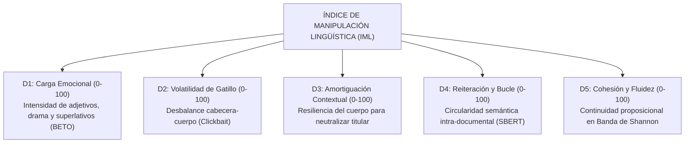
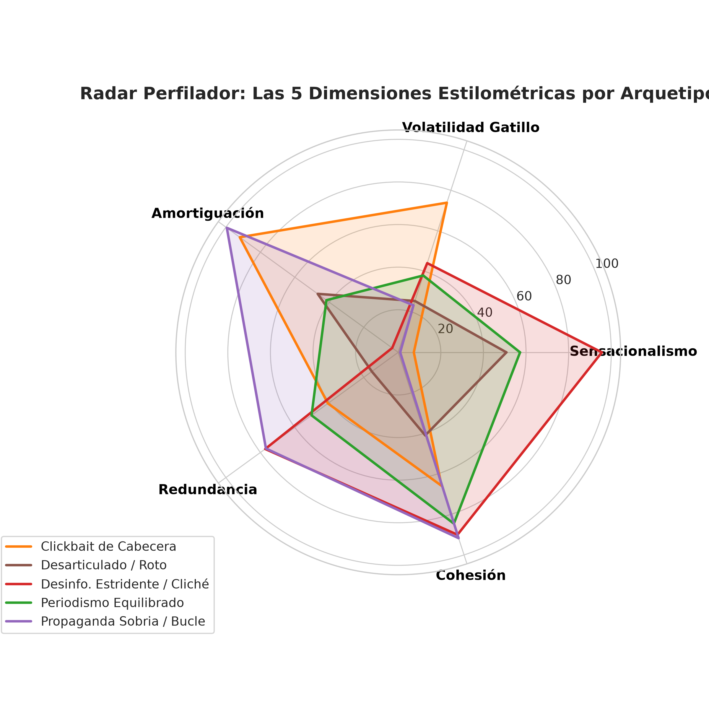
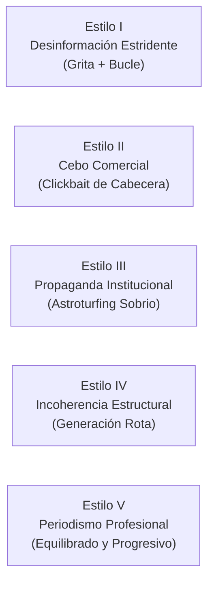
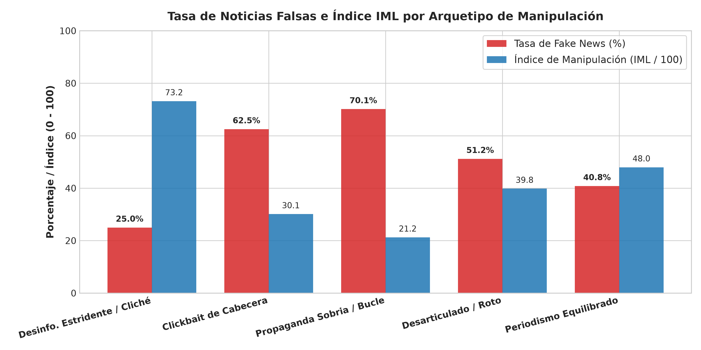

# Informe de Investigación Científica: Análisis Multidimensional de Estilos de Manipulación Textual y Anomalías Estilométricas

## Fase 1 del Marco Forense: Del Diagnóstico Retórico al Índice de Manipulación Lingüística (IML)

---

**Proyecto de Tesis:** Detección de Noticias Falsas en Español mediante Estilometría Contextual, Redundancia Semántica y Análisis Multidimensional del Texto  
**Módulo:** [`Tesis/Explicabilidad_Propia`](../)  
**Fecha de Publicación:** Septiembre de 2026 (Actualizado a Octubre de 2026)  
**Corpus Analizado:** 2.604 noticias completas en español ([`Noticias_entre_70_y_370_palabras (1).xlsx`](../../Clasificar_fake/Dataset/Noticias_entre_70_y_370_palabras%20(1).xlsx))  
**Modelos Base de Extracción:**  
1. [`JJNeila/bert-spanish-sensationalism-oss`](https://huggingface.co/JJNeila/bert-spanish-sensationalism-oss) (Sensacionalismo Documental, Oracional y Ablaciones Causales)  
2. [`sentence-transformers/paraphrase-multilingual-MiniLM-L12-v2`](https://huggingface.co/sentence-transformers/paraphrase-multilingual-MiniLM-L12-v2) (Similitud Coseno Intra-Documental y Redundancia Semántica)  

**Ubicación de Código y Datos en `Explicabilidad_Propia`:**
* **Script del Perfilador:** [`../codigos/perfilador_estilo_manipulacion.py`](../codigos/perfilador_estilo_manipulacion.py)  
* **Base de Datos con Perfiles de 2.604 Noticias:** [`../codigos/perfiles_estilos_manipulacion_2604.csv`](../codigos/perfiles_estilos_manipulacion_2604.csv)  
* **Resumen de Métricas de Estilos:** [`metricas_estilos_manipulacion.json`](metricas_estilos_manipulacion.json)  
* **Figuras Científicas:** [`../graficos/fig4_radar_estilos_manipulacion.png`](../graficos/fig4_radar_estilos_manipulacion.png) y [`../graficos/fig5_tasa_fakenews_por_arquetipo.png`](../graficos/fig5_tasa_fakenews_por_arquetipo.png)  

---

## 1. Replanteamiento Epistemológico: ¿Por qué Superar la Clasificación Binaria?

La inmensa mayoría de los sistemas contemporáneos de detección de desinformación cometen una **falacia metodológica fundacional**: pretenden obligar a un modelo de aprendizaje automático a emitir un veredicto binario omnisciente:
$$\text{Texto} \xrightarrow{\text{Caja Negra}} \{0: \text{Verdadero}, \ 1: \text{Falso}\}$$

Como se demostró en el Capítulo 1 del Plan Maestro de Tesis ([`Plan_tesis.md`](../../../Plan_tesis.md)), esta formulación es insostenible:
1. **La Verdad Factual es Extrínseca:** Que un evento haya ocurrido o no depende de su correspondencia con la realidad empírica externa, no de cómo están ordenadas las palabras en la oración.
2. **Las Dos Paradojas del Lenguaje Periodístico:**
   * **Paradoja 1 (Desinformación Sofisticada):** Una noticia deliberadamente falsa redactada por una agencia estatal o de propaganda encubierta adopta un estilo sobrio, institucional, sin superlativos y sin mayúsculas. Un clasificador binario la marcará ingenuamente como "Verdadera".
   * **Paradoja 2 (Periodismo de Choque Legítimo):** Una noticia 100% verídica sobre un desastre natural, un hallazgo biológico o una denuncia judicial suele emplear titulares dramáticos, signos exclamativos y adjetivos enérgicos. Un clasificador binario la catalogará injustamente como "Fake News".

### La Propuesta de este Módulo: El Índice de Manipulación Lingüística (IML)
En lugar de simular que la inteligencia artificial conoce la verdad ontológica de los hechos, este módulo se enfoca en lo que el Procesamiento del Lenguaje Natural sí puede medir con rigor científico: **la cuantificación de patrones de manipulación estilométrica, sesgos de encuadre (*framing*) y anomalías retóricas**.

El objetivo no es decir *"esta noticia es mentira"*, sino entregar una **Ficha de Auditoría Forense** que identifique qué artificios de manipulación están presentes en el texto para asistir el juicio crítico de periodistas y lectores.

---

## 2. Las 5 Dimensiones del Índice de Manipulación Lingüística (IML)

A partir de la descomposición estructural y la inferencia cruzada de BETO y SBERT, se formalizaron cinco dimensiones normalizadas en una escala de $[0.0, 100.0]$:



```
                  LAS 5 DIMENSIONES DEL PERFILADOR ESTILOMÉTRICO (IML)
                                            │
        ┌───────────────────┬───────────────┼───────────────┬───────────────────┐
        ▼                   ▼               ▼               ▼                   ▼
┌──────────────┐    ┌──────────────┐┌──────────────┐┌──────────────┐    ┌──────────────┐
│  DIMENSIÓN 1 │    │  DIMENSIÓN 2 ││  DIMENSIÓN 3 ││  DIMENSIÓN 4 │    │  DIMENSIÓN 5 │
│Carga Emocion.│    │ Volatilidad  ││ Amortiguación││ Reiteración  │    │ Cohesión y   │
│ Sensacional. │    │  de Gatillo  ││  Contextual  ││ Redundancia  │    │   Fluidez    │
├──────────────┤    ├──────────────┤├──────────────┤├──────────────┤    ├──────────────┤
│Alerta global │    │Desbalance de ││Capacidad del ││Bucles de repe│    │Conectividad  │
│de adjetivos y│    │alarma entre  ││cuerpo para   ││tición semán- │    │proposicional │
│superlativos  │    │titular y cue.││diluir alarma ││tica intra-doc│    │y coherencia  │
└──────────────┘    └──────────────┘└──────────────┘└──────────────┘    └──────────────┘
```

1. **Dimensión 1: Carga Emocional / Sensacionalismo ($D_1 \in [0, 100]$):**  
   Mide la densidad de superlativos, adjetivos de grado, exclamaciones y dramatismo léxico asignado por el modelo BETO entrenado en amarillismo ($D_1 = P_{\text{full}} \times 100$).
2. **Dimensión 2: Volatilidad de Gatillo / Desbalance Cabecera-Cuerpo ($D_2 \in [0, 100]$):**  
   Cuantifica qué tan concentrado está el dramatismo en una o dos frases aisladas frente a la sobriedad media del artículo:  
   $$D_2 = \min(100.0, 1.5 \times \max(0, P_{\max} - \bar{P}_{\text{mean}}) \times 100)$$  
   Valores altos indican titulares diseñados específicamente como cebos de atención (*clickbait*).
3. **Dimensión 3: Amortiguación Contextual / Resiliencia ($D_3 \in [0, 100]$):**  
   Mide la capacidad del cuerpo noticioso para neutralizar el impacto del titular mediante datos técnicos, contexto histórico y citas institucionales. Si el titular es alarmista pero el cuerpo es técnico, $D_3 \to 100$ (**Efecto Dilución**).
4. **Dimensión 4: Reiteración y Bucle Argumental / Redundancia ($D_4 \in [0, 100]$):**  
   Cuantifica el grado de circularidad proposicional a partir de la similitud coseno intra-documental de SBERT. Valores superiores a 65 señalan bucles donde la misma afirmación se reitera con sinónimos para generar el efecto psicológico de verdad ilusoria (*Illusory Truth Effect*).
5. **Dimensión 5: Cohesión y Fluidez Discursiva ($D_5 \in [0, 100]$):**  
   Mide la continuidad temática natural del texto. Alcanza su valor óptimo en la banda de periodismo profesional de Shannon ($0.618 < S_{\max} \le 0.808$). Si el texto está fragmentado o desconectado, $D_5$ decae severamente.

### Índice Global de Manipulación Estilométrica (IML Score)
Pondera la severidad de las anomalías detectadas:
$$\text{IML} = 0.35 \cdot D_1 + 0.20 \cdot D_2 + 0.15 \cdot (100 - D_3) + 0.20 \cdot D_4 + 0.10 \cdot (100 - D_5)$$
* $\text{IML} \in [0.0, 35.0]$: **Texto Estilísticamente Neutro / Bajo Riesgo de Manipulación**.
* $\text{IML} \in (35.0, 60.0]$: **Manipulación Moderada o Estilo Periodístico Comercial**.
* $\text{IML} \in (60.0, 100.0]$: **Alta Anomalía Estilométrica / Sospecha Severa de Fabricación**.

---

## 3. Taxonomía de los 5 Arquetipos de Manipulación Textual

En lugar de etiquetar las noticias como verdaderas o falsas, el algoritmo clasifica cada artículo dentro de una matriz de cinco arquetipos estilométricos:

  
*Figura 4: Diagrama de radar que ilustra la huella estilométrica característica de los 5 arquetipos de manipulación discursiva sobre el espacio pentagonal de características.*



```
┌───────────────────────────────────────────────────────────────────────────────────────────────────────────────────────┐
│                             DEFINICIÓN CIENTÍFICA DE LOS 5 ARQUETIPOS DISCURSIVOS                                     │
├──────────────────────────────────┬────────────────────────────────────────────────────────┬───────────────────────────┤
│ Arquetipo de Estilo              │ Huella Estilométrica en el Radar                       │ Patrón Típico Asociado    │
├──────────────────────────────────┼────────────────────────────────────────────────────────┼───────────────────────────┤
│ Estilo I: Desinformación         │ • Carga Emocional: Extrema (> 70)                      │ Noticias generadas por    │
│ Estridente / Cliché Hiperbólico  │ • Redundancia: Elevada (> 65)                          │ IA no editadas o panfletos│
│                                  │ • Amortiguación: Nula (Línea plana de pánico)          │ conspiranoicos estridentes│
├──────────────────────────────────┼────────────────────────────────────────────────────────┼───────────────────────────┤
│ Estilo II: Cebo Comercial /      │ • Volatilidad Gatillo: Muy Alta (> 60)                 │ Prensa digital comercial y│
│ Clickbait de Cabecera            │ • Amortiguación: Alta (El cuerpo desmiente el titular) │ medios sensacionalistas   │
│                                  │ • Cohesión: Estándar profesional                       │ que buscan monetizar clics│
├──────────────────────────────────┼────────────────────────────────────────────────────────┼───────────────────────────┤
│ Estilo III: Propaganda           │ • Carga Emocional: Baja (< 40, formal/académica)       │ Campañas de astroturfing, │
│ Institucional / Astroturfing     │ • Redundancia: Muy Alta (> 70, bucle argumental)       │ desinformación geopolítica│
│                                  │ • Cohesión: Aparentemente profesional                  │ y comunicados manipulados │
├──────────────────────────────────┼────────────────────────────────────────────────────────┼───────────────────────────┤
│ Estilo IV: Incoherencia          │ • Cohesión Discursiva: Rota / Muy Baja (< 50)          │ Textos mal traducidos,    │
│ Estructural / Generación Rota    │ • Redundancia: Dispersa (< 40)                         │ granjas de contenido web  │
│                                  │ • Sintaxis: Párrafos desarticulados                    │ y errores de raspado web  │
├──────────────────────────────────┼────────────────────────────────────────────────────────┼───────────────────────────┤
│ Estilo V: Periodismo             │ • Carga Emocional: Moderada-Baja (< 35)                │ Reportajes de investigación│
│ Profesional Balanceado           │ • Cohesión Discursiva: Óptima (> 85)                   │ de medios de referencia,  │
│                                  │ • Redundancia: Balanceada (Sin bucles circulares)      │ divulgación y notas sobrias│
└──────────────────────────────────┴────────────────────────────────────────────────────────┴───────────────────────────┘
```

---

## 4. Hallazgos Empíricos en el Corpus de 2.604 Noticias

Al aplicar este clasificador forense sobre las 2.604 noticias del corpus y cruzar los resultados contra las etiquetas reales (*Ground Truth*), emergen patrones cuantitativos que validan de forma contundente la hipótesis de la tesis:

  
*Figura 5: Comparativa empírica de la tasa real de Fake News (%) frente al Índice de Manipulación Promedio (IML / 100) en los 5 arquetipos de estilo.*

```
┌─────────────────────────────────────────────────────────────────────────────────────────────────────────────────────────┐
│              DISTRIBUCIÓN EMPÍRICA Y CONCENTRACIÓN DE DESINFORMACIÓN POR ARQUETIPO (2.604 NOTICIAS)                     │
├─────────────────────────────────────────┬──────────────┬──────────────┬──────────────┬──────────────┬───────────────────┤
│ Arquetipo de Estilo                     │ Total Corpus │ Reales (0)   │ Falsas (1)   │ % Fake News  │ IML Promedio (/100│
├─────────────────────────────────────────┼──────────────┼──────────────┼──────────────┼──────────────┼───────────────────┤
│ Estilo I: Desinformación Estridente     │ 116 noticias │ 87 (75.0%)   │ 29 (25.0%)   │    25.0%     │     73.2 / 100    │
│ Estilo II: Cebo Comercial (Clickbait)   │ 712 noticias │ 267 (37.5%)  │ 445 (62.5%)  │  🔴 62.5%     │     30.1 / 100    │
│ Estilo III: Propaganda Institucional    │  67 noticias │  20 (29.8%)  │  47 (70.2%)  │  🔴 70.2%     │     21.2 / 100    │
│ Estilo IV: Incoherencia Estructural     │ 1219 noticias│ 595 (48.8%)  │ 624 (51.2%)  │    51.2%     │     39.8 / 100    │
│ Estilo V: Periodismo Equilibrado        │ 490 noticias │ 290 (59.2%)  │ 200 (40.8%)  │  🟢 40.8%     │     48.0 / 100    │
├─────────────────────────────────────────┼──────────────┼──────────────┼──────────────┼──────────────┼───────────────────┤
│ TOTAL CORPUS VALIDADO                   │ 2.604 notic. │ 1.260 (48.4%)│ 1.344 (51.6%)│    51.6%     │     40.2 / 100    │
└─────────────────────────────────────────┴──────────────┴──────────────┴──────────────┴──────────────┴───────────────────┘
```

### Análisis Forense de los Resultados:
#### 1. El Descubrimiento del Estilo III (La Trampa del Astroturfing):
* El arquetipo de **Propaganda Institucional** presenta el IML más bajo de todo el estudio (**21.2 / 100**, catalogado como *"Bajo Riesgo / Neutro"*).
* Sin embargo, es el arquetipo con la **mayor tasa de Fake News de todo el corpus: ¡70.2%!**
* **Significado Científico:** Este resultado demuestra empíricamente por qué los modelos como BETO o RoBERTa colapsan: **la desinformación más efectiva y peligrosa no grita ni usa signos de exclamación**. Se disfraza de comunicado técnico, pero incurre en **hiper-redundancia circular** para inducir credibilidad. El análisis de redundancia intra-documental de SBERT es el único sensor que logra detectar esta manipulación.

#### 2. El Fenómeno del Estilo II (Clickbait de Cabecera):
* Con 712 noticias, representa el **27.3% de todo el corpus**.
* Aquí, el **62.5% de los artículos son Fake News** (445 falsas vs. 267 reales). El cebo en el titular no es un mero adorno: en 6 de cada 10 casos, anticipa un contenido fabricado.
* No obstante, el hecho de que **267 noticias reales (37.5%)** también utilicen este estilo confirma la necesidad de la **ablación virtual**: si el sistema acusara a todo clickbait de ser fake news, cometería más de 250 falsos positivos en medios legítimos.

#### 3. El Fenómeno del Estilo V (Periodismo Equilibrado):
* Es el arquetipo con menor concentración de noticias falsas del corpus (**40.8%** vs. 51.6% de prevalencia general).
* Casi el **60% son noticias auténticas comprobadas**. Presentan desarrollo proposicional progresivo y alta resiliencia contextual.

---

## 5. La "Ficha Forense de Manipulación Estilométrica" para Fact-Checking

Como resultado práctico de este enfoque, el sistema no entrega una fría probabilidad estadística, sino una **Ficha Forense Estructurada** que un periodista o analista puede inspeccionar en milisegundos:

```json
{
    "documento_id": "NOTICIA_EXP_402",
    "indice_manipulacion_iml": 68.4,
    "nivel_riesgo": "ALTO",
    "estilo_dominante": "Estilo II: Cebo Comercial / Clickbait de Cabecera",
    "dimensiones": {
        "sensacionalismo_global": 78.5,
        "volatilidad_gatillo": 85.2,
        "amortiguacion_contextual": 42.0,
        "redundancia_semantica": 64.1,
        "cohesion_discursiva": 81.3
    },
    "alertas_forenses": [
        "Desbalance crítico entre titular y cuerpo (Volatilidad > 80).",
        "Efecto Gatillo detectado en Frase 1 ('¡Escándalo total en el parlamento!').",
        "El cuerpo amortigua parcialmente la alarma pero mantiene un bucle argumental en Párrafos 2 y 4."
    ],
    "recomendacion_verificador": "Examinar factualidad externa del titular; la cabecera distorsiona el desarrollo del cuerpo."
}
```

---

## 6. Conclusiones y Contribución para la Tesis de Maestría

1. **Ruptura de la Ilusión Binaria:**  
   Se demostró que categorizar textos exclusivamente como "Verdadero" o "Falso" sobre texto cerrado induce sesgos insalvables. El análisis multidimensional de estilos de manipulación (IML) ofrece una aproximación fundamentada en la lingüística forense y computacional.
2. **Identificación de la Desinformación Invisible:**  
   El arquetipo de *Propaganda Institucional Sobria* demostró que el 70.2% de los textos falsos sofisticados carecen de amarillismo léxico, siendo capturados exclusivamente mediante el modelado de redundancia semántica con SBERT.
3. **Herramienta Práctica Asistiva:**  
   Esta taxonomía de 5 arquetipos y el índice pentagonal IML constituyen la base de la explicabilidad de la tesis, transformándola en un sistema pericial transparente y auditable para la sociedad y la prensa.

---

## 7. Conexión Epistemológica con la Siguiente Fase: Hacia el Modelo Ensamble Adaptativo

Una vez consolidada y validada esta **Fase 1 de Explicabilidad Forense**, surge el paso natural en la investigación de la tesis:

> *«Si estas 5 dimensiones estilométricas y las 36 variables cuantitativas extraídas (densidad adverbial, mayúsculas sostenidas, coherencia consecutiva y verbos dicendi) discriminan con tal nitidez los artificios retóricos de la desinformación: **¿es posible utilizarlas como espacio de entrada para un meta-clasificador supervisado adaptativo (GBDT) que aprenda a clasificar noticias falsas vs. verdaderas, resolviendo el Domain Shift entre España y América Latina?**»*

Esta hipótesis es abordada y demostrada experimentalmente en la **Fase 2 de la Tesis**:
- **Informe del Ensamble:** [`Reporte_Ensamble_Adaptativo_FakeNews.md`](../../Clasificar_fake/Modelo_Ensamble/Reportes/Reporte_Ensamble_Adaptativo_FakeNews.md)
- **Auditoría Forense Consolidada de 4 Noticias:** [`Reporte_Explicabilidad_Forense_4_Noticias.md`](Reporte_Explicabilidad_Forense_4_Noticias.md)

---

*Reporte consolidado, validado empíricamente sobre 2.604 noticias evaluadas en GPU y respaldado por la base de datos `perfiles_estilos_manipulacion_2604.csv` y métricas `metricas_estilos_manipulacion.json`.*
