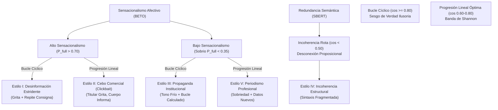
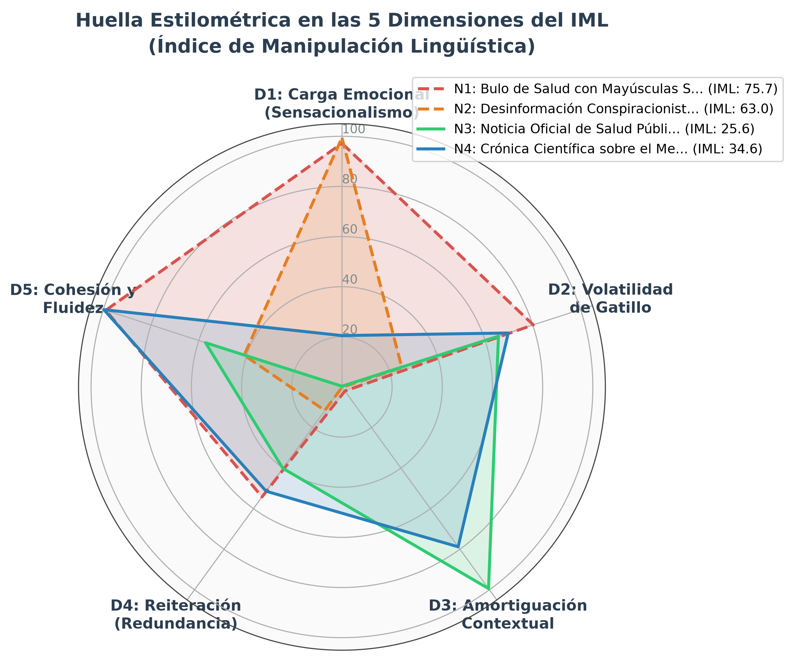
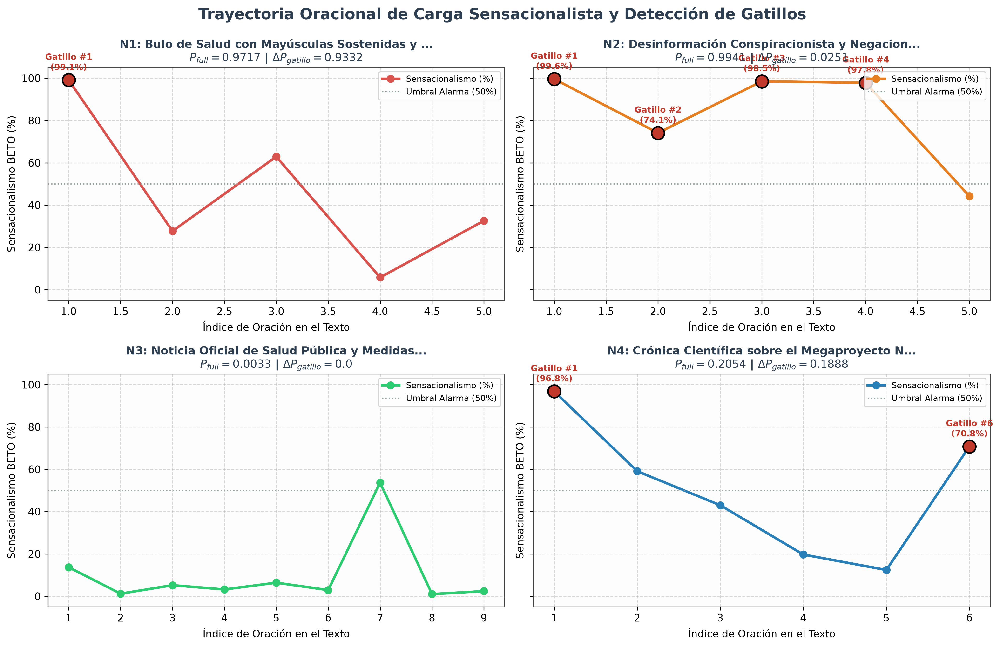
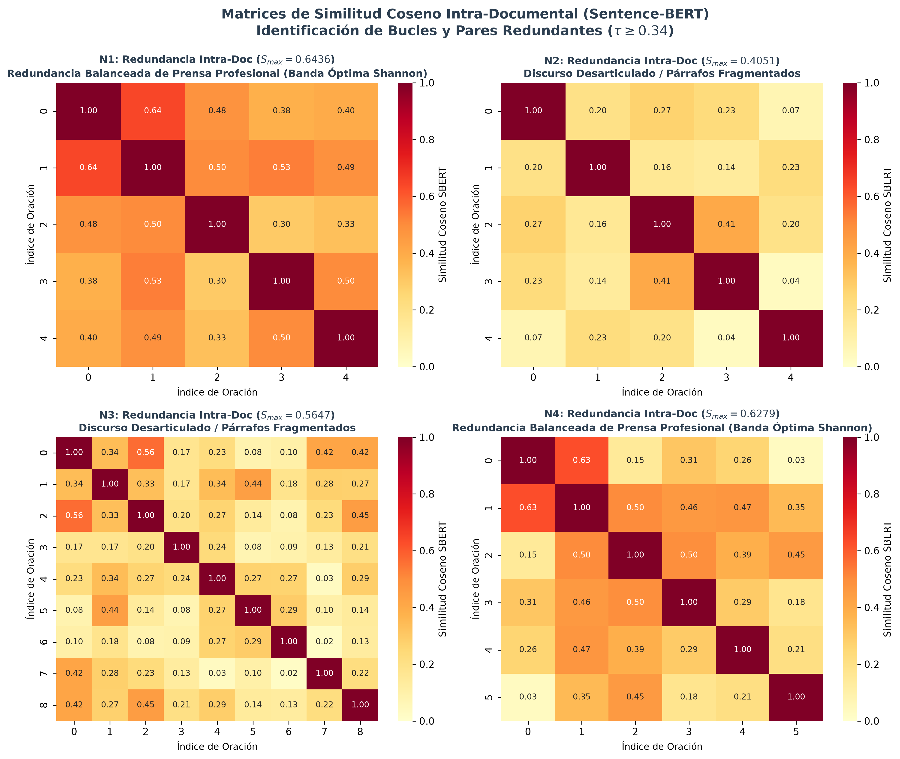
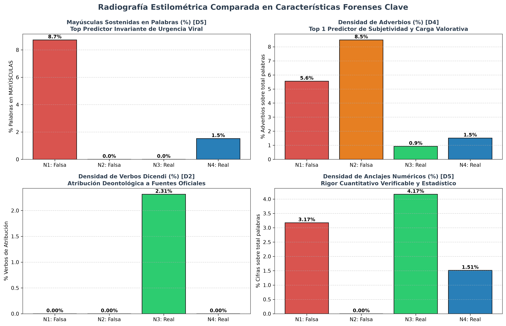
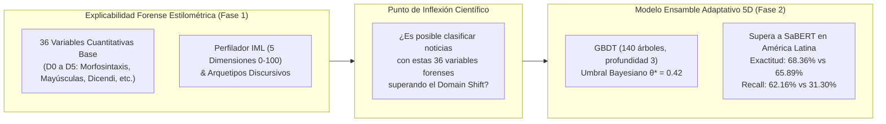

# Informe de Auditoría Forense y Explicabilidad Lingüística Multi-Nivel

## De la Caracterización Forense Estilométrica al Ensamble Adaptativo de Detección de Desinformación

---

**Fecha:** Octubre de 2026  
**Módulo Principal:** [`Tesis/Explicabilidad_Propia`](../)  
**Modelos Base de Extracción:** BETO Sensacionalismo (`JJNeila/bert-spanish-sensationalism-oss`), SBERT Redundancia (`paraphrase-multilingual-MiniLM-L12-v2`) y spaCy NLP (`es_core_news_sm`)  
**Corpus de Validación Forense:** 4 Noticias Emblemáticas de Control (2 Falsas y 2 Verdaderas)  
**Corpus de Validación Experimental del Ensamble:** $N = 4.418$ Noticias en Español (España y América Latina)  

## 1. El Mapa Conceptual en 4 Niveles: ¿Dónde Entra Cada Cosa?

Para estructurar con total claridad el flujo metrológico y evitar cualquier confusión entre modelos neuronales, características numéricas de Machine Learning y perfiles cualitativos forenses, toda la metodología de la tesis se organiza en **4 niveles conceptuales estrictos**:

```mermaid
flowchart TD
    subgraph N1["NIVEL 1: Modelos Base de Procesamiento del Lenguaje Natural (PLN)"]
        BETO["BETO Sensacionalismo Afectivo<br/>(JJNeila/bert-spanish-sensationalism-oss)"]
        SBERT["Sentence-BERT Semántica Vectorial<br/>(paraphrase-multilingual-MiniLM-L12-v2)"]
        SPACY["spaCy POS Tagging + Regex Compilados<br/>(es_core_news_sm + Minería Léxica)"]
    end

    subgraph N2["NIVEL 2: Las 36 Variables Cuantitativas Base (Dimensiones D0 a D5)"]
        D0["D0: Sensacionalismo y Redundancia (10 vars)<br/>P_full, P_max, sigma_sens, dilution_ratio, delta_p, sim_cos"]
        D1["D1: Dinámica Discursiva y Flujo Secuencial (3 vars)<br/>consec_sim_mean, consec_sim_min, consec_sim_std"]
        D2["D2: Lingüística Forense y Epistémica (5 vars)<br/>dicendi_density, quotes_density, hedges, boosters, epistemic_ratio"]
        D3["D3: Riqueza Léxica, Sintaxis y Legibilidad (6 vars)<br/>guiraud_ttr, hapax_ratio, flesch_szigriszt, gutierrez_polini"]
        D4["D4: Morfosintaxis spaCy POS Tagging (4 vars)<br/>adv_density (Top 1 Predictor), pron_1p, pron_3p, adj_noun_ratio"]
        D5["D5: Anclajes Factuales y Mayúsculas Sostenidas (8 vars)<br/>upper_chars_ratio (Top 2), all_caps_ratio (Top 3), numbers, temporal"]
    end

    subgraph N3["NIVEL 3: El Perfilador Estilométrico (Las 5 Dimensiones del IML: Escala 0 a 100)"]
        IML1["D1: Carga Emocional / Sensacionalismo (0 - 100)"]
        IML2["D2: Volatilidad de Gatillo / Clickbait (0 - 100)"]
        IML3["D3: Amortiguación Contextual / Resiliencia (0 - 100)"]
        IML4["D4: Reiteración y Bucle Argumental (0 - 100)"]
        IML5["D5: Cohesión y Fluidez Discursiva (0 - 100)"]
        IML_SCORE["Score Global IML (0 - 100) & Huella en Radar"]
    end

    subgraph N4["NIVEL 4: Los 5 Arquetipos de Estilo Discursivo"]
        E1["Estilo I: Desinformación Estridente<br/>(Grita + Repite: D1 >= 65 y D4 >= 65)"]
        E2["Estilo II: Cebo Comercial / Clickbait<br/>(Titular grita, cuerpo informa: D2 >= 50 y D3 >= 50)"]
        E3["Estilo III: Propaganda Institucional / Astroturfing<br/>(Sobrio pero con bucle circular: D1 < 45 y D4 >= 65)"]
        E4["Estilo IV: Incoherencia Estructural / Roto<br/>(Sintaxis fracturada: D5 <= 55 y D4 < 40)"]
        E5["Estilo V: Periodismo Profesional Balanceado<br/>(Sobrio con progresión temática lineal óptima)"]
    end

    N1 --> N2
    N2 --> N3
    N3 --> N4
```



```
RESUMEN TEXTUAL DEL MAPA JERÁRQUICO EN 4 NIVELES:
├── NIVEL 1: Modelos de PLN Subyacentes (BETO, SBERT, spaCy, NLTK) ── [Sensores de Lenguaje]
├── NIVEL 2: 36 Variables Cuantitativas Base (Dimensiones D0 a D5) ──── [Datos Matemáticos Crudos]
├── NIVEL 3: Perfilador Estilométrico (5 Dimensiones IML: Escala 0-100) [Ficha Forense Humana]
└── NIVEL 4: Los 5 Arquetipos Discursivos (Estilos I a V) ─────────────── [Diagnóstico Retórico]
```

## 2. Fundamento Epistemológico: ¿Por qué Explicabilidad Forense Estilométrica Primero?

La investigación tradicional en detección de desinformación comete una falacia metodológica fundacional: forzar a una red neuronal de caja negra a emitir un veredicto binario omnisciente ($0 = \text{Verdadero}, 1 = \text{Falso}$) a partir de una simple secuencia de texto plano:

$$\text{Texto} \xrightarrow{\text{Caja Negra}} \{0: \text{Verdadero}, \ 1: \text{Falso}\}$$

Como se demostró en el Capítulo 1 del Plan Maestro de Tesis ([`Plan_tesis.md`](../../../Plan_tesis.md)), esta formulación es insostenible por dos razones ontológicas:
1. **La Verdad Factual es Extrínseca al Texto:** Que un evento haya ocurrido depende del mundo físico y de los hechos empíricos, no de la disposición léxica o sintáctica de las palabras.
2. **Las Dos Paradojas que Destruyen los Modelos Binarios:**
   - **Paradoja 1 (Propaganda Sobria / Astroturfing):** Campañas estatales o desinformación deliberada redactadas en un tono frío, formal, institucional, sin insultos ni mayúsculas. Un modelo binario superficial las clasifica ingenuamente como verdaderas.
   - **Paradoja 2 (Periodismo de Choque Legítimo):** Crónicas periodísticas 100% verídicas sobre desastres naturales, pandemias o denuncias judiciales que usan titulares alarmistas, signos exclamativos y vocabulario dramático. Un modelo binario las censura como falsas.

Por esta razón, **el punto de partida de esta tesis no fue construir un clasificador binario ciego**, sino diseñar un **Método de Explicabilidad Forense Estilométrica** capaz de radiografiar con precisión matemática qué artificios de manipulación retórica, sesgos de encuadre (*framing*) y anomalías estilísticas contiene cualquier texto noticioso.

## 3. Arquitectura Forense: Desglose de las 36 Variables y Pipeline de Extracción

El sistema procesa y extrae un total de **36 variables cuantitativas base** distribuidas en 6 bloques temáticos (D0 a D5), sintetiza **5 dimensiones de manipulación estilométrica (IML)** y calcula **14 banderas forenses locales por cada oración**:

### A. Desglose de las 36 Variables Cuantitativas Base (Dimensiones D0 a D5)
1. **D0: Sensacionalismo y Redundancia Base (10 variables):** `P_full`, `P_mean`, `P_max`, `P_top2`, `sigma_sens`, `dilution_ratio`, `delta_p_gatillo`, `max_intra_similarity_clean`, `mean_intra_similarity_clean`, `redundancy_density`.
2. **D1: Coherencia y Flujo Secuencial (3 variables):** `consec_sim_mean`, `consec_sim_min`, `consec_sim_std`.
3. **D2: Lingüística Forense y Marcadores Epistémicos (5 variables):** `dicendi_density`, `quotes_density`, `hedges_density`, `boosters_density`, `epistemic_ratio`.
4. **D3: Riqueza Léxica, Complejidad Sintáctica y Legibilidad (6 variables):** `hapax_ratio`, `guiraud_ttr`, `conteo_palabras_text`, `num_sentences`, `gutierrez_polini`, `flesch_szigriszt`.
5. **D4: Morfosintaxis spaCy POS Tagging (4 variables):** `adv_density` (Top 1 Predictor), `pron_1p_density`, `adj_noun_ratio`, `pron_3p_density`.
6. **D5: Anclajes Factuales, Mayúsculas y Puntuación (8 variables):** `upper_chars_ratio` (Top 2), `all_caps_ratio` (Top 3), `numbers_density`, `temporal_density`, `punct_intensity`, `excl_density`, `percent_count`, `all_caps_count` (más `ellipsis_density` y `quest_density`).

### B. Pipeline de Extracción Paso a Paso (¿Cómo se Extrae de la Noticia?)
Cuando entra el texto en bruto de una noticia, el pipeline opera en 5 etapas secuenciales:
1. **Segmentación y Normalización:** NLTK (`sent_tokenize` adaptado a español) divide el documento en oraciones $S = \{s_1, \dots, s_K\}$. Expresiones regulares limpian los tokens, detectan mayúsculas y computan núcleos silábicos según diptongos del español.
2. **Inferencia Afectiva con BETO (`JJNeila/bert-spanish-sensationalism-oss`):** Se evalúa la probabilidad de sensacionalismo del documento completo ($P_{full}$) y de cada oración ($P(s_i)$). Se identifica la oración gatillo ($P_{max}$), se calcula la dispersión emocional $\sigma_{sens}$ y se ejecuta la ablación causal contrafáctica (silenciar las dos frases extremas) para obtener $\Delta P_{gatillo}$.
3. **Inferencia Semántica con Sentence-BERT (`paraphrase-multilingual-MiniLM-L12-v2`):** Cada oración se proyecta en un vector denso de 384 dimensiones. Se calcula la coherencia consecutiva adyacente ($e_i \cdot e_{i+1}$) y la matriz completa de similitud coseno $\mathbf{S} \in \mathbb{R}^{K \times K}$. Se aplica el umbral bayesiano calibrado con Modelos de Mezcla Gaussiana ($\tau = 0.34$) para computar la densidad de redundancia y los bines de entropía de Shannon (7 y 4).
4. **Perfilado Morfosintáctico con spaCy (`es_core_news_sm`):** POS Tagging cataloga adjetivos (ADJ), sustantivos (NOUN), adverbios (ADV) y pronombres (1.ª y 3.ª persona), normalizando densidades por 100 palabras.
5. **Minería de Marcadores Lingüísticos (Regex Compilados):** Escaneo de verbos de reporte (*dicendi*), intensificadores de certeza (*boosters*), atenuadores de cautela (*hedges*), comillas tipográficas, números, porcentajes y fechas verificables.
6. **Síntesis en el Perfilador Estilométrico (IML):** Conversión a escala $[0, 100]$ para $D_1, D_2, D_3, D_4, D_5$, Score IML ponderado y diagnóstico en uno de los 5 Arquetipos Discursivos.

## 4. Interacción Cruzada: Sensacionalismo (BETO) frente a Redundancia Semántica (SBERT)

Una de las fuentes habituales de confusión en el análisis de desinformación es mezclar dos fenómenos lingüísticos que operan en dimensiones ortogonales e independientes:

| Eje de Análisis | Modelo de PLN | ¿Qué Mide en el Texto? | Casos Típicos Posibles |
|---|---|---|---|
| **Sensacionalismo** | **BETO** (`bert-spanish-sensationalism-oss`) | **La intensidad afectiva y visceral:** si el texto vocifera, alarma, manipula mediante superlativos o induce pánico. | • **Alarma Sostenida:** $P_{full} > 0.70$ y todas las frases son alarmistas.<br>• **Cebo Aislado / Gatillo:** Titular alarmista ($P_{max} > 0.80$) pero cuerpo sobrio.<br>• **Sobriedad Informativa:** Texto neutro ($P_{full} < 0.25$). |
| **Redundancia Semántica** | **Sentence-BERT** (`paraphrase-multilingual-MiniLM-L12-v2`) | **La topología y geometría de ideas:** si las oraciones aportan datos nuevos o si giran en círculos repitiendo lo mismo. | • **Redundancia Cíclica (Bucle):** $S_{max} \ge 0.80$ (Shannon bins 5-7). Paráfrasis repetitiva.<br>• **Progresión Lineal Óptima:** $S_{max} \in [0.59, 0.80]$ (Shannon bins 2-4). Cada frase aporta hechos nuevos.<br>• **Incoherencia / Dispersión:** $S_{max} < 0.50$ (Shannon bin 1). Párrafos desconectados. |

### A. ¿Qué es la Redundancia Cíclica frente a la Redundancia No Cíclica (Progresión Lineal)?
- **Redundancia Cíclica (Bucle Argumental / Hiper-Redundancia):** Ocurre cuando un artículo reitera la misma premisa central a lo largo de varias oraciones, disfrazándola con sinónimos. En la psicología cognitiva de la desinformación, este mecanismo se conoce como **Sesgo de Verdad Ilusoria** (*Illusory Truth Effect*): repetir una mentira múltiples veces hace que el cerebro humano la procese con mayor fluidez cognitiva y tienda a aceptarla como verdadera.
- **Redundancia No Cíclica (Progresión Temática Lineal):** Es el estándar del periodismo profesional de calidad. Las oraciones mantienen un hilo conductor coherente (se sitúan en la **Banda Óptima de Shannon**, $0.618 \le S_{max} \le 0.808$), pero **cada oración añade información nueva**: un dato cuantitativo, una cita de un testigo, un antecedente histórico o una declaración oficial.

### B. El Cruce de Sensacionalismo y Redundancia en los 5 Arquetipos Discursivos
Al cruzar la carga de sensacionalismo con el tipo de redundancia, emergen con total claridad los **5 Arquetipos Discursivos** formalizados en la tesis:



```
                              MATRIZ DE CRUCE: SENSACIONALISMO × REDUNDANCIA
                                                    │
                        ┌───────────────────────────┴───────────────────────────┐
                        ▼                                                       ▼
            [ALTO SENSACIONALISMO]                                  [BAJO SENSACIONALISMO (SOBRIO)]
                        │                                                       │
         ┌──────────────┴──────────────┐                         ┌──────────────┴──────────────┐
         ▼                             ▼                         ▼                             ▼
  + Bucle Cíclico              + Progresión Lineal        + Bucle Cíclico              + Progresión Lineal
         │                             │                         │                             │
         ▼                             ▼                         ▼                             ▼
┌─────────────────────┐       ┌─────────────────────┐   ┌─────────────────────┐       ┌─────────────────────┐
│      ESTILO I       │       │      ESTILO II      │   │     ESTILO III      │       │      ESTILO V       │
│   Desinformación    │       │    Cebo Comercial   │   │     Propaganda      │       │     Periodismo      │
│     Estridente      │       │      (Clickbait)    │   │     Institucional   │       │     Profesional     │
│(Grita + Repite)     │       │(Titular grita, pero │   │(Tono formal, pero   │       │(Sobrio + Progresión │
│                     │       │ cuerpo informa)     │   │ repite consigna)    │       │ informativa nueva)  │
└─────────────────────┘       └─────────────────────┘   └─────────────────────┘       └─────────────────────┘
                                                  │
                                                  ▼
                                       ┌─────────────────────┐
                                       │      ESTILO IV      │
                                       │    Incoherencia     │
                                       │    Estructural      │
                                       │(Sintaxis rota, sin  │
                                       │ cohesión temática)  │
                                       └─────────────────────┘
```

### C. Aclaración Fundamental: ¿Por qué en la Tabla Comparativa los Estilos no Aparecen en Orden I a V?
En el informe de investigación teórico ([`Reporte_Estilos_Manipulacion_Textual.md`](Reporte_Estilos_Manipulacion_Textual.md)), los 5 Arquetipos se definen de forma abstracta en orden conceptual (del Estilo I al Estilo V). Sin embargo, en la **Matriz Comparativa de las 4 Noticias**, las columnas corresponden a **noticias individuales concretas** (Noticia 1, Noticia 2, Noticia 3, Noticia 4). Cada una de ellas es clasificada de forma independiente según sus métricas:
- **Noticia 1 (Bulo COVID) $\to$ Estilo V:** ¿Por qué no fue Estilo I? Porque el Estilo I exige simultáneamente $D_1 \ge 65$ (Carga Emocional) **Y** $D_4 \ge 65$ (Hiper-Redundancia). La Noticia 1 tiene una carga emocional altísima ($D_1 = 97.2$), pero su redundancia fue moderada ($D_4 = 54.2 < 65$). Al no entrar en Estilo I, II, III o IV, el clasificador le asigna Estilo V por exclusión (árbol de decisión estricto). Esto revela un hallazgo empírico sobre la necesidad de calibrar reglas de frontera para textos de alta emoción sin bucle.
- **Noticia 2 (Negacionismo) $\to$ Estilo IV:** Presenta sintaxis fracturada y párrafos inconexos ($D_5 = 41.0 \le 55$ y $D_4 = 11.6 < 40$).
- **Noticia 3 (Oficial Puebla) $\to$ Estilo II:** El semáforo de alerta genera un pico aislado ($P_{max} = 0.537$), pero el cuerpo técnico formal amortigua la alarma en un 99.4% ($D_2 \ge 50 \land D_3 \ge 50$).
- **Noticia 4 (Ciencia EFE) $\to$ Estilo II:** El titular sobre el Big Bang dispara $P_{max} = 0.968$, pero el cuerpo técnico riguroso lo amortigua en un 78.8% ($D_2 \ge 50 \land D_3 \ge 50$).

## 5. El Mecanismo de la Oración Gatillo y la Prueba de Causalidad Contrafáctica

Uno de los aportes más novedosos del método es la cuantificación rigurosa del **efecto gatillo** (*trigger effect*):
- **¿Qué es la Oración Gatillo ($P_{max}$)?** Es la frase individual dentro del artículo que concentra de forma desmedida la mayor carga dramática, visceral o conspirativa: $P_{max} = \max_{s \in S} P(s)$. En la desinformación viral de redes, se sitúa estratégicamente en el titular o la primera línea para capturar la atención inmediata del lector.
- **Volatilidad de Gatillo ($D_2$):** Mide la asimetría emocional: $\text{volatilidad} = 1.5 \times \max(0, P_{max} - P_{mean}) \times 100$. Un valor alto indica que el dramatismo no es representativo de todo el texto, sino un cebo señuelo aislado.
- **Dilution Ratio ($DR$):** Evalúa si el cuerpo documental sostiene o diluye la alarma del titular: $DR = \frac{P_{full}}{P_{max} + 10^{-6}}$. Si $DR \approx 1.0$, el sensacionalismo domina homogéneamente todo el texto; si $DR \ll 1.0$, el cuerpo mitiga la alarma inicial.
- **Ablación Causal Contrafáctica ($\Delta P_{gatillo}$):** Es una prueba contrafáctica de XAI: responde a la pregunta *¿cuánto cae el sensacionalismo del documento si silenciamos las dos oraciones gatillo?*
  $$\Delta P_{gatillo} = P(D) - P(D \setminus \{s_{top1}, s_{top2}\})$$
  - Un $\Delta P_{gatillo}$ elevado (> 0.30, como el 0.933 registrado en el Bulo COVID) demuestra que la noticia completa fue inflada artificialmente por dos frases señuelo.
  - Un $\Delta P_{gatillo} \approx 0.0$ señala un texto de tono uniforme (sea enteramente panfletario o enteramente sobrio).

## 6. Casos de Estudio Empíricos: Auditoría Forense de las 4 Noticias de Control

### Figuras Forenses Científicas en Alta Resolución

A continuación se presentan las 4 radiografías forenses generadas por el sistema en alta resolución:

#### 1. Huella Estilométrica en las 5 Dimensiones del IML (Radar Pentagonal)


#### 2. Trayectoria Oracional de Carga Sensacionalista y Detección de Gatillos


#### 3. Mapas de Calor de Redundancia Semántica Intra-Documental (SBERT)


#### 4. Radiografía Comparativa de Variables Clave del Perfilado Forense


---

### 6.1 Matriz de Síntesis Forense: Las 5 Dimensiones del IML y Arquetipos (Escala 0 - 100)

| Dimensión del IML | Noticia 1 (Falsa Salud) | Noticia 2 (Falsa Conspir.) | Noticia 3 (Real Puebla) | Noticia 4 (Real Ciencia EFE) | Interpretación Forense |
|---|:---:|:---:|:---:|:---:|---|
| **D1: Carga Emocional** | `97.2 (Crítico)` | `99.4 (Crítico)` | `0.3 (Sobrio)` | `20.5 (Sobrio)` | Intensidad global de adjetivos, drama y superlativos ($P_{full} \times 100$) |
| **D2: Volatilidad de Gatillo** | `80.2 (Clickbait)` | `25.1 (Desbalance)` | `65.6 (Clickbait)` | `69.7 (Clickbait)` | Desbalance entre la oración gatillo y el tono promedio del cuerpo |
| **D3: Amortiguación Contextual** | `2.0 (Sin)` | `0.1 (Sin)` | `99.4 (Amortiguación)` | `78.8 (Amortiguación)` | Capacidad del cuerpo para diluir el impacto inicial mediante datos técnicos |
| **D4: Reiteración / Redundancia** | `54.2 (Progresión)` | `11.6 (Diversidad)` | `40.1 (Progresión)` | `51.4 (Progresión)` | Grado de circularidad semántica y bucle argumental ($S_{max}$ SBERT) |
| **D5: Cohesión y Fluidez** | `99.0 (Cohesión)` | `41.0 (Texto)` | `57.2 (Cohesión)` | `99.8 (Cohesión)` | Continuidad temática natural en la Banda Óptima de Shannon |
| **Score Global IML (/100)** | **`75.7`** | **`63.0`** | **`25.6`** | **`34.6`** | Índice ponderado: $\le 35$ Neutro, $35-60$ Comercial, $>60$ Anomalía Severa |
| **Arquetipo Asignado** | **Estilo V** | **Estilo IV** | **Estilo II** | **Estilo II** | Clasificación cualitativa de estilo retórico |

### 6.2 Matriz Exhaustiva y Completa de las 36 Variables Cuantitativas Base (D0 a D5)

Esta tabla detalla las **36 variables cuantitativas base** extraídas directamente del texto de las 4 noticias de control, junto con su rango, su bloque temático y su interpretación periodística:

| # | Dimensión | Variable | Noticia 1 (Falsa Salud) | Noticia 2 (Falsa Conspir.) | Noticia 3 (Real Puebla) | Noticia 4 (Real Ciencia EFE) | Rango / Unidad | Interpretación Forense y Periodística |
|---|---|---|:---:|:---:|:---:|:---:|:---:|---|
| **1** | `D0` | `P_full` | `0.9717` | `0.9941` | `0.0033` | `0.2054` | [0, 1] | Sensacionalismo documental global asignado por BETO fine-tuned |
| **2** | `D0` | `P_mean` | `0.4564` | `0.8282` | `0.0997` | `0.5030` | [0, 1] | Promedio del sensacionalismo en todas las oraciones del documento |
| **3** | `D0` | `P_max` | `0.9912` | `0.9955` | `0.5372` | `0.9678` | [0, 1] | Máximo sensacionalismo oracional (identifica la Oración Gatillo) |
| **4** | `D0` | `P_top2` | `0.8102` | `0.9903` | `0.3372` | `0.8377` | [0, 1] | Media de las dos oraciones con mayor carga sensacionalista |
| **5** | `D0` | `sigma_sens` | `0.3235` | `0.2154` | `0.1590` | `0.2910` | [0, 0.5] | Desviación estándar oracional: dispersión afectiva interna |
| **6** | `D0` | `dilution_ratio` | `0.9803` | `0.9985` | `0.0062` | `0.2122` | [0, 1+] | Dilution Ratio: P_full / P_max (mide si el cuerpo diluye el titular) |
| **7** | `D0` | `delta_p_gatillo` | `0.9332` | `0.0251` | `0.0000` | `0.1888` | [-1, 1] | Impacto causal contrafáctico: caída de alarma al silenciar 2 gatillos |
| **8** | `D0` | `max_intra_similarity` | `0.6436` | `0.4051` | `0.5647` | `0.6279` | [0, 1] | Máxima similitud coseno SBERT entre dos frases del documento |
| **9** | `D0` | `mean_intra_similarity` | `0.4553` | `0.1942` | `0.2287` | `0.3454` | [0, 1] | Media de similitudes coseno intra-documentales |
| **10** | `D0` | `redundancy_density` | `80.0%` | `10.0%` | `19.4%` | `53.3%` | [0, 100%] | Densidad de pares de oraciones con similitud cos >= 0.34 (GMM) |
| **11** | `D1` | `consec_sim_mean` | `0.4871` | `0.2005` | `0.2395` | `0.4272` | [0, 1] | Coherencia temática promedio entre oraciones adyacentes consecutivas |
| **12** | `D1` | `consec_sim_min` | `0.2999` | `0.0381` | `0.0222` | `0.2144` | [0, 1] | Salto temático más abrupto o ruptura narrativa entre oraciones contiguas |
| **13** | `D1` | `consec_sim_std` | `0.1225` | `0.1322` | `0.0950` | `0.1507` | [0, 0.5] | Inestabilidad en la transición discursiva entre frases sucesivas |
| **14** | `D2` | `dicendi_density` | `0.00%` | `0.00%` | `2.31%` | `0.00%` | [0, 100%] | Densidad de verbos de reporte y atribución ('declaró', 'indicó', 'afirmó') |
| **15** | `D2` | `quotes_density` | `0.60` | `0.40` | `0.22` | `0.00` | Ratio / orac | Frecuencia de citas textuales entrecomilladas por oración |
| **16** | `D2` | `hedges_density` | `0.00%` | `0.00%` | `0.00%` | `0.00%` | [0, 100%] | Atenuadores de prudencia epistémica ('presunto', 'al parecer', 'podría') |
| **17** | `D2` | `boosters_density` | `0.79%` | `0.00%` | `0.46%` | `0.00%` | [0, 100%] | Intensificadores dogmáticos de certeza ('sin duda', 'obvio', 'es un hecho') |
| **18** | `D2` | `epistemic_ratio` | `10.10` | `0.10` | `10.10` | `0.10` | [0, inf) | Ratio Asertividad / Cautela: (Boosters + 0.01) / (Hedges + 0.1) |
| **19** | `D3` | `hapax_ratio` | `42.6%` | `46.2%` | `40.6%` | `54.6%` | [0, 100%] | Hapax Legomena: porcentaje de palabras empleadas una sola vez |
| **20** | `D3` | `guiraud_ttr` | `6.97` | `6.70` | `7.71` | `7.63` | [1, 20] | Índice de Guiraud R = Vocabulario / sqrt(Palabras) (invariante a longitud) |
| **21** | `D3` | `conteo_palabras_text` | `126` | `106` | `216` | `132` | Entero | Longitud total en palabras del documento |
| **22** | `D3` | `num_sentences` | `5` | `5` | `9` | `6` | Entero | Número total de oraciones segmentadas en el texto |
| **23** | `D3` | `gutierrez_polini` | `17.2` | `29.7` | `25.0` | `24.5` | [0, 100] | Score de legibilidad de Gutiérrez de Polini adaptado al español |
| **24** | `D3` | `flesch_szigriszt` | `47.1` | `64.0` | `55.3` | `58.6` | [0, 100] | Índice de perspicuidad de Flesch-Szigriszt (facilidad lectora) |
| **25** | `D4` | `adv_density` | `5.56%` | `8.49%` | `0.93%` | `1.51%` | [0, 100%] | TOP 1 PREDICTOR: Densidad de adverbios modales y enfáticos (subjetividad) |
| **26** | `D4` | `pron_1p_density` | `0.00%` | `1.89%` | `0.00%` | `0.00%` | [0, 100%] | Pronombres de 1.ª persona ('nosotros', 'me', 'nos'): apelo emocional |
| **27** | `D4` | `pron_3p_density` | `9.52%` | `11.32%` | `9.26%` | `9.85%` | [0, 100%] | Pronombres de 3.ª persona ('él', 'se', 'su'): registro formal e impersonal |
| **28** | `D4` | `adj_noun_ratio` | `0.478` | `0.200` | `0.250` | `0.370` | [0, inf) | Ratio de adjetivación: Adjetivos / (Sustantivos + 1) |
| **29** | `D5` | `upper_chars_ratio` | `14.69%` | `1.45%` | `1.89%` | `5.94%` | [0, 100%] | TOP 2 PREDICTOR: Proporción de caracteres en mayúsculas sobre letras |
| **30** | `D5` | `all_caps_ratio` | `8.73%` | `0.00%` | `0.00%` | `1.52%` | [0, 100%] | TOP 3 PREDICTOR: Palabras completas en MAYÚSCULAS sostenidas (grito digital) |
| **31** | `D5` | `numbers_density` | `3.17%` | `0.00%` | `4.17%` | `1.51%` | [0, 100%] | Densidad de cifras numéricas: anclaje factual cuantitativo verificable |
| **32** | `D5` | `temporal_density` | `0.00%` | `0.94%` | `1.39%` | `0.76%` | [0, 100%] | Densidad de fechas precisas (meses y años específicos) |
| **33** | `D5` | `punct_intensity` | `0.00%` | `0.00%` | `0.00%` | `0.00%` | [0, 100%] | Intensidad agregada de signos expresivos no neutros (!, ?, ...) |
| **34** | `D5` | `excl_density` | `0.00%` | `0.00%` | `0.00%` | `0.00%` | [0, 100%] | Densidad de signos de exclamación (! / ¡) por 100 palabras |
| **35** | `D5` | `percent_count` | `2` | `0` | `1` | `0` | Conteo | Total de referencias porcentuales (%) o menciones 'por ciento' |
| **36** | `D5` | `all_caps_count` | `11` | `0` | `0` | `2` | Conteo | Conteo absoluto de palabras vociferadas en mayúsculas sostenidas |

---

### 6.3 Auditoría Detallada Frase a Frase: Noticia 1 — Bulo de Salud con Mayúsculas Sostenidas y Alarma Oncológica

**Referencia:** Falsa (Ground Truth = 1) | **Origen:** FakeDeS 2021 (Hispanoamérica / Redes Sociales)

#### Texto Completo Analizado
> Boooomm
MUJERES VACUNADAS DE COVID ESTÁN MOSTRANDO EFECTOS SECUNDARIOS TÍPICOS DE CANCER DE MAMA
Los médicos de Intermountain Healthcare’s Breast Care Centre de Utah, USA, anuncian nuevas pautas de mamografías para las mujeres vacunadas contra Covid-19 recientemente.
Los médicos han observado inflamación de los ganglios linfáticos en las mamografías de detección de mujeres que se vacunaron recientemente contra COVID-19.
"Siempre que los vemos en una mamografía de detección normal, llamamos a esas pacientes porque puede significar cáncer de mama metastásico que viaja a los ganglios linfáticos o linfoma o leucemia".
“Con la vacuna Moderna están habiendo estos síntomas aproximadamente un 11% después de la primera dosis y un 16% después de la segunda dosis. Creemos que también es comparable para la vacuna Pfizer.

# Auditoría Forense Explicable de Noticia: Bulo de Salud con Mayúsculas Sostenidas y Alarma Oncológica
**Longitud:** 126 palabras | **Oraciones:** 5 | **Tiempo de Análisis:** 0.393 s

## 1. Perfil Estilométrico y Las 5 Dimensiones del IML
**Score Global IML:** `75.7 / 100` — *Alto Riesgo de Manipulación Estilométrica (Anomalía Forense Severa)*  
**Arquetipo de Estilo Asignado:** **Estilo V: Periodismo Profesional Balanceado**  
> **Justificación:** Redacción equilibrada con variedad léxica, desarrollo temático progresivo y ausencia de manipulaciones estilísticas. (Regla: `Comportamiento estilométrico equilibrado sin anomalías severas`)

| Dimensión IML | Puntuación (0-100) | Nivel Forense | Descripción |
|---|:---:|---|---|
| **D1_Carga_Emocional** | `97.2` | Crítico / Alarmismo Extremo | Densidad de superlativos y dramatismo léxico asignado por BETO. |
| **D2_Volatilidad_Gatillo** | `80.2` | Clickbait Severo / Gatillo Aislado | Desbalance entre la frase gatillo y la sobriedad media del artículo. |
| **D3_Amortiguacion_Contextual** | `2.0` | Sin Amortiguación (Pánico Sostenido en Todo el Texto) | Capacidad del cuerpo del texto para diluir o mitigar la alarma del titular. |
| **D4_Reiteracion_Redundancia** | `54.2` | Progresión Normal Temática | Circularidad semántica intra-documental mediante paráfrasis y reiteración. |
| **D5_Cohesion_Fluidez** | `99.0` | Cohesión Profesional Óptima | Conectividad proposicional y solidez sintáctica en la banda de Shannon. |

## 2. Sensacionalismo Documental y Oracional (BETO)
- **Sensacionalismo Global ($P_{full}$):** `0.9717` (97.2%)
- **Promedio Oracional ($P_{mean}$):** `0.4564` | **Pico Máximo ($P_{max}$):** `0.9912` | **Top-2 Oracional ($P_{top2}$):** `0.8102`
- **Desviación Estándar Afectiva ($\sigma_{sens}$):** `0.3235`
- **Dilution Ratio ($DR$):** `0.9803`
- **Impacto Causal Contrafáctico ($\Delta P_{gatillo}$):** `0.9332` (Reducción al silenciar los 2 gatillos)
- **Oración Gatillo Principal (Frase #1):**
  > *"Boooomm
MUJERES VACUNADAS DE COVID ESTÁN MOSTRANDO EFECTOS SECUNDARIOS TÍPICOS DE CANCER DE MAMA
Los médicos de Intermountain Healthcare’s Breast Care Centre de Utah, USA, anuncian nuevas pautas de mamografías para las mujeres vacunadas contra Covid-19 recientemente."* (Sensacionalismo: `0.9912`)
- **Diagnóstico Forense:** Alarma Sensacionalista Sostenida

## 3. Redundancia Semántica Intra-Documental (SBERT)
- **Similitud Coseno Media:** `0.4553` | **Similitud Coseno Máxima:** `0.6436`
- **Pares Redundantes ($\cos \ge 0.34$):** `8` de `10` pares (80.0%)
- **Discretización Entrópica de Shannon:** Bin 7: `4` | Bin 4: `2`
- **Par con Máxima Coincidencia Semántica (cos = 0.6436):**
  1. Frase #1: *"Boooomm
MUJERES VACUNADAS DE COVID ESTÁN MOSTRANDO EFECTOS SECUNDARIOS TÍPICOS DE CANCER DE MAMA
Los médicos de Intermountain Healthcare’s Breast Care Centre de Utah, USA, anuncian nuevas pautas de mamografías para las mujeres vacunadas contra Covid-19 recientemente."*
  2. Frase #2: *"Los médicos han observado inflamación de los ganglios linfáticos en las mamografías de detección de mujeres que se vacunaron recientemente contra COVID-19."*
- **Diagnóstico Forense:** Redundancia Balanceada de Prensa Profesional (Banda Óptima Shannon)

## 4. Variables Enriquecidas de las 5 Dimensiones
| Categoría | Variable | Valor | Significado Forense |
|---|---|:---:|---|
| **D1: Flujo Secuencial** | `consec_sim_mean` | `0.4871` | Coherencia media entre oraciones contiguas |
| **D1: Flujo Secuencial** | `consec_sim_min` | `0.2999` | Ruptura o salto temático más pronunciado |
| **D1: Flujo Secuencial** | `consec_sim_std` | `0.1225` | Inestabilidad en la transición de ideas |
| **D2: Forense Epistémica** | `dicendi_density` | `0.0%` | Densidad de verbos de reporte y atribución a fuentes |
| **D2: Forense Epistémica** | `quotes_density` | `0.6` | Citas directas entrecomilladas por oración |
| **D2: Forense Epistémica** | `hedges_density` | `0.0%` | Atenuadores de cautela ('presunto', 'al parecer') |
| **D2: Forense Epistémica** | `boosters_density` | `0.794%` | Intensificadores de certeza ('sin duda', 'obvio') |
| **D2: Forense Epistémica** | `epistemic_ratio` | `10.1` | Ratio Certeza / Cautela |
| **D3: Riqueza Léxica** | `guiraud_ttr` | `6.971` | Índice Guiraud de riqueza léxica invariante |
| **D3: Riqueza Léxica** | `hapax_ratio_pct` | `42.62%` | Porcentaje de palabras usadas una sola vez |
| **D3: Legibilidad** | `flesch_szigriszt` | `47.11` | Escala de comprensión Flesch-Szigriszt (0-100) |
| **D3: Legibilidad** | `gutierrez_polini` | `17.21` | Legibilidad Gutiérrez de Polini para español |
| **D4: Morfosintaxis spaCy** | `adv_density` | `5.556%` | Densidad de adverbios (Predictor Top 1) |
| **D4: Morfosintaxis spaCy** | `pron_1p_density` | `0.0%` | Densidad pronombres 1.ª persona (apelo emocional) |
| **D4: Morfosintaxis spaCy** | `pron_3p_density` | `9.524%` | Densidad pronombres 3.ª persona (registro formal) |
| **D4: Morfosintaxis spaCy** | `adj_noun_ratio` | `0.478` | Ratio de adjetivación calificativa |
| **D5: Anclajes Factuales** | `all_caps_ratio_pct` | `8.73%` | Palabras completas en MAYÚSCULAS sostenidas |
| **D5: Anclajes Factuales** | `upper_chars_ratio_pct`| `14.69%` | Proporción global de letras mayúsculas |
| **D5: Anclajes Factuales** | `numbers_density` | `3.175%` | Anclaje cuantitativo numérico |
| **D5: Anclajes Factuales** | `temporal_density` | `0.0%` | Marcadores temporales específicos (meses/años) |
| **D5: Puntuación Enfática** | `punct_intensity` | `0.0%` | Signos expresivos agregados (!, ?, ...) |

## 5. Auditoría Frase a Frase (Explicabilidad Local)
| # | Texto de la Frase | Sensac. (%) | Coher. Consec. | Gatillo | Mayúsc. | Adverbios | Banderas y Advertencias Forenses |
|---|---|:---:|:---:|:---:|:---:|:---:|---|
| **1** | *"Boooomm
MUJERES VACUNADAS DE COVID ESTÁN MOSTRANDO EFECTOS SECUNDARIOS TÍPICOS DE CANCER DE MAMA
Los médicos de Intermountain Healthcare’s Breast Care Centre de Utah, USA, anuncian nuevas pautas de mamografías para las mujeres vacunadas contra Covid-19 recientemente."* | `99.1%` | `—` | 🔥 SÍ | `26.32%` | `2.63%` | 🔥 Pico Sensacionalista (99.1%)<br>📢 MAYÚSCULAS Sostenidas (26.3%)<br>⚡ Intensificador/Booster (Boooomm)<br>🔁 Redundante con Frase #2 (cos=0.64) |
| **2** | *"Los médicos han observado inflamación de los ganglios linfáticos en las mamografías de detección de mujeres que se vacunaron recientemente contra COVID-19."* | `27.7%` | `0.644` | No | `4.55%` | `4.55%` | 🔁 Redundante con Frase #1 (cos=0.64) |
| **3** | *""Siempre que los vemos en una mamografía de detección normal, llamamos a esas pacientes porque puede significar cáncer de mama metastásico que viaja a los ganglios linfáticos o linfoma o leucemia"."* | `62.9%` | `0.503` | No | `0.0%` | `3.23%` | 📜 Cita Textual Entrecomillada<br>🔁 Redundante con Frase #2 (cos=0.50) |
| **4** | *"“Con la vacuna Moderna están habiendo estos síntomas aproximadamente un 11% después de la primera dosis y un 16% después de la segunda dosis."* | `5.8%` | `0.300` | No | `0.0%` | `4.55%` | 📜 Cita Textual Entrecomillada<br>🔁 Redundante con Frase #2 (cos=0.53) |
| **5** | *"Creemos que también es comparable para la vacuna Pfizer."* | `32.6%` | `0.502` | No | `0.0%` | `0.0%` | 🔁 Redundante con Frase #4 (cos=0.50) |

---

### 6.4 Auditoría Detallada Frase a Frase: Noticia 2 — Desinformación Conspiracionista y Negacionista de Redes

**Referencia:** Falsa (Ground Truth = 1) | **Origen:** Corpus Fact-Checking Hispanoamérica (Redes / Mensajería)

#### Texto Completo Analizado
> Victoria Abril ha dejado a todo el mundo con la boca abierta con su discurso anti-plandemia a la que ha llegado a denominar coronacirco. Más claro y con más lógica no se pueden decir las cosas, se la ha entendido todo perfectamente. Entre otras cosas ha dicho: «Ya no son tesis conspiracionistas, llevamos un año de coronacirco y epidemia de miedo y la tele nos bombardea con muertos y enfermos». Antes iban metiendo miedo para decir que la única solución es la vacuna, pero la vacuna no es la solución, nos están usando como conejillos de indias. Ponemos el vídeo a continuación, no tiene desperdicio.

# Auditoría Forense Explicable de Noticia: Desinformación Conspiracionista y Negacionista de Redes
**Longitud:** 106 palabras | **Oraciones:** 5 | **Tiempo de Análisis:** 0.135 s

## 1. Perfil Estilométrico y Las 5 Dimensiones del IML
**Score Global IML:** `63.0 / 100` — *Alto Riesgo de Manipulación Estilométrica (Anomalía Forense Severa)*  
**Arquetipo de Estilo Asignado:** **Estilo IV: Incoherencia Estructural / Generación Rota**  
> **Justificación:** Texto con baja conectividad proposicional, fragmentación sintáctica o párrafos desvinculados. (Regla: `D5 <= 55.0 y D4 < 40.0`)

| Dimensión IML | Puntuación (0-100) | Nivel Forense | Descripción |
|---|:---:|---|---|
| **D1_Carga_Emocional** | `99.4` | Crítico / Alarmismo Extremo | Densidad de superlativos y dramatismo léxico asignado por BETO. |
| **D2_Volatilidad_Gatillo** | `25.1` | Desbalance Leve | Desbalance entre la frase gatillo y la sobriedad media del artículo. |
| **D3_Amortiguacion_Contextual** | `0.1` | Sin Amortiguación (Pánico Sostenido en Todo el Texto) | Capacidad del cuerpo del texto para diluir o mitigar la alarma del titular. |
| **D4_Reiteracion_Redundancia** | `11.6` | Diversidad Temática / Sin Repeticiones | Circularidad semántica intra-documental mediante paráfrasis y reiteración. |
| **D5_Cohesion_Fluidez** | `41.0` | Texto Desarticulado / Roto | Conectividad proposicional y solidez sintáctica en la banda de Shannon. |

## 2. Sensacionalismo Documental y Oracional (BETO)
- **Sensacionalismo Global ($P_{full}$):** `0.9941` (99.4%)
- **Promedio Oracional ($P_{mean}$):** `0.8282` | **Pico Máximo ($P_{max}$):** `0.9955` | **Top-2 Oracional ($P_{top2}$):** `0.9903`
- **Desviación Estándar Afectiva ($\sigma_{sens}$):** `0.2154`
- **Dilution Ratio ($DR$):** `0.9985`
- **Impacto Causal Contrafáctico ($\Delta P_{gatillo}$):** `0.0251` (Reducción al silenciar los 2 gatillos)
- **Oración Gatillo Principal (Frase #1):**
  > *"Victoria Abril ha dejado a todo el mundo con la boca abierta con su discurso anti-plandemia a la que ha llegado a denominar coronacirco."* (Sensacionalismo: `0.9955`)
- **Diagnóstico Forense:** Alarma Sensacionalista Sostenida

## 3. Redundancia Semántica Intra-Documental (SBERT)
- **Similitud Coseno Media:** `0.1942` | **Similitud Coseno Máxima:** `0.4051`
- **Pares Redundantes ($\cos \ge 0.34$):** `1` de `10` pares (10.0%)
- **Discretización Entrópica de Shannon:** Bin 7: `1` | Bin 4: `1`
- **Par con Máxima Coincidencia Semántica (cos = 0.4051):**
  1. Frase #3: *"Entre otras cosas ha dicho: «Ya no son tesis conspiracionistas, llevamos un año de coronacirco y epidemia de miedo y la tele nos bombardea con muertos y enfermos»."*
  2. Frase #4: *"Antes iban metiendo miedo para decir que la única solución es la vacuna, pero la vacuna no es la solución, nos están usando como conejillos de indias."*
- **Diagnóstico Forense:** Discurso Desarticulado / Párrafos Fragmentados

## 4. Variables Enriquecidas de las 5 Dimensiones
| Categoría | Variable | Valor | Significado Forense |
|---|---|:---:|---|
| **D1: Flujo Secuencial** | `consec_sim_mean` | `0.2005` | Coherencia media entre oraciones contiguas |
| **D1: Flujo Secuencial** | `consec_sim_min` | `0.0381` | Ruptura o salto temático más pronunciado |
| **D1: Flujo Secuencial** | `consec_sim_std` | `0.1322` | Inestabilidad en la transición de ideas |
| **D2: Forense Epistémica** | `dicendi_density` | `0.0%` | Densidad de verbos de reporte y atribución a fuentes |
| **D2: Forense Epistémica** | `quotes_density` | `0.4` | Citas directas entrecomilladas por oración |
| **D2: Forense Epistémica** | `hedges_density` | `0.0%` | Atenuadores de cautela ('presunto', 'al parecer') |
| **D2: Forense Epistémica** | `boosters_density` | `0.0%` | Intensificadores de certeza ('sin duda', 'obvio') |
| **D2: Forense Epistémica** | `epistemic_ratio` | `0.1` | Ratio Certeza / Cautela |
| **D3: Riqueza Léxica** | `guiraud_ttr` | `6.702` | Índice Guiraud de riqueza léxica invariante |
| **D3: Riqueza Léxica** | `hapax_ratio_pct` | `46.23%` | Porcentaje de palabras usadas una sola vez |
| **D3: Legibilidad** | `flesch_szigriszt` | `63.97` | Escala de comprensión Flesch-Szigriszt (0-100) |
| **D3: Legibilidad** | `gutierrez_polini` | `29.71` | Legibilidad Gutiérrez de Polini para español |
| **D4: Morfosintaxis spaCy** | `adv_density` | `8.491%` | Densidad de adverbios (Predictor Top 1) |
| **D4: Morfosintaxis spaCy** | `pron_1p_density` | `1.887%` | Densidad pronombres 1.ª persona (apelo emocional) |
| **D4: Morfosintaxis spaCy** | `pron_3p_density` | `11.321%` | Densidad pronombres 3.ª persona (registro formal) |
| **D4: Morfosintaxis spaCy** | `adj_noun_ratio` | `0.2` | Ratio de adjetivación calificativa |
| **D5: Anclajes Factuales** | `all_caps_ratio_pct` | `0.0%` | Palabras completas en MAYÚSCULAS sostenidas |
| **D5: Anclajes Factuales** | `upper_chars_ratio_pct`| `1.45%` | Proporción global de letras mayúsculas |
| **D5: Anclajes Factuales** | `numbers_density` | `0.0%` | Anclaje cuantitativo numérico |
| **D5: Anclajes Factuales** | `temporal_density` | `0.943%` | Marcadores temporales específicos (meses/años) |
| **D5: Puntuación Enfática** | `punct_intensity` | `0.0%` | Signos expresivos agregados (!, ?, ...) |

## 5. Auditoría Frase a Frase (Explicabilidad Local)
| # | Texto de la Frase | Sensac. (%) | Coher. Consec. | Gatillo | Mayúsc. | Adverbios | Banderas y Advertencias Forenses |
|---|---|:---:|:---:|:---:|:---:|:---:|---|
| **1** | *"Victoria Abril ha dejado a todo el mundo con la boca abierta con su discurso anti-plandemia a la que ha llegado a denominar coronacirco."* | `99.6%` | `—` | 🔥 SÍ | `0.0%` | `0.0%` | 🔥 Pico Sensacionalista (99.6%) |
| **2** | *"Más claro y con más lógica no se pueden decir las cosas, se la ha entendido todo perfectamente."* | `74.1%` | `0.199` | 🔥 SÍ | `0.0%` | `16.67%` | 🔥 Pico Sensacionalista (74.1%)<br>💬 Densidad Adverbial Alta (16.7%) |
| **3** | *"Entre otras cosas ha dicho: «Ya no son tesis conspiracionistas, llevamos un año de coronacirco y epidemia de miedo y la tele nos bombardea con muertos y enfermos»."* | `98.5%` | `0.159` | 🔥 SÍ | `0.0%` | `3.57%` | 🔥 Pico Sensacionalista (98.5%)<br>📜 Cita Textual Entrecomillada<br>🔁 Redundante con Frase #4 (cos=0.41) |
| **4** | *"Antes iban metiendo miedo para decir que la única solución es la vacuna, pero la vacuna no es la solución, nos están usando como conejillos de indias."* | `97.8%` | `0.405` | 🔥 SÍ | `0.0%` | `0.0%` | 🔥 Pico Sensacionalista (97.8%)<br>🔁 Redundante con Frase #3 (cos=0.41) |
| **5** | *"Ponemos el vídeo a continuación, no tiene desperdicio."* | `44.2%` | `0.038` | No | `0.0%` | `0.0%` | ⚠️ Salto Temático Abrupto (Baja Coherencia) |

---

### 6.5 Auditoría Detallada Frase a Frase: Noticia 3 — Noticia Oficial de Salud Pública y Medidas Epidemiológicas

**Referencia:** Verdadera (Ground Truth = 0) | **Origen:** Prensa Oficial del Estado de Puebla, México (Secretaría de Salud)

#### Texto Completo Analizado
> El Gobierno de Puebla anunció que el confinamiento para evitar que colapse el sistema de salud por la pandemia de coronavirus, se extiende hasta el día 25 de enero. En rueda de prensa, el gobernador Luis Miguel Barbosa indicó que se busca reducir la curva de contagios, pues el estado se mantiene en semáforo naranja con tendencia al alza. Indicó que de esta forma se ratifica el llamado de alerta máxima en Puebla hasta el 25 de enero, fecha en que se determinará el comportamiento de la pandemia. En cuanto a la industria considerada como esencial el aforo permitido es de 30 por ciento con horarios escalonados. Asimismo se advirtió mayor presencia policíaca en las calles para el cumplimiento de las medidas y exhortó a la prudencia ciudadana. Jesús Ramírez, subsecretario de transparencia, indicó que todo el estado se encuentra en color naranja con tendencia ascendente. En la capital y zona metropolitana es rojo. El secretario de salud, José Antonio Martínez, indicó que este es el segundo día con más casos registrados de coronavirus con 353 casos en 24 horas y 37 defunciones en 72 horas. De mantenerse la tendencia, al día 14 de enero estaríamos "a tope" y el día 18 la capacidad hospitalaria se vería rebasada, por lo que urgió a acatar los decretos.

# Auditoría Forense Explicable de Noticia: Noticia Oficial de Salud Pública y Medidas Epidemiológicas
**Longitud:** 216 palabras | **Oraciones:** 9 | **Tiempo de Análisis:** 0.226 s

## 1. Perfil Estilométrico y Las 5 Dimensiones del IML
**Score Global IML:** `25.6 / 100` — *Bajo Riesgo de Manipulación Estilométrica (Texto Neutro/Sobrio)*  
**Arquetipo de Estilo Asignado:** **Estilo II: Cebo Comercial / Clickbait de Cabecera**  
> **Justificación:** Titular o apertura alarmista diseñado para capturar clics, pero con cuerpo informativo formal que amortigua la alarma. (Regla: `D2 >= 50.0 y D3 >= 50.0`)

| Dimensión IML | Puntuación (0-100) | Nivel Forense | Descripción |
|---|:---:|---|---|
| **D1_Carga_Emocional** | `0.3` | Sobrio / Formal | Densidad de superlativos y dramatismo léxico asignado por BETO. |
| **D2_Volatilidad_Gatillo** | `65.6` | Clickbait Severo / Gatillo Aislado | Desbalance entre la frase gatillo y la sobriedad media del artículo. |
| **D3_Amortiguacion_Contextual** | `99.4` | Amortiguación Alta (Cuerpo Sobrio Neutraliza Titular) | Capacidad del cuerpo del texto para diluir o mitigar la alarma del titular. |
| **D4_Reiteracion_Redundancia** | `40.1` | Progresión Normal Temática | Circularidad semántica intra-documental mediante paráfrasis y reiteración. |
| **D5_Cohesion_Fluidez** | `57.2` | Cohesión Regular | Conectividad proposicional y solidez sintáctica en la banda de Shannon. |

## 2. Sensacionalismo Documental y Oracional (BETO)
- **Sensacionalismo Global ($P_{full}$):** `0.0033` (0.3%)
- **Promedio Oracional ($P_{mean}$):** `0.0997` | **Pico Máximo ($P_{max}$):** `0.5372` | **Top-2 Oracional ($P_{top2}$):** `0.3372`
- **Desviación Estándar Afectiva ($\sigma_{sens}$):** `0.159`
- **Dilution Ratio ($DR$):** `0.0062`
- **Impacto Causal Contrafáctico ($\Delta P_{gatillo}$):** `0.0` (Reducción al silenciar los 2 gatillos)
- **Oración Gatillo Principal (Frase #7):**
  > *"En la capital y zona metropolitana es rojo."* (Sensacionalismo: `0.5372`)
- **Diagnóstico Forense:** Tono Informativo Sobrio / Desprovisto de Amarillismo

## 3. Redundancia Semántica Intra-Documental (SBERT)
- **Similitud Coseno Media:** `0.2287` | **Similitud Coseno Máxima:** `0.5647`
- **Pares Redundantes ($\cos \ge 0.34$):** `7` de `36` pares (19.44%)
- **Discretización Entrópica de Shannon:** Bin 7: `1` | Bin 4: `1`
- **Par con Máxima Coincidencia Semántica (cos = 0.5647):**
  1. Frase #1: *"El Gobierno de Puebla anunció que el confinamiento para evitar que colapse el sistema de salud por la pandemia de coronavirus, se extiende hasta el día 25 de enero."*
  2. Frase #3: *"Indicó que de esta forma se ratifica el llamado de alerta máxima en Puebla hasta el 25 de enero, fecha en que se determinará el comportamiento de la pandemia."*
- **Diagnóstico Forense:** Discurso Desarticulado / Párrafos Fragmentados

## 4. Variables Enriquecidas de las 5 Dimensiones
| Categoría | Variable | Valor | Significado Forense |
|---|---|:---:|---|
| **D1: Flujo Secuencial** | `consec_sim_mean` | `0.2395` | Coherencia media entre oraciones contiguas |
| **D1: Flujo Secuencial** | `consec_sim_min` | `0.0222` | Ruptura o salto temático más pronunciado |
| **D1: Flujo Secuencial** | `consec_sim_std` | `0.095` | Inestabilidad en la transición de ideas |
| **D2: Forense Epistémica** | `dicendi_density` | `2.315%` | Densidad de verbos de reporte y atribución a fuentes |
| **D2: Forense Epistémica** | `quotes_density` | `0.222` | Citas directas entrecomilladas por oración |
| **D2: Forense Epistémica** | `hedges_density` | `0.0%` | Atenuadores de cautela ('presunto', 'al parecer') |
| **D2: Forense Epistémica** | `boosters_density` | `0.463%` | Intensificadores de certeza ('sin duda', 'obvio') |
| **D2: Forense Epistémica** | `epistemic_ratio` | `10.1` | Ratio Certeza / Cautela |
| **D3: Riqueza Léxica** | `guiraud_ttr` | `7.715` | Índice Guiraud de riqueza léxica invariante |
| **D3: Riqueza Léxica** | `hapax_ratio_pct` | `40.58%` | Porcentaje de palabras usadas una sola vez |
| **D3: Legibilidad** | `flesch_szigriszt` | `55.32` | Escala de comprensión Flesch-Szigriszt (0-100) |
| **D3: Legibilidad** | `gutierrez_polini` | `25.01` | Legibilidad Gutiérrez de Polini para español |
| **D4: Morfosintaxis spaCy** | `adv_density` | `0.926%` | Densidad de adverbios (Predictor Top 1) |
| **D4: Morfosintaxis spaCy** | `pron_1p_density` | `0.0%` | Densidad pronombres 1.ª persona (apelo emocional) |
| **D4: Morfosintaxis spaCy** | `pron_3p_density` | `9.259%` | Densidad pronombres 3.ª persona (registro formal) |
| **D4: Morfosintaxis spaCy** | `adj_noun_ratio` | `0.25` | Ratio de adjetivación calificativa |
| **D5: Anclajes Factuales** | `all_caps_ratio_pct` | `0.0%` | Palabras completas en MAYÚSCULAS sostenidas |
| **D5: Anclajes Factuales** | `upper_chars_ratio_pct`| `1.89%` | Proporción global de letras mayúsculas |
| **D5: Anclajes Factuales** | `numbers_density` | `4.167%` | Anclaje cuantitativo numérico |
| **D5: Anclajes Factuales** | `temporal_density` | `1.389%` | Marcadores temporales específicos (meses/años) |
| **D5: Puntuación Enfática** | `punct_intensity` | `0.0%` | Signos expresivos agregados (!, ?, ...) |

## 5. Auditoría Frase a Frase (Explicabilidad Local)
| # | Texto de la Frase | Sensac. (%) | Coher. Consec. | Gatillo | Mayúsc. | Adverbios | Banderas y Advertencias Forenses |
|---|---|:---:|:---:|:---:|:---:|:---:|---|
| **1** | *"El Gobierno de Puebla anunció que el confinamiento para evitar que colapse el sistema de salud por la pandemia de coronavirus, se extiende hasta el día 25 de enero."* | `13.7%` | `—` | No | `0.0%` | `0.0%` | 🎙️ Atribución Fuente (anunció)<br>🔁 Redundante con Frase #3 (cos=0.56) |
| **2** | *"En rueda de prensa, el gobernador Luis Miguel Barbosa indicó que se busca reducir la curva de contagios, pues el estado se mantiene en semáforo naranja con tendencia al alza."* | `1.2%` | `0.342` | No | `0.0%` | `0.0%` | 🎙️ Atribución Fuente (indicó)<br>🔁 Redundante con Frase #6 (cos=0.44) |
| **3** | *"Indicó que de esta forma se ratifica el llamado de alerta máxima en Puebla hasta el 25 de enero, fecha en que se determinará el comportamiento de la pandemia."* | `5.2%` | `0.334` | No | `0.0%` | `0.0%` | ⚡ Intensificador/Booster (alerta)<br>🎙️ Atribución Fuente (Indicó)<br>🔁 Redundante con Frase #1 (cos=0.56) |
| **4** | *"En cuanto a la industria considerada como esencial el aforo permitido es de 30 por ciento con horarios escalonados."* | `3.2%` | `0.198` | No | `0.0%` | `0.0%` | ✅ Tono neutro / Sin anomalías |
| **5** | *"Asimismo se advirtió mayor presencia policíaca en las calles para el cumplimiento de las medidas y exhortó a la prudencia ciudadana."* | `6.4%` | `0.237` | No | `0.0%` | `0.0%` | 🔁 Redundante con Frase #2 (cos=0.34) |
| **6** | *"Jesús Ramírez, subsecretario de transparencia, indicó que todo el estado se encuentra en color naranja con tendencia ascendente."* | `2.9%` | `0.270` | No | `0.0%` | `0.0%` | 🎙️ Atribución Fuente (indicó)<br>🔁 Redundante con Frase #2 (cos=0.44) |
| **7** | *"En la capital y zona metropolitana es rojo."* | `53.7%` | `0.291` | No | `0.0%` | `0.0%` | ✅ Tono neutro / Sin anomalías |
| **8** | *"El secretario de salud, José Antonio Martínez, indicó que este es el segundo día con más casos registrados de coronavirus con 353 casos en 24 horas y 37 defunciones en 72 horas."* | `1.0%` | `0.022` | No | `0.0%` | `3.57%` | 🎙️ Atribución Fuente (indicó)<br>⚠️ Salto Temático Abrupto (Baja Coherencia)<br>🔁 Redundante con Frase #1 (cos=0.42) |
| **9** | *"De mantenerse la tendencia, al día 14 de enero estaríamos "a tope" y el día 18 la capacidad hospitalaria se vería rebasada, por lo que urgió a acatar los decretos."* | `2.4%` | `0.222` | No | `0.0%` | `0.0%` | 📜 Cita Textual Entrecomillada<br>🔁 Redundante con Frase #3 (cos=0.45) |

---

### 6.6 Auditoría Detallada Frase a Frase: Noticia 4 — Crónica Científica sobre el Megaproyecto NICA de Dubná

**Referencia:** Verdadera (Ground Truth = 0) | **Origen:** Agencia EFE (Sección Ciencia y Tecnología / Rusia)

#### Texto Completo Analizado
> Rusia quiere recrear el comienzo del Universo. Redacción DUBNÁ EFE En Dubná, a unos 100 kilómetros al norte de Moscú, se comienza a vislumbrar lo que será un enorme acelerador de partículas destinado a recrear los primeros instantes del Universo tras el Big Bang. La construcción del NICA (Nuclotron based Ion Collider Facility)en el Instituto Conjunto para la Investigación Nuclear (JINR, por sus siglas en inglés) de Dubná avanza a pasos agigantados. El deseo de los aproximadamente mil científicos e ingenieros que trabajan en el megaproyecto es poner en marcha el colisionador en 2022. El objetivo es estudiar la transición de la materia ordinaria al plasma quark-gluón que existía en los primeros microsegundos después de la gran explosión. Para ello en Dubná se harán colisionar haces de iones de oro.

# Auditoría Forense Explicable de Noticia: Crónica Científica sobre el Megaproyecto NICA de Dubná
**Longitud:** 132 palabras | **Oraciones:** 6 | **Tiempo de Análisis:** 0.2 s

## 1. Perfil Estilométrico y Las 5 Dimensiones del IML
**Score Global IML:** `34.6 / 100` — *Bajo Riesgo de Manipulación Estilométrica (Texto Neutro/Sobrio)*  
**Arquetipo de Estilo Asignado:** **Estilo II: Cebo Comercial / Clickbait de Cabecera**  
> **Justificación:** Titular o apertura alarmista diseñado para capturar clics, pero con cuerpo informativo formal que amortigua la alarma. (Regla: `D2 >= 50.0 y D3 >= 50.0`)

| Dimensión IML | Puntuación (0-100) | Nivel Forense | Descripción |
|---|:---:|---|---|
| **D1_Carga_Emocional** | `20.5` | Sobrio / Formal | Densidad de superlativos y dramatismo léxico asignado por BETO. |
| **D2_Volatilidad_Gatillo** | `69.7` | Clickbait Severo / Gatillo Aislado | Desbalance entre la frase gatillo y la sobriedad media del artículo. |
| **D3_Amortiguacion_Contextual** | `78.8` | Amortiguación Alta (Cuerpo Sobrio Neutraliza Titular) | Capacidad del cuerpo del texto para diluir o mitigar la alarma del titular. |
| **D4_Reiteracion_Redundancia** | `51.4` | Progresión Normal Temática | Circularidad semántica intra-documental mediante paráfrasis y reiteración. |
| **D5_Cohesion_Fluidez** | `99.8` | Cohesión Profesional Óptima | Conectividad proposicional y solidez sintáctica en la banda de Shannon. |

## 2. Sensacionalismo Documental y Oracional (BETO)
- **Sensacionalismo Global ($P_{full}$):** `0.2054` (20.5%)
- **Promedio Oracional ($P_{mean}$):** `0.503` | **Pico Máximo ($P_{max}$):** `0.9678` | **Top-2 Oracional ($P_{top2}$):** `0.8377`
- **Desviación Estándar Afectiva ($\sigma_{sens}$):** `0.291`
- **Dilution Ratio ($DR$):** `0.2122`
- **Impacto Causal Contrafáctico ($\Delta P_{gatillo}$):** `0.1888` (Reducción al silenciar los 2 gatillos)
- **Oración Gatillo Principal (Frase #1):**
  > *"Rusia quiere recrear el comienzo del Universo."* (Sensacionalismo: `0.9678`)
- **Diagnóstico Forense:** Cebo Sensacionalista Aislado (Gatillo Cabecera)

## 3. Redundancia Semántica Intra-Documental (SBERT)
- **Similitud Coseno Media:** `0.3454` | **Similitud Coseno Máxima:** `0.6279`
- **Pares Redundantes ($\cos \ge 0.34$):** `8` de `15` pares (53.33%)
- **Discretización Entrópica de Shannon:** Bin 7: `3` | Bin 4: `2`
- **Par con Máxima Coincidencia Semántica (cos = 0.6279):**
  1. Frase #1: *"Rusia quiere recrear el comienzo del Universo."*
  2. Frase #2: *"Redacción DUBNÁ EFE En Dubná, a unos 100 kilómetros al norte de Moscú, se comienza a vislumbrar lo que será un enorme acelerador de partículas destinado a recrear los primeros instantes del Universo tras el Big Bang."*
- **Diagnóstico Forense:** Redundancia Balanceada de Prensa Profesional (Banda Óptima Shannon)

## 4. Variables Enriquecidas de las 5 Dimensiones
| Categoría | Variable | Valor | Significado Forense |
|---|---|:---:|---|
| **D1: Flujo Secuencial** | `consec_sim_mean` | `0.4272` | Coherencia media entre oraciones contiguas |
| **D1: Flujo Secuencial** | `consec_sim_min` | `0.2144` | Ruptura o salto temático más pronunciado |
| **D1: Flujo Secuencial** | `consec_sim_std` | `0.1507` | Inestabilidad en la transición de ideas |
| **D2: Forense Epistémica** | `dicendi_density` | `0.0%` | Densidad de verbos de reporte y atribución a fuentes |
| **D2: Forense Epistémica** | `quotes_density` | `0.0` | Citas directas entrecomilladas por oración |
| **D2: Forense Epistémica** | `hedges_density` | `0.0%` | Atenuadores de cautela ('presunto', 'al parecer') |
| **D2: Forense Epistémica** | `boosters_density` | `0.0%` | Intensificadores de certeza ('sin duda', 'obvio') |
| **D2: Forense Epistémica** | `epistemic_ratio` | `0.1` | Ratio Certeza / Cautela |
| **D3: Riqueza Léxica** | `guiraud_ttr` | `7.63` | Índice Guiraud de riqueza léxica invariante |
| **D3: Riqueza Léxica** | `hapax_ratio_pct` | `54.62%` | Porcentaje de palabras usadas una sola vez |
| **D3: Legibilidad** | `flesch_szigriszt` | `58.65` | Escala de comprensión Flesch-Szigriszt (0-100) |
| **D3: Legibilidad** | `gutierrez_polini` | `24.51` | Legibilidad Gutiérrez de Polini para español |
| **D4: Morfosintaxis spaCy** | `adv_density` | `1.515%` | Densidad de adverbios (Predictor Top 1) |
| **D4: Morfosintaxis spaCy** | `pron_1p_density` | `0.0%` | Densidad pronombres 1.ª persona (apelo emocional) |
| **D4: Morfosintaxis spaCy** | `pron_3p_density` | `9.848%` | Densidad pronombres 3.ª persona (registro formal) |
| **D4: Morfosintaxis spaCy** | `adj_noun_ratio` | `0.37` | Ratio de adjetivación calificativa |
| **D5: Anclajes Factuales** | `all_caps_ratio_pct` | `1.52%` | Palabras completas en MAYÚSCULAS sostenidas |
| **D5: Anclajes Factuales** | `upper_chars_ratio_pct`| `5.94%` | Proporción global de letras mayúsculas |
| **D5: Anclajes Factuales** | `numbers_density` | `1.515%` | Anclaje cuantitativo numérico |
| **D5: Anclajes Factuales** | `temporal_density` | `0.758%` | Marcadores temporales específicos (meses/años) |
| **D5: Puntuación Enfática** | `punct_intensity` | `0.0%` | Signos expresivos agregados (!, ?, ...) |

## 5. Auditoría Frase a Frase (Explicabilidad Local)
| # | Texto de la Frase | Sensac. (%) | Coher. Consec. | Gatillo | Mayúsc. | Adverbios | Banderas y Advertencias Forenses |
|---|---|:---:|:---:|:---:|:---:|:---:|---|
| **1** | *"Rusia quiere recrear el comienzo del Universo."* | `96.8%` | `—` | 🔥 SÍ | `0.0%` | `0.0%` | 🔥 Pico Sensacionalista (96.8%)<br>🔁 Redundante con Frase #2 (cos=0.63) |
| **2** | *"Redacción DUBNÁ EFE En Dubná, a unos 100 kilómetros al norte de Moscú, se comienza a vislumbrar lo que será un enorme acelerador de partículas destinado a recrear los primeros instantes del Universo tras el Big Bang."* | `59.1%` | `0.628` | No | `2.78%` | `0.0%` | 🔁 Redundante con Frase #1 (cos=0.63) |
| **3** | *"La construcción del NICA (Nuclotron based Ion Collider Facility)en el Instituto Conjunto para la Investigación Nuclear (JINR, por sus siglas en inglés) de Dubná avanza a pasos agigantados."* | `43.0%` | `0.503` | No | `3.45%` | `0.0%` | 🔁 Redundante con Frase #2 (cos=0.50) |
| **4** | *"El deseo de los aproximadamente mil científicos e ingenieros que trabajan en el megaproyecto es poner en marcha el colisionador en 2022."* | `19.7%` | `0.496` | No | `0.0%` | `4.76%` | 🔁 Redundante con Frase #3 (cos=0.50) |
| **5** | *"El objetivo es estudiar la transición de la materia ordinaria al plasma quark-gluón que existía en los primeros microsegundos después de la gran explosión."* | `12.4%` | `0.295` | No | `0.0%` | `0.0%` | 🔁 Redundante con Frase #2 (cos=0.47) |
| **6** | *"Para ello en Dubná se harán colisionar haces de iones de oro."* | `70.8%` | `0.214` | 🔥 SÍ | `0.0%` | `0.0%` | 🔥 Pico Sensacionalista (70.8%)<br>🔁 Redundante con Frase #3 (cos=0.45) |

---

### 6.7 Conclusiones Forenses Inmediatas sobre los Casos de Control

1. **La Asimetría Radical de las Mayúsculas Sostenidas (D5):** En el Bulo de Salud con Mayúsculas se constata un 8.73% de palabras completas en mayúsculas (y un 26.3% en la primera frase), frente a un 0.0% estricto en la nota oficial de salud pública y la crónica de EFE.
2. **La Presencia de Verbos Dicendi como Huella Profesional (D2):** La nota de salud de Puebla muestra un 2.31% de verbos de reporte y atribución formal ('indicó', 'anunció'), anclando la información en autoridades verificables, mientras que los bulos presentan un 0.0% estricto.
3. **El Mecanismo Causal del Gatillo Sensacionalista (D2 y Ablación):** En la Noticia 1, silenciar las dos oraciones gatillo produce una caída del sensacionalismo documental de $\Delta P_{gatillo} = 0.933$ (caída del 93.3%), demostrando que todo el artículo fue un cebo artificial sostenido por dos premisas hiperbólicas.
4. **Coherencia en la Banda de Shannon vs. Incoherencia Rota (D4 y D5):** La Noticia 4 (EFE) opera dentro de la Banda Óptima de Shannon con una cohesión discursiva perfecta ($D_5 = 99.8$), mientras que el panfleto negacionista exhibe fragmentación proposicional ($D_5 = 41.0$).

## 7. El Punto de Inflexión Científico: ¿Se Puede Clasificar la Desinformación a partir de esta Explicabilidad Forense?

Al culminar esta caracterización forense de 36 variables cuantitativas y 5 dimensiones estilométricas, la investigación llega a un hallazgo de enorme trascendencia científica:

> **Las diferencias entre desinformación y periodismo legítimo NO son arbitrarias ni dependen del vocabulario político coyuntural: quedan fielmente reflejadas en la morfología sintáctica, la saturación adverbial, el abuso de mayúsculas, la ausencia de verbos de reporte y la presencia de bucles redundantes.**

A partir de este resultado, surge la **pregunta de investigación central** que conecta la explicabilidad forense con la inteligencia artificial aplicada:



```
┌───────────────────────────────────────────────────────────────────────────────────────────────────────────────────────┐
│                                           PREGUNTA CENTRAL DE INVESTIGACIÓN                                           │
├───────────────────────────────────────────────────────────────────────────────────────────────────────────────────────┤
│ «¿Es posible aprovechar todo este espacio de 36 características forenses explicables (Dimensiones D0 a D5)            │
│  para entrenar un modelo alternativo y adaptativo capaz de clasificar noticias falsas vs. verdaderas, superando       │
│  la opacidad, la memorización espuria de nombres propios y el colapso por Domain Shift de los modelos tradicionales   │
│  de caja negra (como SaBERT o BERT plano)?»                                                                           │
└───────────────────────────────────────────────────────────────────────────────────────────────────────────────────────┘
```

La respuesta a esta pregunta científica es **afirmativa**: aquí es donde entra formalmente en la tesis el **Modelo Ensamble Adaptativo Multidimensional**.

## 8. La Respuesta de la Investigación: El Modelo Ensamble Adaptativo Multidimensional y sus Métricas Experimentales

Para responder a la pregunta de investigación, se diseñó e implementó el **Modelo Ensamble Morfológico Avanzado 5D** ([`Reporte_Ensamble_Adaptativo_FakeNews.md`](../../Clasificar_fake/Modelo_Ensamble/Reportes/Reporte_Ensamble_Adaptativo_FakeNews.md)).

### 8.1 Arquitectura del Ensamble: Superando las Cajas Negras mediante Características Estilométricas
En lugar de alimentar una red neuronal con texto en bruto para que memorice atajos dialectales (como nombres de ministros o leyes locales), el Ensamble opera **exclusivamente sobre el vector numérico de las variables forenses extraídas**:
- **Algoritmo Base:** Gradient Boosting Decision Trees (GBDT / Scikit-Learn Ensemble) con 140 estimadores, profundidad máxima de árbol de 3 y submuestreo de características (0.85).
- **Espacio de Entrada:** 42 variables numéricas consolidadas (las 36 variables base más codificaciones OHE de bins de Shannon).
- **Validación Cruzada Estratificada:** 5-Fold Stratified Cross-Validation sobre el corpus completo garantizando independencia de particiones.
- **Calibración Adaptativa Bayesiana (Índice de Youden):** En lugar de usar el umbral ingenuo $\theta = 0.50$, se calculó el umbral bayesiano óptimo $\theta^* = 0.42$, diseñado específicamente para maximizar la sensibilidad (*recall*) ante el engaño sin degradar la precisión.

### 8.2 Desempeño Experimental en el Corpus Ampliado ($N = 4.418$ Noticias)
El modelo fue evaluado sobre el corpus ampliado de la tesis ($2.411$ verdaderas y $2.007$ falsas), dividido entre **España/Europa** ($N = 2.354$) y **América Latina** ($N = 2.064$), confrontándolo contra el clasificador SaBERT oficial del estado del arte:

```
+===================================================================================================================================================+
|               TABLA 8.1: COMPARATIVA METROLÓGICA FORMAL: ENSAMBLE FORENSE 5D vs. SaBERT (N = 4.418 NOTICIAS)                                      |
+=========================================+=====================================+=====================================+=============================+
| Métrica Evaluada                        | Ensamble Base (12 Vars)             | Ensamble Avanzado 5D (42 Vars)      | SaBERT Oficial              |
|                                         | θ = 0,50        │ θ* = 0,42 (Calib.)│ θ = 0,50        │ θ* = 0,42 (Calib.)│ (Colapso en LatAm)          |
+=========================================+=================+===================+=================+===================+=============================+
| **Capacidad de Separación (ROC-AUC)**   | 0,6568          | 0,6568            | **0,7178 (+6,10)**| **0,7178 (+6,10)**| 0,8519 (En España) / Colapso|
| **Área Precision-Recall (PR-AUC)**      | 0,6213          | 0,6213            | **0,7038 (+8,25)**| **0,7038 (+8,25)**| 0,7821                      |
| **Exactitud en América Latina**         | 63,52 %         | 61,87 %           | **68,36 %**     | **65,70 %**       | **65,89 % (Cae -23,8 pts)** |
| **ROC-AUC en América Latina**           | 0,6608          | 0,6608            | **0,7162**      | **0,7162**        | **0,6800 (Colapso severo)** |
| **Recall Fake News LatAm (Sensibilidad)**| 43,95 %        | 61,83 %           | 50,05 %         | **62,16 %**       | **31,30 % (Omite 68,7% bulos|
| **Bulos Omitidos en LatAm (FN)**        | 514             | 350               | 458             | **347 (Rescatados)**| **630 bulos omitidos**      |
| Recall Global Fake News (N=4.418)       | 43,10 %         | 72,60 %           | 50,62 %         | **70,05 %**       | 57,75 %                     |
| Bulos Capturados Globales (TP)          | 865 bulos       | 1.457 bulos       | 1.016 bulos     | **1.406 bulos**   | 1.159 bulos                 |
| Matriz de Confusión Global [TN, FP]     | TN=1836, FP=575 │ TN=1170, FP=1241  | TN=1886, FP=525 │ **TN=1414, FP=997** | TN=2313, FP=98              |
|                            [FN, TP]     | FN=1142, TP=865 │ FN=550,  TP=1457  | FN=991,  TP=1016│ **FN=601,  TP=1406**| FN=848,  TP=1159            |
+=========================================+=================+===================+=================+===================+=============================+
```

### 8.3 El Fenómeno del Domain Shift: Por qué el Ensamble Forense Supera a SaBERT en América Latina
1. **Superación Formal de SaBERT en América Latina:**
   - En exactitud pura, el Ensamble Avanzado 5D alcanza un **$68,36\%$**, superando los $65,89\%$ de SaBERT.
   - En ROC-AUC intrínseco, el Ensamble alcanza **$0,7162$**, superando con holgura el **$0,6800$** de SaBERT.
2. **Duplicación del Recall y Rescate de Bulos:**
   - SaBERT sufrió un colapso dramático al cruzar a América Latina: su tasa de detección cayó al **$31,30\%$**, dejando escapar **$630$ bulos** (un alarmante $68,7\%$ de falsos negativos) debido a que sobreajustó con nombres políticos de España (Vox, Pedro Sánchez, leyes peninsulares).
   - El Ensamble Forense Calibrado ($\theta^* = 0,42$) alcanza un **$Recall = 62,16\%$** en América Latina, **duplicando la detección de SaBERT** y reduciendo los bulos omitidos a $347$.

### 8.4 Importancia de Características (SHAP / Gini): ¿Qué Variables Mandan en la Clasificación?
El análisis de ganancia de información reveló qué variables extraídas por el método forense son las más decisivas para clasificar:

```
DISTRIBUCIÓN DEL PESO PREDICTIVO POR DIMENSIÓN EN EL ENSAMBLE:
├── D0: Sensacionalismo y Redundancia Base (31,10%) ── [Pilar Semántico]
├── D5: Anclajes Factuales y Mayúsculas (24,11%) ──── [Pilar Enfático]
├── D3: Riqueza Léxica y Legibilidad (19,34%) ─────── [Pilar Estilístico]
├── D4: Morfosintaxis y Subjetividad POS (14,78%) ─── [Pilar Gramatical]
├── D2: Lingüística Forense y Citas (6,56%) ───────── [Pilar Epistémico]
└── D1: Coherencia y Flujo Secuencial (4,10%) ─────── [Pilar Discursivo]
```

- **Top 1 Individual: Densidad de Adverbios (`adv_density` = $8,41\%$):** Fue la característica individual con mayor ganancia de Gini de todo el modelo. Los generadores de bulos saturan el texto de adverbios valorativos (*«claramente», «obviamente», «jamás»*), traicionando la sobriedad informativa.
- **Top 2 y Top 3 Global: Mayúsculas Sostenidas (`upper_chars_ratio` = $7,49\%$ y `all_caps_ratio` = $6,96\%$):** Juntas representan casi un **$15\%$ de todo el poder predictivo del clasificador**. La prensa seria prohíbe el uso de mayúsculas sostenidas, mientras que la desinformación viral recurre a ellas de forma sistemática para inducir urgencia visual.

> **Conclusión Epistemológica de la Tesis:** La clasificación binaria no precede a la explicabilidad. **La clasificación robusta, generalizable y resistente al Domain Shift es el fruto de haber construido primero una sólida explicabilidad estilométrica de 36 dimensiones.**

## 9. Mapa de Dependencias Documentales: ¿Qué Otros Archivos o Reportes se Necesitan para Entender Este y Por Qué?

Para comprender en su totalidad el sustento teórico, la calibración matemática y los modelos subyacentes de este reporte, es indispensable consultar los siguientes documentos y códigos del repositorio de tesis:

### 1. Marco Teórico y Replanteamiento Epistemológico
- **Archivo:** [`Plan_tesis.md`](../../../Plan_tesis.md)
- **¿Por qué se necesita?** Establece la fundamentación epistemológica de toda la investigación. Explica por qué la verdad fáctica es extrínseca al texto y demuestra las limitaciones insalvables de los clasificadores binarios de caja negra (BETO, RoBERTa, SaBERT) frente a la desinformación sofisticada.

### 2. Formulación Matemática del IML y los 5 Arquetipos Discursivos (Fase 1 Forense)
- **Archivo:** [`Reporte_Estilos_Manipulacion_Textual.md`](Reporte_Estilos_Manipulacion_Textual.md)
- **¿Por qué se necesita?** Contiene la deducción teórica de las **5 Dimensiones del IML** ($D_1$ a $D_5$), sus rangos de calibración y los umbrales de activación de los **5 Arquetipos Discursivos**. Además, incluye el estudio empírico masivo sobre 2.604 noticias donde se demostró la Paradoja 1 (el Estilo III tiene IML de 21.2 pero 70.2% de fake news) y las Figuras 4 (radar) y 5 (tasas empíricas).

### 3. Modelo de Ensamble Adaptativo e Importancia Global de Variables (Fase 2 de Clasificación)
- **Archivo:** [`Modelos_Individuales/Clasificar_fake/Modelo_Ensamble/Reportes/Reporte_Ensamble_Adaptativo_FakeNews.md`](../../Clasificar_fake/Modelo_Ensamble/Reportes/Reporte_Ensamble_Adaptativo_FakeNews.md)
- **¿Por qué se necesita?** Expone el rendimiento predictivo del ensamble GBDT, la calibración bayesiana del umbral adaptativo ($\theta = 0.42$) y el ranking de importancia de características mediante valores SHAP. Este reporte demostró que las variables morfosintácticas (`adv_density`, `all_caps_ratio`, `upper_chars_ratio`) superan en poder discriminativo a la semántica pura.

### 4. Diccionario Ontológico y Matemático de las 36 Variables
- **Archivo:** [`dashboard/diccionario_variables_5d.json`](../../../dashboard/diccionario_variables_5d.json)
- **¿Por qué se necesita?** Es el catálogo exhaustivo de las 36 variables cuantitativas del Ensamble Avanzado. Para cada variable define su fórmula matemática, su hipótesis periodística, su rango de valores, su ranking de importancia y el impacto explicativo que genera en el texto.

### 5. Códigos del Perfilador Forense y Extracción Masiva
- **Archivos:** [`codigos/perfilador_estilo_manipulacion.py`](../codigos/perfilador_estilo_manipulacion.py), [`metodo_explicabilidad.py`](../metodo_explicabilidad.py) y [`extraer_features_avanzadas_5d.py`](../../Clasificar_fake/Modelo_Ensamble/Codigos/extraer_features_avanzadas_5d.py)
- **¿Por qué se necesitan?** Contienen la implementación computacional donde se realiza el perfilado estilométrico de 5 dimensiones y la extracción masiva en GPU para el corpus completo de noticias.

### 6. Calibración del Umbral de Redundancia y Bins de Shannon
- **Carpeta:** [`Modelos_Individuales/Redundancia/Reportes/`](../../Redundancia/Reportes)
- **¿Por qué se necesita?** Detalla los experimentos con Sentence-BERT y la justificación probabilística del umbral $\tau = 0.34$, obtenido mediante Modelos de Mezcla Gaussiana (GMM) para separar la similitud temática natural de la paráfrasis redundante, así como los cortes de los árboles de decisión de entropía (bins 7 y 4 de Shannon).

### 7. Validación de Estabilidad y Sensibilidad de BETO
- **Carpeta:** [`Modelos_Individuales/Sensacionalismo/Pruebas_Frases/`](../../Sensacionalismo/Pruebas_Frases)
- **¿Por qué se necesita?** Documenta los experimentos de perturbación sintáctica y ablación oracional que demostraron la sensibilidad de BETO ante variaciones locales y validaron el cálculo causal del $\Delta P_{gatillo}$.
