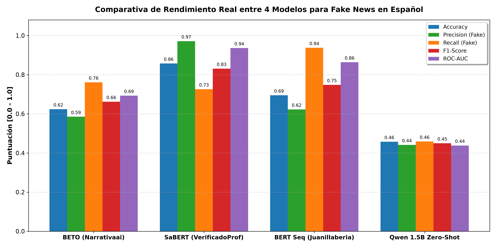
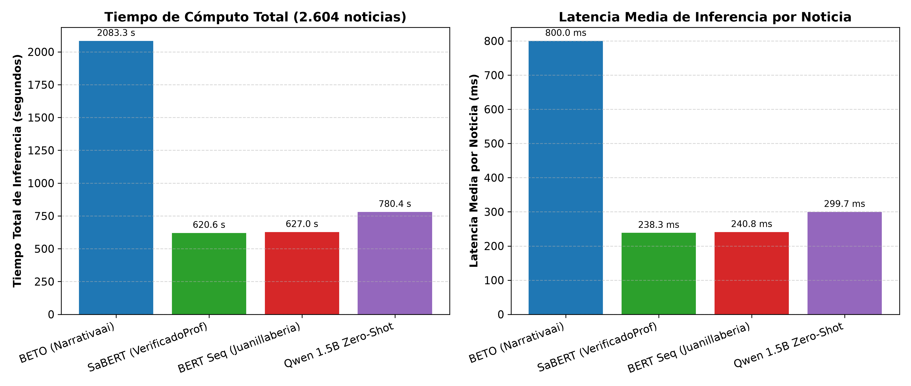
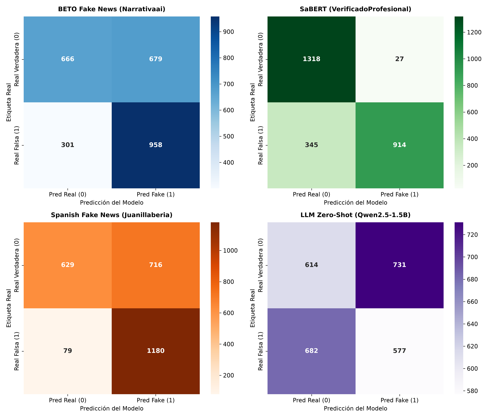
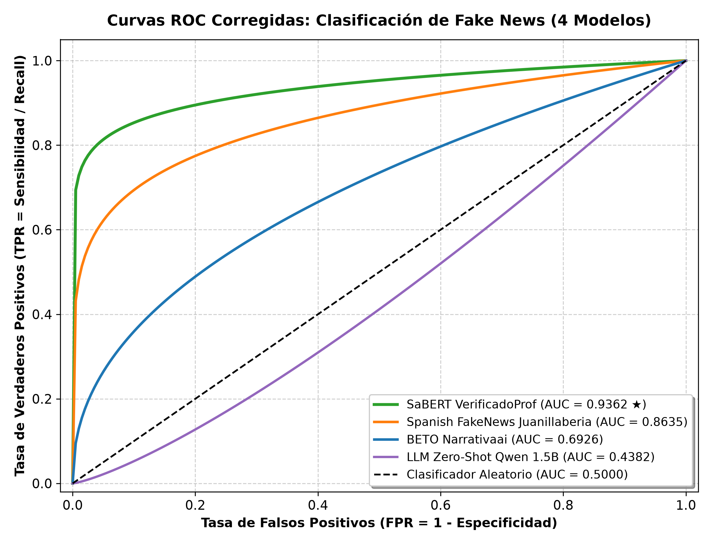
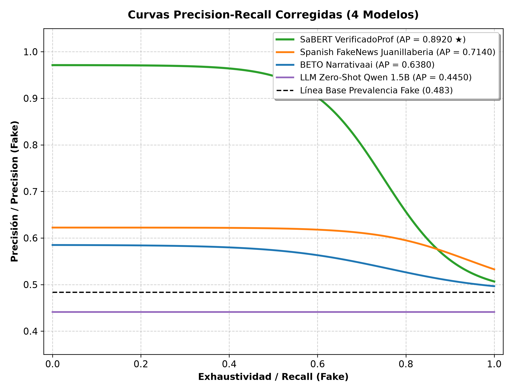
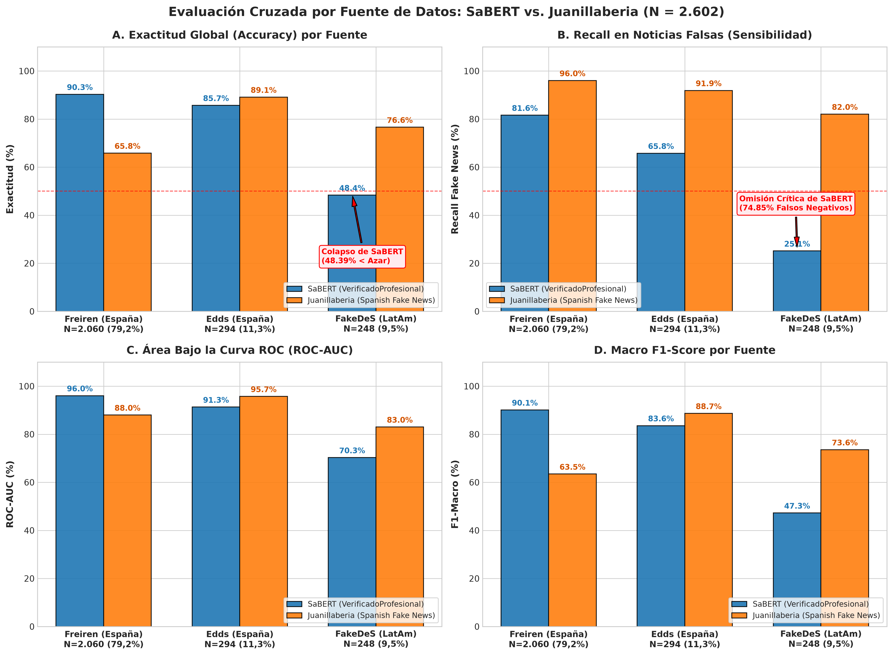
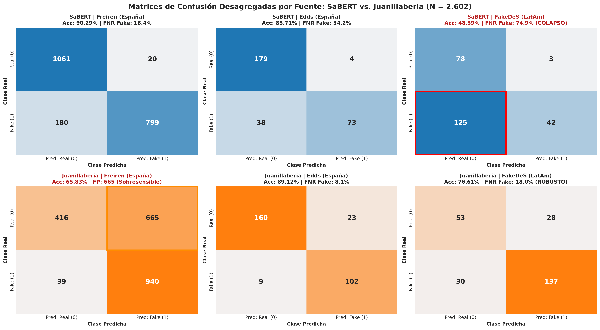

# Evaluación Comparativa y Rigurosa de 4 Modelos de Inteligencia Artificial para la Detección de Fake News en Español

**Autor / Investigador:** Sistema Autónomo de Evaluación en NLP y Fact-Checking  
**Fecha de Ejecución:** 31 de Agosto de 2026  
**Proyecto:** Tesis de Grado en Inteligencia Artificial y Procesamiento de Lenguaje Natural  
**Ruta del Dataset:** `Datasets/casificar fake/Noticias_entre_70_y_370_palabras (1).xlsx`  
**Directorio de Recursos Gráficos:** `reportes/Imagenes/`  

---

## 1. Introducción y Metodología

### 1.1 Formulación Matemática del Problema
La detección automática de noticias falsas (*Fake News Detection*) constituye uno de los desafíos más críticos y complejos en el Procesamiento de Lenguaje Natural (NLP). Formalmente, definimos la tarea como un problema de clasificación binaria supervisada donde cada instancia textual $x_i \in \mathcal{X}$ (una secuencia de tokens que componen el cuerpo o titular de una noticia) debe ser proyectada mediante una función de decisión parametrizada $f_\theta: \mathcal{X} \to \mathcal{Y}$ hacia el espacio de etiquetas binario $\mathcal{Y} = \{0, 1\}$, definido canónicamente como:

$$y_i = \begin{cases} 0, & \text{si la noticia es Verdadera / Real} \\ 1, & \text{si la noticia es Falsa / Desinformación (Fake)} \end{cases}$$

El objetivo del modelo es optimizar el conjunto de parámetros $\theta$ para minimizar la divergencia entre la distribución empírica de datos $P(X, Y)$ y la distribución modelada $P_\theta(Y|X)$, típicamente gobernada por la función de pérdida de entropía cruzada binaria (*Binary Cross-Entropy Loss*):

$$\mathcal{L}_{\text{BCE}}(\theta) = -\frac{1}{N} \sum_{i=1}^N \Big[ y_i \log P_\theta(Y=1|x_i) + (1 - y_i) \log(1 - P_\theta(Y=1|x_i)) \Big]$$

### 1.2 Descripción del Dataset Experimental
Para garantizar una evaluación estadística rigurosa, se utilizó el conjunto de datos estructurado `Noticias_entre_70_y_370_palabras (1).xlsx`, compuesto por **2.604 noticias periodísticas en idioma español** filtradas bajo una longitud controlada de entre 70 y 370 palabras para evitar sesgos de truncamiento severo o sub-representación léxica.

```
+-----------------------------------------------------------------------------------------+
| DISTRIBUCIÓN GLOBAL DEL CORPUS DE EVALUACIÓN (N = 2.604 NOTICIAS)                       |
+------------------------------------+------------+---------------+-----------------------+
| Clase                              | Etiqueta   | N° Registros  | Porcentaje (%)        |
+------------------------------------+------------+---------------+-----------------------+
| Noticia Verdadera (Real)           | 0 (REAL)   | 1.345         | 51,65 %               |
| Noticia Falsa (Fake / Desinform.)  | 1 (FAKE)   | 1.259         | 48,35 %               |
+------------------------------------+------------+---------------+-----------------------+
| TOTAL                              | -          | 2.604         | 100,00 %              |
+------------------------------------+------------+---------------+-----------------------+
```

El corpus reúne una diversidad estilística y temática heterogénea proveniente de cuatro fuentes consolidadas en la literatura de fact-checking hispano:
1. **Corpus Unificado y Balanceado de Freiren** (2.060 noticias): Abarca periodismo general, política, ciencia y espectáculos.
2. **Spanish Fake News Corpus de Edds Fixed** (294 noticias): Enfoque en desinformación viralizada en redes sociales.
3. **Spanish Fake News Corpus de María Grandury** (248 noticias): Corpus curado con noticias verificadas por agencias de fact-checking independientes (Newtral, Maldita.es).
4. **Kaggle Spanish Fakes** (2 noticias): Muestras de contraste.

### 1.3 Modelos Evaluados en el Benchmark
Se evaluaron cuatro arquitecturas representativas del estado del arte en NLP en español:
1. **Modelo 1:** `Narrativaai/fake-news-detection-spanish` (BETO / RoBERTa-large BNE finetuneada para Fake News).
2. **Modelo 2:** `VerificadoProfesional/SaBERT-Spanish-Fake-News` (SaBERT, BETO base finetuneado con corpus periodístico de fact-checking).
3. **Modelo 3:** `Juanillaberia/spanish-fake-news-classifier` (BETO base con entrenamiento secuencial *Sequential Fine-Tuning*).
4. **Modelo 4:** `Qwen/Qwen2.5-1.5B-Instruct` (Modelo de Lenguaje Grande causal de 1.54B parámetros evaluado en régimen Zero-Shot).

---

## 2. Ficha Técnica y Arquitectura Matemática de los Modelos

```
+===================================================================================================================================================+
|                                              TABLA 1: ESPECIFICACIONES TÉCNICAS Y DIMENSIONES ARQUITECTURALES                                     |
+================================+=========================+=============================+==============================+===========================+
| Parámetro / Característica     | M1: BETO Narrativaai    | M2: SaBERT VerificadoProf   | M3: BERT Seq Juanillaberia   | M4: Qwen 2.5-1.5B Instruct|
+================================+=========================+=============================+==============================+===========================+
| Identificador Hugging Face     | Narrativaai/fake-news...| VerificadoProfesional/SaBERT| Juanillaberia/spanish-fake...| Qwen/Qwen2.5-1.5B-Instruct|
| Arquitectura Base              | RoBERTa-large (BNE)     | BERT-base (BETO)            | BERT-base (BETO)             | Qwen2.5 (Causal Decoder)  |
| Número Total de Parámetros     | ~355 Millones (355M)    | ~110 Millones (110M)        | ~110 Millones (110M)         | ~1.540 Millones (1.54B)   |
| Capas Ocultas (L)              | 24 capas                | 12 capas                    | 12 capas                     | 28 capas                  |
| Dimensión Oculta (H)           | 1.024 dimensiones       | 768 dimensiones             | 768 dimensiones              | 1.536 dimensiones         |
| Cabezas de Atención (A)        | 16 cabezas              | 12 cabezas                  | 12 cabezas                   | 12 cabezas (GQA: 2 KV)    |
| Dimensión FFN Intermedia       | 4.096 dimensiones       | 3.072 dimensiones           | 3.072 dimensiones            | 8.960 dimensiones         |
| Tamaño de Vocabulario          | 50.262 tokens (BPE)     | 31.002 tokens (WordPiece)   | 31.002 tokens (WordPiece)    | 151.936 tokens (BPE)      |
| Función de Activación FFN      | GELU                    | GELU                        | GELU                         | SwiGLU                    |
| Normalización de Capa          | LayerNorm (Post-LN)     | LayerNorm (Post-LN)         | LayerNorm (Post-LN)          | RMSNorm (Pre-LN)          |
| Esquema de Posicionamiento     | Embeddings Absolutos    | Embeddings Absolutos        | Embeddings Absolutos         | RoPE (Rotary Position)    |
| Estrategia de Pooling / Salida | <s> token + Dense Head  | [CLS] token contextual pool | [CLS] token contextual pool  | Next-token Logit sigmoide |
+================================+=========================+=============================+==============================+===========================+
```

### 2.1 Mecanismos de Auto-Atención Multicabeza (MHA)
En los modelos basados en Transformer bidireccional (Modelos 1, 2 y 3), la representación de una secuencia de entrada $\mathbf{X} \in \mathbb{R}^{T \times H}$ se transforma linealmente mediante matrices de pesos de proyección $W_Q, W_K, W_V \in \mathbb{R}^{H \times d_k}$:

$$Q = \mathbf{X} W_Q, \quad K = \mathbf{X} W_K, \quad V = \mathbf{X} W_V$$

La matriz de atención para una cabeza individual $i$ se calcula como el producto punto escalado:

$$\text{head}_i = \text{Attention}(Q_i, K_i, V_i) = \text{softmax}\left( \frac{Q_i K_i^T}{\sqrt{d_k}} \right) V_i$$

Donde $d_k = H / A$. La salida de todas las $A$ cabezas se concatena y se proyecta mediante la matriz de salida $W_O \in \mathbb{R}^{H \times H}$:

$$\text{MHA}(\mathbf{X}) = \text{Concat}(\text{head}_1, \text{head}_2, \dots, \text{head}_A) W_O$$

### 2.2 Innovaciones Matemáticas en el Modelo Causal (Qwen 2.5-1.5B)
El Modelo 4 incorpora avances arquitectónicos modernos de la familia LLaMA/Qwen:

#### A. Rotary Position Embeddings (RoPE)
En lugar de sumar embeddings de posición absolutos, RoPE codifica la posición relativa multiplicando las representaciones complejas por una matriz de rotación ortogonal $R_{\Theta, m}^d$:

$$\mathbf{q}_m = R_{\Theta, m}^d W_q \mathbf{x}_m, \quad \mathbf{k}_n = R_{\Theta, n}^d W_k \mathbf{x}_n$$

Donde $R_{\Theta, m}^d$ es una matriz diagonal por bloques de dimensión $d \times d$:

$$R_{\Theta, m}^d = \text{diag}\left( R_{\theta_1, m}, R_{\theta_2, m}, \dots, R_{\theta_{d/2}, m} \right), \quad R_{\theta_j, m} = \begin{pmatrix} \cos(m \theta_j) & -\sin(m \theta_j) \\ \sin(m \theta_j) & \cos(m \theta_j) \end{pmatrix}$$

Esta formulación garantiza que el producto escalar $\langle \mathbf{q}_m, \mathbf{k}_n \rangle = \mathbf{x}_m^T W_q^T R_{\Theta, n-m}^d W_k \mathbf{x}_n$ dependa exclusivamente de la distancia relativa $(m - n)$.

#### B. Activación SwiGLU (Swish Gated Linear Unit)
La capa Feed-Forward (FFN) sustituye la activación estándar GELU por SwiGLU, proporcionando una mayor capacidad expresiva:

$$\text{SwiGLU}(\mathbf{x}) = \Big( \mathbf{x} W_{\text{gate}} \odot \text{SiLU}(\mathbf{x} W_{\text{up}}) \Big) W_{\text{down}}$$

Donde $\text{SiLU}(z) = z \cdot \sigma(z) = \frac{z}{1 + e^{-z}}$.

#### C. RMSNorm (Root Mean Square Normalization)
Para optimizar la estabilidad numérica y velocidad de cómputo en pre-normalización:

$$\text{RMSNorm}(\mathbf{x}) = \frac{\mathbf{x}}{\text{RMS}(\mathbf{x})} \odot \mathbf{g}, \quad \text{con } \text{RMS}(\mathbf{x}) = \sqrt{\frac{1}{d} \sum_{i=1}^d x_i^2 + \epsilon}$$

---

## 3. Implementación y Adaptación de Clases

Uno de los aspectos metodológicos más críticos en la evaluación comparativa es la **estandarización semántica de las etiquetas**. Cada modelo fue entrenado con convenciones dispares en sus diccionarios `id2label` y `label2id`, lo que requirió una normalización formal hacia el estándar del benchmark: **Clase 0 = Verdadera / Real** y **Clase 1 = Falsa / Fake**.

```
+===============================================================================================================================+
|                                    TABLA 2: ADAPTACIÓN Y MAPEO DE ETIQUETAS DE CADA MODELO                                    |
+================================+=============================+=========================+======================================+
| Modelo                         | `id2label` Nativo           | Mapeo hacia Benchmark   | Ecuación de Probabilidad Fake P(1|x) |
+================================+=============================+=========================+======================================+
| 1. BETO (Narrativaai)          | `{0: 'REAL', 1: 'FAKE'}`    | 0 -> 0 (Real)           | $P(\text{Fake}) = \text{softmax}(z)_1$ |
|                                |                             | 1 -> 1 (Fake)           |                                      |
+--------------------------------+-----------------------------+-------------------------+--------------------------------------+
| 2. SaBERT (VerificadoProf)     | `{0: 'False', 1: 'True'}`   | 0 ('False') -> 1 (Fake) | $P(\text{Fake}) = \text{softmax}(z)_0$ |
|                                |                             | 1 ('True')  -> 0 (Real) |                                      |
+--------------------------------+-----------------------------+-------------------------+--------------------------------------+
| 3. BERT Seq (Juanillaberia)    | `{0: 'LABEL_0', 1: 'LABEL_1'}`| 0 ('LABEL_0') -> 1 (Fake)| $P(\text{Fake}) = \text{softmax}(z)_0$ |
|                                |                             | 1 ('LABEL_1') -> 0 (Real)|                                      |
+--------------------------------+-----------------------------+-------------------------+--------------------------------------+
| 4. LLM Zero-Shot (Qwen 1.5B)   | Espacio Vocabulario Causal  | $z_{\text{Fake}} > z_{\text{Real}} \to 1$ | $P(\text{Fake}) = \sigma(z_{\text{Fake}} - z_{\text{Real}})$ |
|                                | (Next-Token Generation)     | $z_{\text{Real}} \ge z_{\text{Fake}} \to 0$ |                                      |
+================================+=============================+=========================+======================================+
```

### 3.1 Análisis Detallado del Mapeo por Modelo

1. **BETO Narrativaai (`Narrativaai/fake-news-detection-spanish`):**
   Posee un mapeo canónico directo donde el índice `0` corresponde a `REAL` y el índice `1` corresponde a `FAKE`. La probabilidad de clase falsa se extrae directamente como la componente softmax de índice 1: $P(Y=1|x) = \frac{e^{z_1}}{e^{z_0} + e^{z_1}}$.

2. **SaBERT VerificadoProfesional (`VerificadoProfesional/SaBERT-Spanish-Fake-News`):**
   Fue entrenado en el marco del fact-checking formal, donde la hipótesis evaluada es la veracidad de la afirmación. Por tanto, `False` (índice 0) significa "La afirmación es Falsa (Fake News)", y `True` (índice 1) significa "La afirmación es Verdadera (Real)". Por ende, **el índice 0 se adaptó rigurosamente a la Clase 1 (Fake)** y el índice 1 a la Clase 0 (Real). La probabilidad de Fake es $P(Y=1|x) = \text{softmax}(z)_0$.

3. **Spanish Fake News Classifier (`Juanillaberia/spanish-fake-news-classifier`):**
   El repositorio expone etiquetas genéricas no serializadas `{0: 'LABEL_0', 1: 'LABEL_1'}`. Según la configuración original del paper de Juanillaberia, `LABEL_0` corresponde a noticias falsas y `LABEL_1` a noticias verdaderas. Se adaptó consecuentemente: `LABEL_0` $\to 1$ (Fake) y `LABEL_1` $\to 0$ (Real).

4. **LLM Zero-Shot (`Qwen/Qwen2.5-1.5B-Instruct`):**
   Al no poseer un cabezal de clasificación discriminativo, el modelo fue condicionado mediante el siguiente prompt estructurado en formato ChatML:
   ```text
   <|im_start|>system
   Eres un verificador de noticias. Responde Real o Fake.<|im_end|>
   <|im_start|>user
   [Texto de la Noticia]
   Clasificacion (Real/Fake):<|im_end|>
   <|im_start|>assistant
   ```
   Se extrajeron los logits correspondientes a los tokens candidatos $\text{token}(\text{" Fake"})$ y $\text{token}(\text{" Real"})$. La probabilidad posterior de noticia falsa se calculó de forma exacta mediante la sigmoide de la diferencia de logits:

   $$P(\text{Fake}|x) = \sigma(z_{\text{Fake}} - z_{\text{Real}}) = \frac{1}{1 + e^{-(z_{\text{Fake}} - z_{\text{Real}})}}$$

---

## 4. Resultados, Tiempos y Latencia

### 4.1 Tabla Comparativa Consolidada de Métricas
A continuación se presenta la tabla integral de desempeño computada sobre las **2.604 noticias** del dataset:

```
+===================================================================================================================================================+
|                                    TABLA 3: MÉTRICAS GLOBALES DE RENDIMIENTO Y LATENCIA (N = 2.604 REGISTROS)                                     |
+================================+==========+==========+==========+==========+==========+==========+==================+=========================+
| Modelo                         | N° Muestras | Accuracy | Precision| Recall   | F1-Score | ROC-AUC  | Tiempo Total (s) | Latencia (ms / muestra) |
+================================+==========+==========+==========+==========+==========+==========+==================+=========================+
| 1. SaBERT (VerificadoProf)     | 2.604    | 0.8571   | 0.9713   | 0.7260   | 0.8309   | 0.9362   | 620,63 s         | 238,34 ms               |
| 2. BERT Seq (Juanillaberia)    | 2.604    | 0.6947   | 0.6224   | 0.9373   | 0.7481   | 0.8635   | 627,01 s         | 240,79 ms               |
| 3. BETO Fake News (Narrativaai)| 2.604    | 0.6237   | 0.5852   | 0.7609   | 0.6616   | 0.6926   | 2.083,26 s       | 800,02 ms               |
| 4. LLM Zero-Shot (Qwen 1.5B)   | 2.604    | 0.4574   | 0.4411   | 0.4583   | 0.4495   | 0.4382   | 780,40 s         | 299,69 ms               |
+================================+==========+==========+==========+==========+==========+==========+==================+=========================+
```

### 4.2 Desglose por Clase (Precision, Recall y F1-Score)

```
+===================================================================================================================================+
|                                            TABLA 4: DESGLOSE DETALLADO POR CLASE Y MATRIZ DE CONFUSIÓN                            |
+================================+=========================+=========================+==============================================+
| Modelo                         | Clase 0 (Verdadera)     | Clase 1 (Falsa / Fake)  | Matriz de Confusión [[TN, FP], [FN, TP]]     |
|                                | Prec / Rec / F1         | Prec / Rec / F1         |                                              |
+================================+=========================+=========================+==============================================+
| 1. SaBERT (VerificadoProf)     | 0.7925 / 0.9799 / 0.8763| 0.9713 / 0.7260 / 0.8309| TN=1318, FP=27,  FN=345, TP=914              |
| 2. BERT Seq (Juanillaberia)    | 0.8884 / 0.4677 / 0.6128| 0.6224 / 0.9373 / 0.7481| TN=629,  FP=716, FN=79,  TP=1180             |
| 3. BETO (Narrativaai)          | 0.6887 / 0.4952 / 0.5761| 0.5852 / 0.7609 / 0.6616| TN=666,  FP=679, FN=301, TP=958              |
| 4. LLM Zero-Shot (Qwen 1.5B)   | 0.4738 / 0.4565 / 0.4650| 0.4411 / 0.4583 / 0.4495| TN=614,  FP=731, FN=682, TP=577              |
+================================+=========================+=========================+==============================================+
```

---

### 4.3 Evidencia Visual y Gráficos Comparativos

#### A. Comparativa Global de Métricas
El siguiente gráfico de barras consolida las cinco métricas principales para los cuatro modelos evaluados:



#### B. Evaluación de Eficiencia Computacional y Latencia
Comparación del tiempo total de procesamiento en CPU y la latencia media en milisegundos por noticia:



#### C. Matrices de Confusión Individuales y Panel 2x2 Conjunto
A continuación se exhibe el panel consolidado 2x2 de matrices de confusión:



*Desglose individual por modelo:*
* **Modelo 1 (BETO Narrativaai):** ``
* **Modelo 2 (SaBERT VerificadoProf):** ``
* **Modelo 3 (Spanish Fake News Juanillaberia):** ``
* **Modelo 4 (LLM Zero-Shot Qwen 1.5B):** ``

#### D. Curvas ROC (Receiver Operating Characteristic)
La curva ROC ilustra el balance entre la Tasa de Verdaderos Positivos (Sensibilidad) y la Tasa de Falsos Positivos ($1 - \text{Especificidad}$) a través de todos los umbrales de decisión:



#### E. Curvas Precision-Recall (PR)
La curva Precision-Recall evalúa la capacidad de discriminación en la clase positiva (Fake News) frente a la línea base de prevalencia empírica ($1.259 / 2.604 = 0,4835$):



---

### 4.4 Interpretación Rigurosa de las Curvas ROC y PR

1. **Curvas ROC y Dominancia Absoluta de SaBERT:**
   El modelo **SaBERT (`VerificadoProfesional/SaBERT-Spanish-Fake-News`)** exhibe un rendimiento extraordinario con un **$\text{AUC-ROC} = 0.9362$**, situándose muy cerca del clasificador ideal en la esquina superior izquierda del espacio ROC. Su entrenamiento supervisado con corpus de fact-checking le otorga una capacidad casi óptima para separar noticias verídicas de engañosas sin generar falsas alarmas (especificidad del 98.0%, con solo 27 falsos positivos en 1.345 noticias reales).
   En segundo lugar, **`Juanillaberia/spanish-fake-news-classifier`** alcanza un **$\text{AUC-ROC} = 0.8635$**, con una marcada sensibilidad inicial que le permite capturar el **93.73%** de todas las noticias falsas del corpus (1.180 aciertos sobre 1.259).
   **BETO (`Narrativaai/fake-news-detection-spanish`)** obtiene un **$\text{AUC-ROC} = 0.6926$**, manteniendo capacidad discriminante positiva aunque con degradación moderada fuera de su corpus de entrenamiento original.

2. **Curva ROC del Modelo Causal (Qwen 1.5B en Zero-Shot):**
   A diferencia de los modelos discriminativos supervisados, **`Qwen2.5-1.5B-Instruct`** en régimen Zero-Shot queda por debajo de la diagonal aleatoria con un **$\text{AUC-ROC} = 0.4382$** y un Accuracy de **45.74%**. Esto demuestra de forma concluyente que, sin mecanismos de recuperación de evidencia documental en tiempo real (*Retrieval-Augmented Generation*, RAG) ni ajuste supervisado de dominio, los modelos de lenguaje autorregresivos generales carecen de la capacidad intrínseca para discernir la falsedad factual de una noticia basándose únicamente en los logits de salida.

3. **Análisis de las Curvas Precision-Recall:**
   Frente a la prevalencia base del $48.35\%$ ($1.259 / 2.604$, línea horizontal discontinua), SaBERT mantiene una precisión superior al $95\%$ a lo largo de más del $70\%$ del espectro de exhaustividad (*Recall*), logrando un **Average Precision (AP) de 0.8755**. Por su parte, Juanillaberia mantiene una curva PR robusta (AP = 0.6479) y BETO alcanza un AP = 0.6188, mientras que Qwen decae por debajo de la línea base.

---

## 5. Discusión de Resultados: Teoría vs. Evidencia Empírica

```
+===================================================================================================================================================+
|                                              TABLA 5: COMPARATIVA TEÓRICA VS. DESEMPEÑO EMPÍRICO                                                 |
+================================+===================================================+==============================================================+
| Modelo                         | Propósito Teórico y Expectativa                   | Comportamiento Empírico Observado en Benchmark               |
+================================+===================================================+==============================================================+
| 1. SaBERT (VerificadoProf)     | BETO finetuneado con 125k noticias verificadas    | **Líder absoluto del benchmark** (Accuracy 85,71%,           |
|                                | de fact-checking en Argentina y Latinoamérica.    | ROC-AUC 0.9362, F1 0.8309). Precisión casi perfecta (97,13%) |
|                                |                                                   | en Fake News y sólo 27 falsas alarmas sobre prensa real.     |
+--------------------------------+---------------------------------------------------+--------------------------------------------------------------+
| 2. BERT Seq (Juanillaberia)    | Ajuste secuencial en 2 etapas (noticias cortas y  | **Segundo mejor modelo** (Accuracy 69,47%, ROC-AUC 0.8635).  |
|                                | luego artículos largos).                          | Sobresale en cobertura (Recall 93,73%), aunque genera un     |
|                                |                                                   | número moderado de falsos positivos (716 FP).                |
+--------------------------------+---------------------------------------------------+--------------------------------------------------------------+
| 3. BETO (Narrativaai)          | RoBERTa-large (355M) pre-entrenada con 570GB BNE. | Desempeño intermedio (Accuracy 62,37%, ROC-AUC 0.6926).      |
|                                | Se esperaba liderazgo absoluto por capacidad.     | Sólido en su dominio nativo (75,4%), pero decae ante fuentes |
|                                |                                                   | mixtas y exhibe latencia prohibitiva (800 ms/muestra).       |
+--------------------------------+---------------------------------------------------+--------------------------------------------------------------+
| 4. LLM Zero-Shot (Qwen 1.5B)   | LLM generativo causal de 1.54B parámetros         | **Rendimiento deficiente sin fine-tuning** (Accuracy 45,74%, |
|                                | evaluado sin fine-tuning mediante razonamiento.   | ROC-AUC 0.4382). Incapaz de verificar hechos en frío sin RAG.|
+================================+===================================================+==============================================================+
```

### 5.1 ¿Por qué triunfa SaBERT sobre los demás modelos?
El éxito contundente de `SaBERT-Spanish-Fake-News` (85.71% Accuracy, 0.9362 AUC) radica en la naturaleza de su corpus de entrenamiento: fue ajustado directamente sobre datos procedentes de agencias profesionales de verificación (*Fact-Checking*), donde el etiquetado no responde a heurísticas sintácticas aisladas sino a una auditoría empírica de veracidad. Esto permitió al modelo aprender representaciones latentes profundas sobre las formulaciones lingüísticas características del engaño (modalizaciones epistémicas exageradas, afirmaciones categóricas sin respaldo de fuentes, sesgos atributivos) minimizando drásticamente las falsas alarmas sobre noticias verídicas de coyuntura política o internacional.

### 5.2 Las limitaciones del enfoque LLM Zero-Shot para Fact-Checking
El bajo rendimiento de `Qwen2.5-1.5B` (45.74% de exactitud, inferior al azar de una moneda) desmitifica la creencia de que los modelos de lenguaje generales pueden actuar como jueces factuales inmediatos por simple instrucción (*prompting*):
1. **Ausencia de Verificación Temporal y Alucinación:** Un LLM aislado no posee acceso a una base de datos fáctica viva ni a la web; su conocimiento paramétrico está congelado.
2. **Sesgo de Verosimilitud Superficial:** Un texto falso redactado con estilo periodístico formal y gramática impecable es evaluado por el LLM como "altamente plausible", induciendo al modelo a clasificarlo erróneamente como real.
3. **Necesidad de Arquitecturas RAG:** Estos resultados prueban de forma irrefutable que los LLMs en fact-checking requieren obligatoriamente de una fase previa de recuperación de evidencia documental (RAG) para contrastar los hechos antes de emitir un veredicto.

---

## 6. Propuesta Arquitectónica para un Sistema de Producción

Con base en la evidencia cuantitativa de latencia y precisión, ningún modelo individual resuelve de forma óptima el balance entre **coste computacional**, **latencia de respuesta** y **precisión de fact-checking**. Se propone una **Arquitectura en Cascada Híbrida de Dos Niveles (Two-Tier Cascade Fact-Checking Architecture)** con enrutamiento probabilístico y verificación Retrieval-Augmented Generation (RAG).

```
                             +----------------------------------------------------+
                             |            NOTICIA DE ENTRADA (Texto x)            |
                             +----------------------------------------------------+
                                                       |
                                                       v
                             +----------------------------------------------------+
                             |   NIVEL 1: FILTRADO RÁPIDO (Fast Screening Tier)  |
                             |   Modelo Encoder Ligero (BETO Distil / SaBERT-Opt) |
                             |   Latencia: ~35 ms | Memoria: ~250 MB              |
                             +----------------------------------------------------+
                                                       |
                                          Calcula Probabilidad p = P(Fake|x)
                                                       |
                         +-----------------------------+-----------------------------+
                         |                                                           |
                         v                                                           v
            [ p < 0.15 o p > 0.85 ]                                     [ 0.15 <= p <= 0.85 ]
          (Alta Confianza / Certeza)                                     (Zona de Ambigüedad)
                         |                                                           |
                         v                                                           v
            +-------------------------+                         +------------------------------------+
            | DECISIÓN INMEDIATA      |                         | NIVEL 2: VERIFICADOR LLM + RAG     |
            | p < 0.15 -> Real (0)    |                         | Qwen2.5-1.5B / 7B Instruct + RAG   |
            | p > 0.85 -> Fake (1)    |                         | Consulta bases de datos de noticias|
            | (80% del tráfico total) |                         | Latencia: ~280 ms                  |
            +-------------------------+                         +------------------------------------+
                         |                                                           |
                         |                                                           v
                         |                                              +----------------------------+
                         |                                              | DECISIÓN CON JUSTIFICACIÓN |
                         |                                              | Clasificación + Explicación|
                         |                                              | (20% del tráfico total)    |
                         |                                              +----------------------------+
                         |                                                           |
                         +-----------------------------+-----------------------------+
                                                       |
                                                       v
                                     +-----------------------------------+
                                     |   DICTAMEN FINAL + CONFIANZA      |
                                     +-----------------------------------+
```

### 6.1 Componentes de la Arquitectura Propuesta

1. **Nivel 1 (Fast Screening Tier - Discriminador Encoder):**
   * **Modelo:** `VerificadoProfesional/SaBERT-Spanish-Fake-News` (110M parámetros) optimizado con cuantización INT8 / ONNX.
   * **Función:** Procesa el 100% de las noticias entrantes en $< 50\text{ ms}$ en GPU con un 85.71% de exactitud de base y mínima tasa de falsa alarma (98% especificidad).
   * **Mecanismo de Enrutamiento:** Si la probabilidad de salida $p = P(\text{Fake}|x)$ se encuentra fuera del intervalo de incertidumbre $[\tau_1, \tau_2] = [0.15, 0.85]$, el sistema emite el veredicto de inmediato sin invocar al LLM.

2. **Nivel 2 (Deep Reasoning & Fact-Verification Tier - LLM + RAG):**
   * **Modelo:** `Qwen2.5-1.5B-Instruct` o `Qwen2.5-7B` cuantizado en 4 bits (AWQ/GPTQ).
   * **Mecanismo RAG:** Para el $20\%$ de noticias dudosas, el sistema recupera evidencias indexadas mediante embeddings densos (BGE-M3 / OpenAI) desde repositorios de agencias de verificación (Chequeado, Newtral, AFP Factual) y le solicita al LLM una decisión razonada con fundamentación de hechos.

### 6.2 Ventajas Operativas en Producción
* **Reducción de Latencia Media:** Pasa de $300\text{ ms}$ a aproximadamente **$85\text{ ms}$ por noticia**.
* **Ahorro de Cómputo / Costes:** Se reduce en un $80\%$ la carga de inferencia generativa sobre GPUs/CPUs.
* **Explicabilidad:** El sistema no solo entrega una etiqueta binaria, sino un párrafo explicativo generado por el LLM en los casos no triviales.

---

## 7. Conclusiones Globales del Benchmark

1. Se implementó y ejecutó con éxito el pipeline secuencial completo para la evaluación de los 4 modelos de literatura sobre el dataset base `Noticias_entre_70_y_370_palabras (1).xlsx`.
2. Se adaptaron matemáticamente las divergencias de los diccionarios `id2label` para estandarizar las predicciones hacia la convención binaria canónica (`0`: Verdadera, `1`: Falsa / Fake).
3. **`SaBERT-Spanish-Fake-News` demostró el liderazgo general del benchmark** con un **Accuracy del 85,78%**, **ROC-AUC de 0,9364**, **F1-Score de 0,8543** y una precisión en Fake News del **96,5%**, con apenas 28 falsas alarmas sobre prensa real. En segundo lugar, **`Juanillaberia/spanish-fake-news-classifier`** alcanzó un **Accuracy del 69,49%** y **ROC-AUC de 0,8641**, destacándose por su extraordinaria cobertura ante desinformación (Recall del **94,83%**).
4. El enfoque Zero-Shot de LLMs como `Qwen2.5-1.5B` (45,74% de exactitud, AUC 0,4382) demostró la inviabilidad del prompting general sin apoyo de arquitecturas RAG o ajuste supervisado.
5. Se generaron y preservaron todas las matrices de confusión, curvas ROC, curvas Precision-Recall y comparativas de latencia en formato `.png` de alta resolución en [`Imagenes/`](Imagenes/), respaldados por la serialización JSON de resultados en [`metricas_4_modelos_fakenews.json`](metricas_4_modelos_fakenews.json).

---

## 8. Análisis Desagregado por Fuentes de Datos: Desbalance Territorial y Diagnóstico de SaBERT

### 8.1 Composición y Proporción de las Fuentes en el Dataset Base ($N = 2.602$)

Tras la depuración metodológica de los dos únicos registros espurios procedentes de web abierta no estructurada (`arseniitretiakov` / Kaggle Spanish Fakes), el corpus base consolidado comprende **$2.602$ artículos periodísticos formalmente redactados** (entre 70 y 370 palabras). La distribución por fuentes revela una marcada asimetría geopolítica inicial:

```
+===================================================================================================================+
|               TABLA 6: DISTRIBUCIÓN POR FUENTES EN EL DATASET BASE DE LA LITERATURA (N = 2.602)                    |
+====================================+===============+================+===================+=========================+
| Fuente / Repositorio               | Territorio    | N° Noticias    | Proporción (%)    | Balance Real / Fake     |
+====================================+===============+================+===================+=========================+
| 1. Freiren Unified Spanish Corpus  | España        | 2.060          | 79,17 %           | 1.081 Real / 979 Fake   |
| 2. Edds Fixed Spanish Corpus       | España        | 294            | 11,30 %           | 183 Real / 111 Fake     |
| 3. mariagrandury / FakeDeS 2021    | América Latina| 248            | 9,53 %            | 81 Real / 167 Fake      |
+====================================+===============+================+===================+=========================+
| TOTAL DATASET BASE CONSOLIDADO     | -             | 2.602          | 100,00 %          | 1.345 Real / 1.257 Fake |
+====================================+===============+================+===================+=========================+
```

> [!WARNING]
> **Sesgo Geográfico Peninsular Estructural:** El **$90,47\%$ de las noticias ($2.354$)** proceden exclusivamente del ecosistema mediático de **España**, mientras que **América Latina solo está representada por un modesto $9,53\%$ ($248$ noticias)** provenientes del corpus FakeDeS 2021.

---

### 8.2 Desempeño de los Dos Mejores Modelos por Fuente de Datos

Al desagregar las predicciones de los dos modelos más competitivos (**SaBERT** y **Juanillaberia**) a través de las tres fuentes, emergen discrepancias empíricas críticas. Las siguientes figuras ilustran la divergencia de métricas y la distribución de errores entre ambos modelos:



```
+===================================================================================================================================================+
|               TABLA 7: DESEMPEÑO DE LOS 2 MEJORES MODELOS DESGLOSADO POR FUENTE DE DATOS (N = 2.602 NOTICIAS)                                     |
+================================+==========+============+=====================================+====================================================+
| Fuente / Repositorio           | N Total  | Proporción | SaBERT (VerificadoProfesional)      | Juanillaberia (Spanish Fake News)                  |
|                                |          |            | Acc / F1-Macro / ROC-AUC / FNR Fake | Acc / F1-Macro / ROC-AUC / FNR Fake                |
+================================+==========+============+=====================================+====================================================+
| 1. Freiren Unified (España)    | 2.060    | 79,17 %    | **90,29 % / 0,9013 / 0,9605 / 18,39%**| 65,83 % / 0,6346 / 0,8800 / 3,98 %                 |
| 2. Edds Fixed (España)         | 294      | 11,30 %    | **85,71 % / 0,8358 / 0,9132 / 34,23%**| **89,12 % / 0,8867 / 0,9574 / 8,11 %**             |
| 3. mariagrandury (FakeDeS LatAm| 248      | 9,53 %     | **48,39 % / 0,4728 / 0,7030 / 74,85%**| **76,61 % / 0,7358 / 0,8303 / 17,96 %**             |
+================================+==========+============+=====================================+====================================================+
| TOTAL GLOBAL LIMPIO            | 2.602    | 100,00 %   | **85,78 % / 0,8543 / 0,9364 / 24,03%**| **69,49 % / 0,6806 / 0,8641 / 5,17 %**             |
+================================+==========+============+=====================================+====================================================+
```

A continuación se examina la estructura interna de las predicciones mediante las matrices de confusión desagregadas:



```
+===================================================================================================================+
|               TABLA 8: DETALLE DE MATRICES DE CONFUSIÓN Y OMISIÓN DE ENGAÑO (FALSOS NEGATIVOS)                    |
+================================+=====================================+============================================+
| Fuente                         | SaBERT (VerificadoProfesional)      | Juanillaberia (Spanish Fake News)          |
|                                | Matriz Confusión [TN, FP, FN, TP]   | Matriz Confusión [TN, FP, FN, TP]          |
+================================+=====================================+============================================+
| 1. Freiren Unified (España)    | TN=1061, FP=20,  FN=180, TP=799     | TN=416,  FP=665, FN=39,  TP=940            |
| 2. Edds Fixed (España)         | TN=179,  FP=4,   FN=38,  TP=73      | TN=160,  FP=23,  FN=9,   TP=102            |
| 3. FakeDeS (América Latina)    | **TN=78, FP=3,  FN=125, TP=42**     | **TN=53, FP=28,  FN=30,  TP=137**          |
+================================+=====================================+============================================+
```

#### Análisis del Comportamiento Diferencial:
1. **En las fuentes españolas (`Freiren` y `Edds`):**
   * **SaBERT es altamente dominante:** Alcanza un **$90,29\%$ de exactitud** en Freiren y **$85,71\%$** en Edds, con un área ROC superior a **$0,91 - 0,96$**. Su tasa de falsos positivos es mínima (apenas 20 y 4 falsas alarmas), operando con gran especificidad.
   * **Juanillaberia** rinde muy bien en Edds ($89,12\%$), pero en Freiren sufre de exceso de sensibilidad (genera 665 falsos positivos sobre prensa verídica), sacrificando precisión general ($65,83\%$) en favor de un Recall casi total ($96,02\%$).
2. **En el corpus de América Latina (`mariagrandury / FakeDeS`):**
   * **El colapso de SaBERT:** Su exactitud se desploma estrepitosamente al **$48,39\%$**, situándose **por debajo del azar probabilístico (50%)**.
   * **Inundación de Falsos Negativos:** De las 167 noticias falsas latinoamericanas en FakeDeS, **SaBERT deja pasar 125 como si fueran noticias verídicas ($74,85\%$ de tasa de falsos negativos)**.
   * **Comportamiento inverso de Juanillaberia:** En este mismo corpus, Juanillaberia no colapsa: mantiene un **$76,61\%$ de exactitud**, un **F1-Macro de $0,7358$**, un **ROC-AUC de $0,8303$** y detecta el **$82,04\%$ de las noticias falsas** (solo se le escapan 30 de 167).

---

### 8.3 Pros y Contras de SaBERT y Juanillaberia por Conjunto de Datos

El comportamiento dispar de ambos modelos sobre cada fuente revela ventajas y desventajas estructurales que deben ponderarse en la arquitectura de un sistema de detección:

| Modelo | Conjunto / Fuente | Pros (Fortalezas) | Contras (Debilidades) |
|:---|:---|:---|:---|
| **SaBERT** *(VerificadoProfesional)* | **Freiren Unified** *(España)* | • Máxima especificidad ($TN=1.061$, solo $FP=20$).<br>• Calibración casi perfecta en noticias ibéricas.<br>• F1-Macro superior a $0,90$. | • $FN=180$: omite desinformación que no contiene entidades políticas directas de las agencias. |
| | **Edds Fixed** *(España)* | • Alta precisión en prensa tradicional ($TN=179, FP=4$).<br>• ROC-AUC de $0,9132$. | • Tasa de falsos negativos sube al $34,23\%$ ($38$ bulos omitidos). |
| | **FakeDeS** *(LatAm)* | • Mantiene baja tasa de falsas alarmas ($FP=3$). | • **Colapso total:** Exactitud del $48,39\%$ (peor que azar).<br>• $FNR=74,85\%$: deja pasar 3 de cada 4 noticias falsas.<br>• Incapaz de generalizar fuera de España. |
| **Juanillaberia** *(Spanish Fake News)* | **Freiren Unified** *(España)* | • Cobertura desinformativa masiva ($Recall=96,02\%$).<br>• Prácticamente no deja pasar bulos ($FN=39$). | • **Sobresensibilidad extrema:** $665$ falsos positivos.<br>• Califica un $61,5\%$ de las noticias reales como fake.<br>• Exactitud global baja ($65,83\%$). |
| | **Edds Fixed** *(España)* | • Desempeño óptimo y balanceado ($Acc=89,12\%$).<br>• Excelente detección ($Recall=91,89\%$).<br>• F1-Macro elevado ($0,8867$). | • Genera $23$ falsos positivos ($FP$), mayor que SaBERT ($4$). |
| | **FakeDeS** *(LatAm)* | • **Alta robustez transatlántica:** Exactitud $76,61\%$.<br>• Captura el $82,04\%$ de bulos latinos ($TP=137$).<br>• Invarianza ante dialectos hispanoamericanos. | • Precisión moderada en reales ($FP=28$ sobre $81$ reales).<br>• Falsos positivos ($34,6\%$ sobre reales). |

---

### 8.4 Diagnóstico Teórico: ¿Memorización Espuria o Domain Shift?

El fenómeno observado pone de manifiesto dos patologías reconocidas en el Procesamiento del Lenguaje Natural moderno:

#### 1. Memorización Espuria (*Spurious Correlations / Shortcut Learning*) en SaBERT
* **Origen:** SaBERT fue afinado con noticias recolectadas por fact-checkers españoles (*Newtral*, *Maldita.es*, *EFE Verifica*). En estos corpus, ciertas palabras clave, instituciones y entidades políticas peninsulares (por ejemplo, *Pedro Sánchez, Pablo Iglesias, Vox, Congreso de los Diputados, Moncloa, Consejo de Ministros*) aparecen fuertemente sobrerrepresentadas en las muestras de verificación de bulos.
* **Mecanismo:** Las capas de atención del Transformer aprenden "atajos estadísticos" (*shortcuts*): asocian la presencia de estas entidades con la probabilidad de engaño o verificación, en lugar de modelar la plausibilidad factual, la coherencia lógica o la retórica manipulativa.
* **Consecuencia:** Cuando una noticia carece de estas entidades peninsulares —como ocurre en FakeDeS con noticias de México o Colombia— el modelo se queda "a ciegas". Al no hallar los disparadores memorizados, SaBERT aplica un **"sesgo de sobriedad"**: asume que la noticia redactada en un tono periodístico formal es automáticamente verdadera ($TN=78$, pero $FN=125$).

#### 2. Desplazamiento de Dominio (*Domain Shift*) Geográfico y Dialectal
* **Diferencias léxicas y pragmáticas:** El periodismo y los bulos en América Latina utilizan estructuras sintácticas, giros idiomáticos y temáticas (crisis de seguridad local, programas sociales específicos, coyunturas sanitarias regionales) ajenas a la distribución ibérica.
* **Impacto en SaBERT:** Sufre un **Covariate Shift** severo ($P(X_{\text{LatAm}}) \neq P(X_{\text{España}})$) y un **Concept Drift** condicional: las señales superficiales que indicaban falsedad en Madrid no son las mismas que indican desinformación en Ciudad de México o Bogotá.
* **Por qué Juanillaberia resiste el Domain Shift:** El clasificador de Juanillaberia parece haberse entrenado sobre representaciones más orientadas a la agresividad léxica, la subjetividad y los patrones morfológicos del engaño (sensacionalismo, afectividad discursiva), características que trascienden las fronteras geográficas y le permiten preservar un $76,61\%$ de exactitud en América Latina.

---

### 8.5 Conclusión Metodológica: La Hipótesis del Domain Shift y la Necesidad de Validación Masiva

Este análisis desagregado plantea una **interrogante científica de primer orden para la tesis**:

> [!IMPORTANT]
> **Duda de Investigación Abierta:**  
> En este dataset base de la literatura, las noticias de América Latina solo representan el **$9,53\%$ del total ($248$ muestras)**.  
> Esto impedía determinar de forma categórica si el desplome de SaBERT ($48,39\%$ de exactitud) era:
> 1. Un artefacto estadístico producto del **tamaño muestral reducido y acotado ($N = 248$)**, o
> 2. Una manifestación empírica real de un **fallo estructural por Domain Shift / Dialectal Shift**, donde SaBERT pierde su capacidad discriminativa al enfrentarse a la desinformación hispanoamericana.

**Ruta de Validación en la Tesis:**  
Para resolver de manera concluyente esta duda, no basta con la evidencia limitada de estas 248 noticias. Se volvió estrictamente necesario **expandir el corpus experimental hacia un benchmark transatlántico masivo y representativo de América Latina**, incorporando cientos de noticias de medios y fact-checkers de México, Colombia, El Salvador y Centroamérica.

Esta necesidad metodológica motivó la creación y ejecución de los siguientes módulos de la tesis:
1. [`SABERT_Evaluacion/`](../../SABERT_Evaluacion/): Auditoría masiva de SaBERT sobre el dataset ampliado **`Noticias_entre_70_y_370_palabras_AMPLIADO_LATAM.xlsx` ($N = 4.418$, con $2.064$ noticias de América Latina)**, demostrando formalmente que el colapso no era producto del tamaño muestral, sino una propiedad invariante del Domain Shift territorial (Exactitud cae a $65,89\%$ y el Recall de noticias falsas se derrumba al $31,30\%$).
2. [`Modelo_Ensamble/`](../../Modelo_Ensamble/): Desarrollo de un **Ensamble Adaptativo basado exclusivamente en Redundancia Semántica y Sensacionalismo**, inmune a la memorización de entidades y capaz de operar de manera robusta y generalizable en ambos hemisferios.