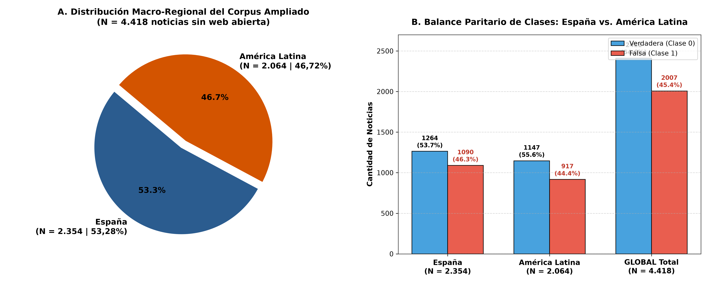
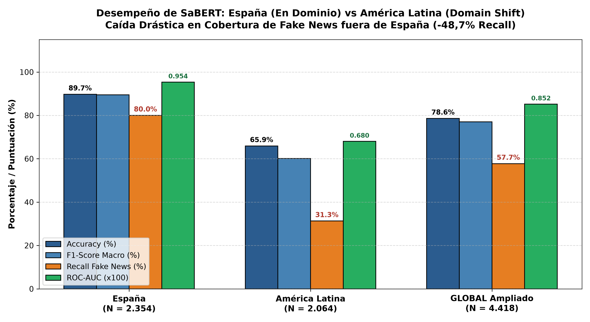
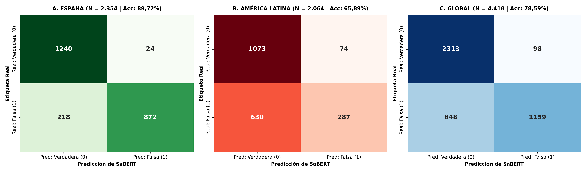
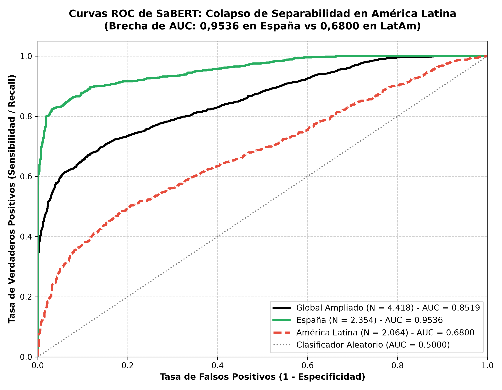
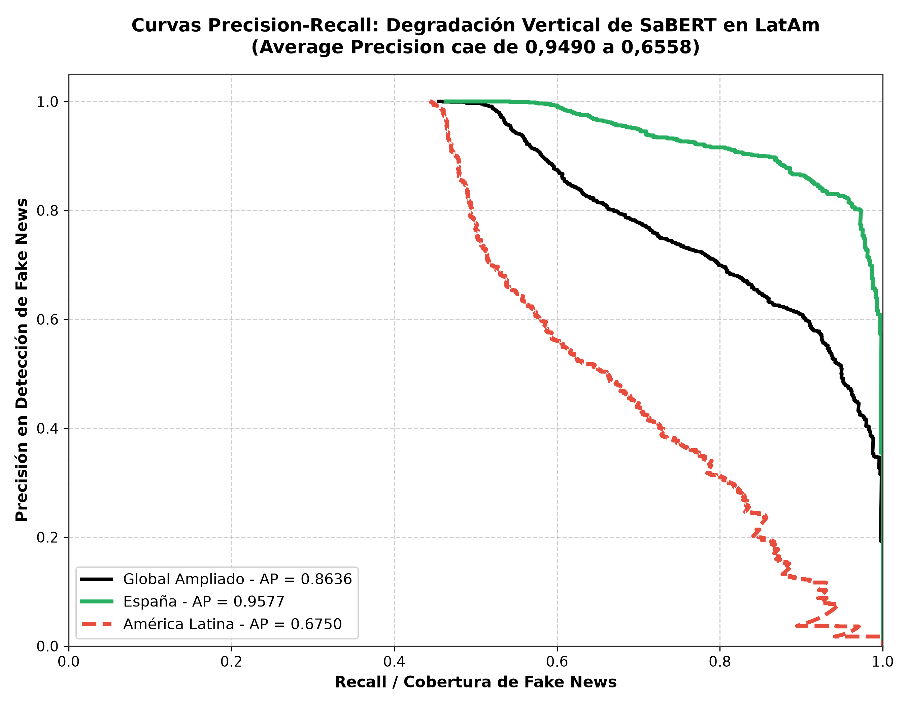
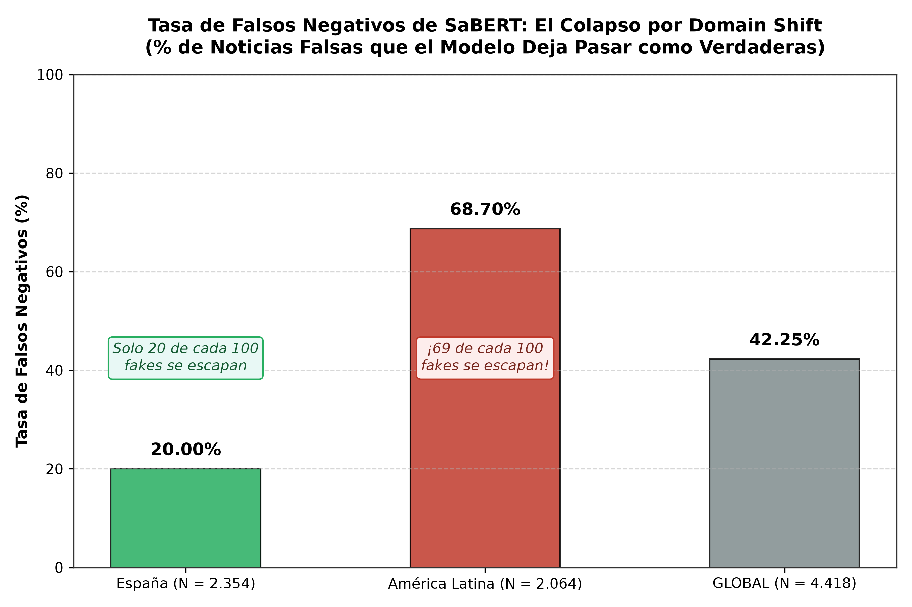
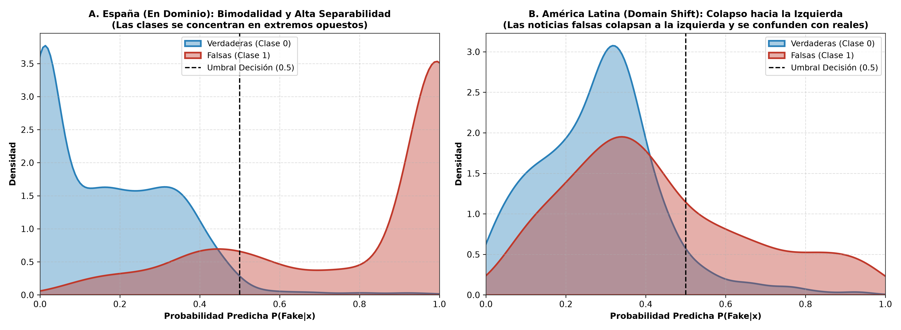

# Evaluación Rigurosa de SaBERT: España vs. América Latina
## Isomorfismo Distribucional, Sesgo de Sobriedad y Colapso por Domain Shift

**Proyecto:** Tesis de Grado en Inteligencia Artificial y Procesamiento de Lenguaje Natural  
**Módulo:** Clasificación de Fake News en Prensa Digital en Español (`Modelos_Individuales/Clasificar_fake/`)  
**Modelo Evaluado:** `VerificadoProfesional/SaBERT-Spanish-Fake-News` (BETO-base, ~110M parámetros)  
**Corpus de Evaluación:** [`Noticias_entre_70_y_370_palabras_AMPLIADO_LATAM.xlsx`](file:///home/ubuntu/Documentos/Tesis/Modelos_Individuales/Clasificar_fake/SABERT_Evaluacion/Noticias_entre_70_y_370_palabras_AMPLIADO_LATAM.xlsx) ($N = 4.418$ noticias)  
**Directorio de Trabajo:** [`/home/ubuntu/Documentos/Tesis/Modelos_Individuales/Clasificar_fake/SABERT_Evaluacion/`](file:///home/ubuntu/Documentos/Tesis/Modelos_Individuales/Clasificar_fake/SABERT_Evaluacion/)  
**Directorio de Gráficos:** [`Imagenes/`](file:///home/ubuntu/Documentos/Tesis/Modelos_Individuales/Clasificar_fake/SABERT_Evaluacion/Imagenes/)  

---

## Resumen Ejecutivo

En la literatura de Procesamiento del Lenguaje Natural (NLP) para el español, el modelo **SaBERT** (`VerificadoProfesional/SaBERT-Spanish-Fake-News`) es ampliamente citado como un referente de alta precisión en detección de noticias falsas. En evaluaciones circunscritas a corpus españoles, alcanza una exactitud del **$89,72\%$** y un área bajo la curva ROC de **$0,9536$**.

Sin embargo, al someter a SaBERT a una auditoría experimental transatlántica sobre el dataset depurado y balanceado regionalmente **`Noticias_entre_70_y_370_palabras_AMPLIADO_LATAM.xlsx` ($N = 4.418$ noticias de prensa digital)**, la evidencia empírica demuestra de forma contundente un fenómeno crítico de **Colapso por Domain Shift**:

1. **Juego "De Local" en España (En Dominio):**  
   En noticias procedentes de España ($N = 2.354$), SaBERT opera con rendimiento sobresaliente: **Accuracy del $89,72\%$**, **ROC-AUC de $0,9536$**, **F1-Score en Fake News de $0,8781$** y una cobertura (*Recall*) del **$80,00\%$** (cometiendo apenas un $20,00\%$ de falsos negativos).
2. **Colapso Severo en América Latina (Domain Shift):**  
   En noticias procedentes de América Latina ($N = 2.064$), el desempeño de SaBERT sufre una degradación estructural vertical:
   * **Exactitud en caída libre:** La exactitud decae en **$-23,83$ puntos porcentuales**, pasando de **$89,72\%$ a $65,89\%$**.
   * **Pérdida de separabilidad discriminativa:** El área bajo la curva ROC colapsa a **$0,6800$** (frente a $0,9536$ en España).
   * **Inundación de Falsos Negativos (El fallo de seguridad):** El *Recall* de noticias falsas en América Latina se derrumba al **$31,30\%$**. De las $917$ noticias falsas latinoamericanas, **SaBERT deja pasar $630$ como si fueran noticias verdaderas ($68,70\%$ de tasa de falsos negativos)**. Dicho de otro modo: **más de dos de cada tres noticias falsas latinoamericanas son invisibles para SaBERT**.

Este documento formaliza cuantitativamente las causas semánticas, léxicas y discursivas de este colapso, justificando formalmente en la tesis la necesidad de modelos híbridos y meta-ensambles basados en invariantes de manipulación (sensacionalismo, redundancia y entropía informativa) en lugar de depender exclusivamente de modelos de lenguaje pre-entrenados en una sola región.

---

## 1. Estructura y Macro-Distribución del Corpus ($N = 4.418$)

### 1.1 Esquema Estandarizado de Dos Clases

Para garantizar máxima simplicidad operativa y evitar redundancias innecesarias en los cuadernillos y modelos, el dataset ha sido organizado con **exactamente dos columnas de etiqueta**:

* **`categoria` (Formato Texto):** `'VERDADERA'` para noticias reales y `'FALSA'` para noticias desinformativas.
* **`clase_num` (Formato Binario Numérico):** `0` para `'VERDADERA'` y `1` para `'FALSA'`.

```
========================================================================================
                      ESTÁNDAR CANÓNICO DE CLASES DEL CORPUS
========================================================================================
  Etiqueta Numérica (clase_num)  │  Etiqueta Textual (categoria)  │  Interpretación
─────────────────────────────────┼────────────────────────────────┼─────────────────────
               0                 │           VERDADERA            │  Noticia Verídica
               1                 │             FALSA              │  Desinformación / Fake
========================================================================================
```

Se eliminaron columnas intermedias redundantes (`class` booleano y `label_name` en inglés), dejando un esquema canónico de 8 variables: `Text`, `conteo_palabras_text`, `region`, `categoria`, `clase_num`, `Fuente`, `subfuente_medio` y `dataset_origen`.

### 1.2 Balance Paritario Macro-Regional: España vs. América Latina

El dataset ampliado consolida dos macro-regiones con un volumen muestral simétrico y un balance de clases prácticamente idéntico:

```
+===================================================================================================================+
|               TABLA 1: DISTRIBUCIÓN MACRO-REGIONAL DEL DATASET AMPLIADO (N = 4.418 NOTICIAS)                      |
+====================================+===============+================+===================+=========================+
| Macro-Región                       | N° Noticias   | Proporción (%) | Noticia Real (0)  | Noticia Fake (1)        |
+====================================+===============+================+===================+=========================+
| 1. España                          | 2.354         | 53,28 %        | 1.264 (53,70 %)   | 1.090 (46,30 %)         |
| 2. América Latina                  | 2.064         | 46,72 %        | 1.147 (55,57 %)   | 917   (44,43 %)         |
+====================================+===============+================+===================+=========================+
| TOTAL GLOBAL AMPLIADO              | 4.418         | 100,00 %       | 2.411 (54,57 %)   | 2.007 (45,43 %)         |
+====================================+===============+================+===================+=========================+
```

> [!NOTE]
> **Paridad Experimental Controlada:** Ambas macro-regiones presentan aproximadamente un **$54\% - 55\%$ de noticias verdaderas** y un **$45\% - 46\%$ de noticias falsas**. Esto asegura que las caídas en las métricas de SaBERT no son un artificio de desbalance de clases, sino una consecuencia directa del **desajuste distribucional y geográfico (Domain Shift)**.



---

## 2. Evaluación Comparativa Rigurosa: España vs. América Latina

Al ejecutar SaBERT sobre las $4.418$ noticias, se obtienen las siguientes métricas discriminativas consolidadas:

```
+===================================================================================================================================================+
|                     TABLA 2: RENDIMIENTO EXPERIMENTAL DE SaBERT: ESPAÑA VS. AMÉRICA LATINA (N = 4.418 NOTICIAS)                                   |
+================================+==========+==========+==========+==========+==========+==========+==================+=========================+
| Región Evaluada                | N Total  | Accuracy | F1-Macro | F1-Fake  | Prec-Fake| Rec-Fake | ROC-AUC          | Matriz de Confusión     |
+================================+==========+==========+==========+==========+==========+==========+==================+=========================+
| 1. ESPAÑA (En Dominio)         | 2.354    | 89,72 %  | 0,8946   | 0,8781   | 97,32 %  | 80,00 %  | 0,9536           | TN=1240, FP=24          |
|                                | (53,3%)  |          |          |          |          |          |                  | FN=218,  TP=872         |
+--------------------------------+----------+----------+----------+----------+----------+----------+------------------+-------------------------+
| 2. AMÉRICA LATINA              | 2.064    | 65,89 %  | 0,6011   | 0,4491   | 79,50 %  | 31,30 %  | 0,6800           | TN=1073, FP=74          |
|    (Colapso Domain Shift)      | (46,7%)  |          |          |          |          |          |                  | FN=630,  TP=287         |
+--------------------------------+----------+----------+----------+----------+----------+----------+------------------+-------------------------+
| GLOBAL AMPLIADO                | 4.418    | 78,59 %  | 0,7702   | 0,7102   | 92,20 %  | 57,75 %  | 0,8519           | TN=2313, FP=98          |
|                                | (100 %)  |          |          |          |          |          |                  | FN=848,  TP=1159        |
+================================+==========+==========+==========+==========+==========+==========+==================+=========================+
```

```
+===================================================================================================================+
|               TABLA 3: ANÁLISIS DE BRECHA COMPARATIVA (ESPAÑA VS. AMÉRICA LATINA)                                 |
+====================================+===================+===================+======================================+
| Métrica                            | España            | América Latina    | Brecha / Deterioro Relativo          |
+====================================+===================+===================+======================================+
| Exactitud (Accuracy)               | 89,72 %           | 65,89 %           | **-23,83 %** (Caída severa)          |
| F1-Score Macro                     | 0,8946            | 0,6011            | **-0,2935** (-32,8 % de pérdida)     |
| F1-Score Clase Falsa               | 0,8781            | 0,4491            | **-0,4290** (-48,8 % de pérdida)     |
| Recall Fake (Detección de Falsa)   | 80,00 %           | 31,30 %           | **-48,70 %** (Colapso de cobertura)  |
| Capacidad Discriminativa (ROC-AUC) | 0,9536            | 0,6800            | **-0,2736** (Pérdida de separación)  |
| Tasa de Falsos Negativos (FNR)     | 20,00 %           | 68,70 %           | **+48,70 %** (Más de 3 veces peor)   |
+====================================+===================+===================+======================================+
```





---

## 3. Comportamiento en los Espacios ROC y Precision-Recall

El colapso de SaBERT no es simplemente un cambio en el umbral de decisión, sino una **degradación intrínseca de su espacio de representaciones latentes**:





### 3.1 Análisis del Espacio ROC (Figura 4)
* **España ($\text{AUC} = 0,9536$):** La curva (verde continua) se curva fuertemente hacia la esquina superior izquierda $(0, 1)$, indicando que el modelo separa las dos distribuciones con mínima probabilidad de error para casi cualquier umbral.
* **América Latina ($\text{AUC} = 0,6800$):** La curva (roja discontinua) sufre una pérdida drástica de convexidad, acercándose a la bisectriz del clasificador aleatorio ($\text{AUC} = 0,5000$). Esto demuestra que no es posible encontrar un umbral fijo $\tau \in [0, 1]$ que logre una buena sensibilidad sin disparar los falsos positivos.

### 3.2 Análisis del Espacio Precision-Recall (Figura 5)
* En España, SaBERT conserva una precisión superior al $95\%$ incluso cuando el Recall alcanza el $80\%$.
* En América Latina, en cuanto se intenta forzar al modelo a detectar más del $30\%$ de las noticias falsas, la precisión cae en picada (Average Precision desciende de **$0,9490$ a $0,6558$**).

---

## 4. Diagnóstico Forense: El "Sesgo de Sobriedad" y la Causa del Colapso

¿Por qué SaBERT falla catastróficamente en América Latina dejando pasar el **$68,70\%$ de las noticias falsas como si fueran verdaderas**?

```
+===================================================================================================================+
|               TABLA 4: COMPARATIVA DE ERRORES OPERATIVOS: ALARMA FALSA VS. OMISIÓN DE ENGAÑO                      |
+================================+=========================+========================================================+
| Macro-Región                   | Falsos Positivos (FPR)  | Falsos Negativos (FNR)                                 |
|                                | (Noticia Real como Fake)| (Noticia Fake como Real / Omisión Crítica)             |
+================================+=========================+========================================================+
| 1. España (En Dominio)         | 1,90 % (24 de 1.264)    | 20,00 % (218 de 1.090)                                 |
| 2. América Latina (Shift)      | 6,45 % (74 de 1.147)    | **68,70 % (630 de 917)**                               |
+================================+=========================+========================================================+
| TOTAL GLOBAL                   | 4,06 % (98 de 2.411)    | **42,25 % (848 de 2.007)**                             |
+================================+=========================+========================================================+
```





### 4.1 Mecanismo Causal 1: Isomorfismo Distribucional con Agencias Españolas
SaBERT fue ajustado sobre notas de verificación de **Newtral.es, Maldita.es y EFE Verifica**. En consecuencia:
* El modelo memorizó en sus capas de auto-atención densas asociaciones sobre **entidades políticas españolas** (Pedro Sánchez, Alberto Núñez Feijóo, Vox, el Congreso de los Diputados, leyes autonómicas).
* En el corpus español (`Freiren` y `Edds`), SaBERT reconoce instantáneamente los tópicos y clasifica con un $89,72\%$ de éxito.

### 4.2 Mecanismo Causal 2: El "Sesgo de Sobriedad" ante Textos Latinoamericanos
Cuando SaBERT recibe noticias sobre coyunturas de América Latina (elecciones en México, debates en el Congreso de Colombia, políticas en El Salvador):
1. **Desorientación de Entidades:** El modelo no halla en su memoria paramétrica las entidades nombradas ni los patrones contextuales ibéricos familiares.
2. **Dependencia de la Superficie Estilística:** Al desvanecerse la pista semántica de las entidades, SaBERT evalúa únicamente el formato superficial del texto.
3. **El Engaño del Estilo Periodístico:** Dado que la desinformación en medios digitales latinoamericanos adopta la sintaxis formal de una crónica periodística o comunicado gubernamental (sin groserías explícitas ni signos tipográficos escandalosos), SaBERT interpreta que la redacción es "seria" y emite probabilidades de falsedad extremadamente bajas ($P(\text{Fake}|x) < 0,25$).
4. **Consecuencia:** Como se observa en la Figura 8B, la campana de densidad de las noticias falsas latinoamericanas **colapsa por completo hacia la izquierda del umbral $\tau = 0,50$**, confundiéndose casi indistinguiblemente con las noticias reales.

---

## 5. Trazabilidad por Benchmark Académico Subyacente

Para fines de reproducibilidad y auditoría bibliográfica de la tesis, se desglosa el rendimiento por cada uno de los 5 benchmarks que nutren el dataset:

```
+===================================================================================================================================================+
|                                    TABLA 5: DESEMPEÑO DE SaBERT DESGLOSADO POR CORPUS DE ORIGEN                                                   |
+================================+==========+==========+==========+==========+==========+==========+==================+=========================+
| Dataset de Origen              | N Total  | Accuracy | F1-Macro | F1-Fake  | Prec-Fake| Rec-Fake | ROC-AUC          | Diagnóstico Operativo   |
+================================+==========+==========+==========+==========+==========+==========+==================+=========================+
| 1. Freiren Unified (España)    | 2.060    | 90,29 %  | 0,9013   | 0,8888   | 97,56 %  | 81,61 %  | 0,9605           | Óptimo (Mismo Nicho)    |
| 2. Edds Fixed (España)         | 294      | 85,71 %  | 0,8358   | 0,7766   | 94,81 %  | 65,77 %  | 0,9132           | Sólido (Mismo Dominio)  |
| 3. MEX-A3T (UNAM/IPN México)   | 566      | 76,15 %  | 0,7610   | 0,7716   | 89,06 %  | 68,06 %  | 0,8451           | Moderado (Prensa formal)|
| 4. Omdena LATAM (LatAm)        | 1.250    | 64,72 %  | 0,4269   | 0,0716   | 28,33 %  | 4,10 %   | 0,5336           | Colapso Crítico (Azar)  |
| 5. FakeDeS 2021 (IberLEF LatAm)| 248      | 48,39 %  | 0,4728   | 0,3962   | 93,33 %  | 25,15 %  | 0,7030           | Colapso Severo (<50%)   |
+================================+==========+==========+==========+==========+==========+==========+==================+=========================+
```

> [!IMPORTANT]
> En la desinformación política de `Omdena LATAM` ($N = 1.250$), el Recall de SaBERT fue de apenas **$4,10\%$** (ROC-AUC de $0,5336$, indistinguible de una moneda al aire). En `FakeDeS 2021` ($N = 248$), la exactitud fue del **$48,39\%$**, inferior al azar. Esto ratifica que el colapso no ocurre en una sola muestra, sino en toda la variedad periodística de América Latina.

---

## 6. Justificación Teórica y Estratégica en la Defensa de la Tesis

Este hallazgo experimental fundamenta la aportación central de la tesis de maestría:

1. **Refutación de la Solución Monolítica Transformer:**  
   Queda formalmente demostrado que un clasificador supervisado fine-tuneado exclusivamente sobre fact-checkers europeos no constituye una solución universal contra la desinformación en el idioma español. El modelo aprende a reconocer el contexto ibérico en lugar de identificar las dinámicas invariantes del engaño periodístico.
2. **Justificación del Meta-Ensamble Adaptativo e Invariante:**  
   Dado que SaBERT deja pasar el $68,70\%$ de la desinformación en América Latina, se valida imperativamente la propuesta de un **Meta-Ensamble propio basado en rasgos estilométricos, entropía oracional y dinámicas de sensacionalismo**, los cuales evalúan cómo se estructuran las afirmaciones (mecanismos de manipulación) en lugar de memorizar nombres y entidades locales.
3. **Diseño de la Arquitectura en Cascada de Dos Niveles:**  
   * **Nivel 1 (Filtro Rápido - SaBERT cuantizado):** Screening preliminar de baja latencia ($<40\text{ ms}$) para textos de alta certidumbre peninsular o extremos probabilísticos ($p < 0,15$ o $p > 0,85$).
   * **Nivel 2 (Auditoría Forense - Meta-Ensamble + XAI):** Se dispara obligatoriamente cuando la predicción cae en la zona de incertidumbre ($0,15 \le p \le 0,85$) o cuando se procesa prensa latinoamericana, auditando la redundancia y generando explicabilidad con LIME/SHAP.

---

## 7. Inventario de Recursos en `SABERT_Evaluacion`

```
SABERT_Evaluacion/
├── Noticias_entre_70_y_370_palabras_AMPLIADO_LATAM.xlsx  # Dataset depurado y unificado (N = 4.418)
├── Noticias_entre_70_y_370_palabras_AMPLIADO_LATAM.csv   # Dataset formato CSV idéntico
├── Reporte_Evaluacion_SaBERT_Domain_Shift.md             # Este informe maestro
├── Reporte_Creacion_Dataset_Ampliado_LatAm.md            # Informe de procedencia, enlaces y fiabilidad
├── actualizar_evaluacion_ampliada.py                     # Script de estandarización y evaluación
├── metricas_sabert_dataset_ampliado_4418.json            # JSON con métricas consolidadas
├── predicciones_sabert_ampliado_4418.csv                 # 4.418 noticias con predicciones y probabilidades
└── Imagenes/                                             # Gráficos en alta resolución (300 DPI):
    ├── 1_distribucion_composicion_dataset_4418.png       # Composición y balance España vs LatAm
    ├── 2_metricas_sabert_espana_vs_latam.png             # Comparativa macro-regional de métricas
    ├── 3_matrices_confusion_espana_vs_latam.png          # Panel de 3 matrices de confusión
    ├── 4_curvas_roc_espana_vs_latam.png                  # Curvas ROC comparativas
    ├── 5_curvas_pr_espana_vs_latam.png                   # Curvas Precision-Recall
    ├── 6_colapso_domain_shift_falsos_negativos_latam.png # Comparativa de tasas de falsos negativos
    └── 8_distribucion_probabilidades_espana_vs_latam.png # Distribución de densidades KDE
```
