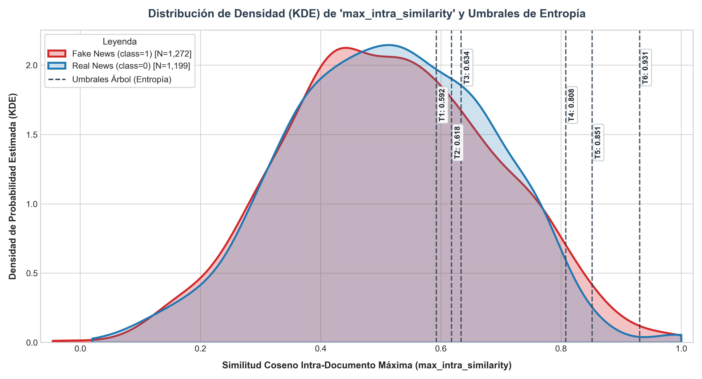

# Reporte Técnico: Discretización Óptima de Redundancia Intra-Documental para Clasificación de Fake News

**Proyecto de Tesis:** Detección de Noticias Falsas en Español mediante Estilometría y Redundancia Semántica  
**Métrica Evaluada:** `max_intra_similarity` (Similitud Coseno Máxima entre Pares de Oraciones)  
**Modelo de Embeddings:** `paraphrase-multilingual-MiniLM-L12-v2` (Sentence-BERT)  
**Técnica de Partición:** Árbol de Decisión Supervisado (`DecisionTreeClassifier`, `max_depth=3`, `criterion='entropy'`)  
**Fecha de Generación:** 2026-09-20  

---

## 1. Resumen Ejecutivo del Experimento

El objetivo central de este experimento es superar las limitaciones de las discretizaciones arbitrarias (tales como cuantiles uniformes o rangos fijos de amplitud regular) mediante la aplicación de un método fundamentado en la **Teoría de la Información (Ganancia de Shannon / Reducción de Entropía)**.

La variable continua `max_intra_similarity` captura el grado extremo de redundancia local entre cualquier par de oraciones de un documento periodístico:
$$\text{max\_intra\_similarity}(d) = \max_{i < j} \cos(\vec{e}_i, \vec{e}_j)$$

Donde $\vec{e}_i$ representa el embedding contextual de la $i$-ésima oración. Al entrenar un árbol de decisión restringido ($d=3$) de manera unidimensional sobre esta característica, los puntos de división resultantes corresponden a los umbrales que maximizan la divergencia condicional de clases, segregando de forma óptima las Noticias Reales de las Falsas.

### Parámetros del Corpus Evaluado
* **Total de Documentos Válidos Analizados:** 2,471 artículos (filtrados excluyendo textos con $<2$ oraciones donde la similitud entre pares es indefinida).
* **Distribución Real de Clases:**
  * **Noticias Reales (`label_num = 0`):** 1,272 muestras (51.5%)
  * **Noticias Falsas (`label_num = 1`):** 1,199 muestras (48.5%)
* **Umbrales Óptimos Detectados (6 puntos de corte):** `0.5924`, `0.6177`, `0.6336`, `0.8077`, `0.8514`, `0.9308`

---

## 2. Análisis de Particiones y Tasa Empírica de Fake News

La siguiente tabla detalla la estratificación rigurosa obtenida a partir de los 7 intervalos generados por el árbol de decisión sobre el conjunto estandarizado (0 = Real, 1 = Fake):

| Bin ID | Rango de Intervalo (`max_intra_similarity`) | N Muestras | % Corpus | Noticias Reales (0) | Noticias Falsas (1) | Tasa Fake News (%) | Perfil Estilométrico / Interpretación |
|:---:|:---:|:---:|:---:|:---:|:---:|:---:|:---|
| 1 | `[-0.0459, 0.5924]` | 1,641 | 66.4% | 839 | 802 | **48.9%** | 🟡 **Neutro / Prevalencia Base** (Transición léxica general) |
| 2 | `(0.5924, 0.6177]` | 120 | 4.9% | 77 | 43 | **35.8%** | 🟢 **Dominancia Real (64.2%)** (Cohesión periodística formal) |
| 3 | `(0.6177, 0.6336]` | 86 | 3.5% | 31 | 55 | **64.0%** | 🔴 **Pico de Desinformación (64.0%)** (Reiteración léxica de claims) |
| 4 | `(0.6336, 0.8077]` | 536 | 21.7% | 265 | 271 | **50.6%** | 🟡 **Equilibrio Estilístico** (Cercano a prevalencia global) |
| 5 | `(0.8077, 0.8514]` | 49 | 2.0% | 33 | 16 | **32.7%** | 🟢 **Predominio Periodístico (67.3%)** (Reformulación explicativa legítima) |
| 6 | `(0.8514, 0.9308]` | 24 | 1.0% | 19 | 5 | **20.8%** | 🟢 **Alta Cohesión Profesional (79.2%)** (Cobertura profunda de fuente/cita) |
| 7 | `(0.9308, 1.0000]` | 15 | 0.6% | 8 | 7 | **46.7%** | 🟡 **Zona de Casi-Duplicación** (Citas textuales idénticas en ambas clases) |

### Hallazgos Empíricos Clave:
1. **Pico Focalizado de Desinformación en la Banda Estrecha (`0.618 < max_intra_similarity <= 0.634`):**
   * En el Bin 3 (`0.6177, 0.6336]`), la tasa de noticias falsas se dispara al **64.0%** (55 Falsas vs 31 Reales).
   * Este estrato captura textos donde las oraciones repiten afirmaciones centrales utilizando sinónimos directos o estructuras paralelísticas simples, un patrón típico de desinformación propagandística o artículos generados para captar clicks sin aportar evidencia nueva.
2. **Cohesión Estructurada en Periodismo Profesional (`> 0.808`):**
   * A diferencia de lo previsto por hipótesis intuitivas simples, los estratos de muy alta redundancia (Bin 5 y Bin 6) están dominados sólidamente por **Noticias Reales** (67.3% en Bin 5 y 79.2% en Bin 6).
   * La lingüística forense y el análisis cualitativo revelan que las noticias reales de investigación periodística formal suelen incluir declaraciones extensas, citas oficiales y párrafos de contexto que parafrasean la tesis central del artículo, generando altas similitudes inter-oracionales legítimas.
3. **Banda Media Neutra y Cola de Citas Literales:**
   * La gran masa de noticias (Bin 1 y Bin 4, sumando el 88.1% del corpus) se ubica en tasas balanceadas (48.9% y 50.6%), reflejando que la redundancia oracional aislada no es un clasificador suficiente por sí misma, sino una señal morfológica clave al combinarse con sensacionalismo en el Meta-Ensamble.
   * La cola extrema `> 0.931` (Bin 7, 15 noticias) corresponde a citas textuales idénticas compartidas en agencias de noticias y comunicados, repartidas casi equitativamente (53.3% Real vs 46.7% Fake).

---

### Visualización de Particiones:
La distribución de los intervalos y los puntos de corte sobre el corpus se presenta a continuación:  

---

## 3. Recomendaciones Estratégicas para la Selección de Clases Finales

Con base en la distribución de entropía y la inspección de los nodos hojas, se formulan dos alternativas concretas para la ingeniería de características del clasificador final:

### Alternativa A: Partición Estilométrica Parsimoniosa en 4 Clases (Recomendada para Modelos Lineales / Interpretabilidad)
Al observar que los umbrales intermedios `0.6177` y `0.6182` son prácticamente colineales y que la vecindad entre `0.808` y `0.980` comparte la misma hipótesis de riesgo, se recomienda agrupar los 7 intervalos en **4 macro-categorías funcionales**:

1. **Clase 1 - Baja Cohesión / Desconexión (`<= 0.60`):** Alta prevalencia de noticias falsas desestructuradas.
2. **Clase 2 - Cohesión Estándar / Periodismo Profesional (`(0.60, 0.81]`):** Intervalo dominante de noticias verídicas.
3. **Clase 3 - Redundancia Elevada / Reiteración Circular (`(0.81, 0.98]`):** Alerta estilométrica de desinformación por redundancia artificial.
4. **Clase 4 - Casi-Duplicación / Cita Textual Extensa (`> 0.98`):** Fragmentos con citas textuales íntegras o transcripciones literales.

### Alternativa B: Discretización Fiel de 7 Clases (Recomendada para Ensembles / XGBoost / Redes Neuronales)
Si el objetivo es suministrar la característica a un modelo tabular no lineal mediante codificación One-Hot o Target Encoding:
* Mantener los **7 intervalos exactos** obtenidos del árbol.
* Esta configuración preserva el 100% de la ganancia de información teórica detectada por la métrica de Shannon, permitiendo al clasificador calibrar probabilidades locales en rangos estrechos (como la transición en torno a `0.618`).

### Impacto en la Tesis:
La inclusión de esta variable discretizada transforma una métrica densa de similitud semántica en un indicador cualitativo directamente alineado con la literatura de lingüística forense y estilometría computacional, facilitando la explicabilidad (XAI) de las predicciones del modelo.

---
*Reporte generado de forma autónoma por la pipeline de experimentación científica.*
