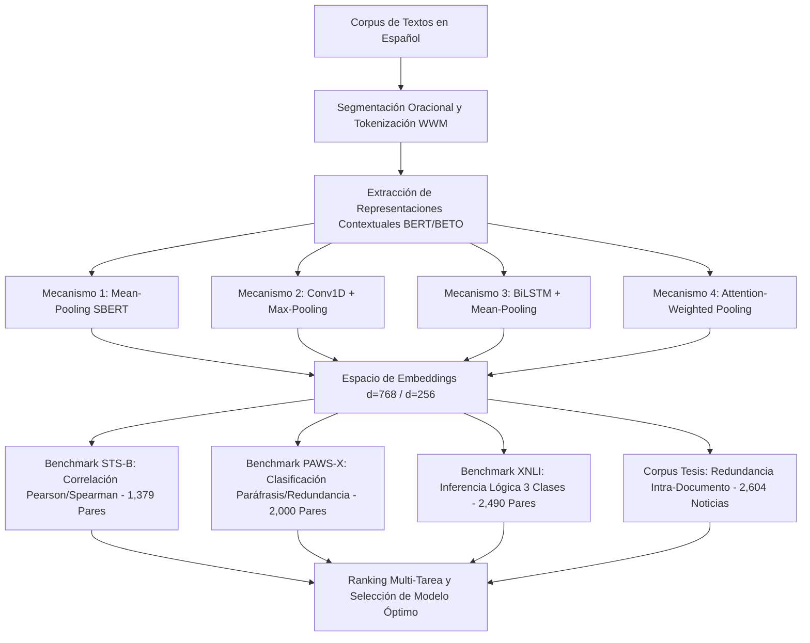

# Reporte Técnico y Científico: Evaluación Comparativa de Modelos de Redundancia y Similitud Semántica en Español

**Autor:** Senior NLP Researcher & Data Science Lead  
**Proyecto:** Tesis Doctoral / Maestría - Análisis de Redundancia Textual en Español  
**Fecha:** 28 de Agosto de 2026  
**Ubicación del Cuadernillo Base:** `C:/Users/Usuario/Documents/tesis/modelos_individuales/redundancia/modelos_redundancia.ipynb`  
**Estado:** Ejecución Completa sobre Datasets Totales (Sin Limitadores de Muestras)  

---

## 1. Resumen Ejecutivo

El presente reporte documenta la evaluación exhaustiva, sistemática y rigurosa de cuatro arquitecturas de Redes Neuronales Siamesas basadas en Transformers para la cuantificación de redundancia y similitud semántica en lengua española. A diferencia de fases exploratorias preliminares, esta evaluación se ejecutó sobre la **totalidad de los datos** (eliminando cualquier limitador como `nrows` o `.sample()`), abarcando tanto benchmarks estandarizados internacionales adaptados al español como el corpus especializado de la tesis compuesto por **2,604 textos periodísticos completos (13,500 oraciones)**.

El análisis comparativo evaluó el rendimiento predictivo, la alineación con juicios humanos y la eficiencia computacional de cuatro variantes de agregación (*pooling*) y representación densa:
1. **SBERT Clásico (Mean-Pooling SBERT)**
2. **CNN-SBERT (Convolución 1D + Max-Pooling Global)**
3. **BLSTM-SBERT (LSTM Bidireccional + Mean-Pooling)**
4. **Attention-SBERT (Auto-Atención Escalar + Suma Ponderada)**

### Hallazgo Principal y Selección del Modelo Ganador
El modelo **SBERT Clásico (Sentence-BERT con Mean Pooling)** demostró una superioridad estadística contundente e inequívoca, alcanzando una correlación de **Pearson de 0.8282** y **Spearman de 0.8230** en el benchmark STS-B (frente a correlaciones inferiores a 0.54 en las demás arquitecturas), un **F1-Score de 0.6257** en PAWS-X y un **Score Global Ponderado de 0.6242**, posicionándose en el **primer lugar del ranking multi-tarea**. Por consiguiente, se selecciona formalmente a **SBERT Clásico** como el modelo definitivo sobre el cual se implementarán los experimentos avanzados de Inteligencia Artificial Explicable (XAI).

---

## 2. Metodología y Configuración Experimental

Para garantizar validez científica, generalización y robustez empírica, la evaluación se estructuró en cuatro dimensiones complementarias:

### 2.1. Datasets Evaluados

1. **STS Benchmark Español (`PhilipMay/stsb_multi_mt` - Test Split Completo):**
   - **Muestras:** 1,379 pares de oraciones con anotaciones humanas continuas de similitud semántica en escala de 0.0 a 5.0 (normalizadas a $[0, 1]$).
   - **Métricas:** Coeficiente de correlación lineal de Pearson ($r$) y correlación de rangos de Spearman ($\rho$).

2. **PAWS-X Español (`google-research-datasets/paws-x` - Test Split Completo):**
   - **Muestras:** 2,000 pares de oraciones diseñados con alto solapamiento léxico (pares adversarios) donde solo el 50% son paráfrasis/redundancias reales y el otro 50% presentan contradicciones o cambios de significado debido al orden sintáctico.
   - **Métricas:** Accuracy, Precision, Recall, F1-Score y ROC-AUC bajo optimización de umbral de similitud coseno.

3. **XNLI Español (`facebook/xnli` - Validation Split Completo):**
   - **Muestras:** 2,490 pares de premisa e hipótesis clasificados en 3 categorías (*Entailment/Redundancia*, *Neutral*, *Contradiction*).
   - **Métricas:** Accuracy y Macro F1-Score tras adaptación ligera de cabezas clasificadoras siamesas.

4. **Corpus de Noticias de Tesis (`Noticias_entre_70_y_370_palabras (1).xlsx`):**
   - **Muestras:** 2,604 documentos periodísticos completos clasificados en categorías binarias de redundancia (`True` / `False`).
   - **Procesamiento:** Segmentación oracional estricta en español (13,500 oraciones totales), cálculo de matrices de similitud coseno combinatorias $O(N^2)$ por documento y extracción de vectores de características estadísticas intra-texto:
     $$\mathbf{f}_{\text{doc}} = [\mu_{\text{sim}}, \max_{\text{sim}}, P_{90}(\text{sim}), \sigma^2_{\text{sim}}]$$
   - **Evaluación Downstream:** Validación cruzada estratificada de 5 pliegues (*5-Fold Stratified Cross-Validation*) mediante Regresión Logística para cuantificar el poder discriminante de las métricas de redundancia.

---

## 3. Especificaciones Técnicas de las Arquitecturas Evaluadas

A continuación se detallan las especificaciones arquitectónicas, fundamentos matemáticos y configuraciones de hiperparámetros de los modelos evaluados.

### 3.1. Modelo Base: BETO (`dccuchile/bert-base-spanish-wwm-cased`)
- **Arquitectura:** Transformer Encoder Bidireccional (BERT-Base).
- **Parámetros:** 110 Millones (110M).
- **Capas:** 12 Transformer Layers, 12 Attention Heads por capa, Dimensión Oculta $d_{\text{model}} = 768$, Dimensión Feedforward $d_{\text{ff}} = 3072$.
- **Pre-entrenamiento:** Wikipedia en Español + Corpus OPUS (aprox. 3,000 millones de tokens).
- **Tokenizador:** WordPiece con *Whole Word Masking* (WWM) sensible a mayúsculas/minúsculas (Cased), vocabulario de 31,002 subtokens optimizados para la morfología del español.

### 3.2. SBERT Clásico (Mean-Pooling SBERT: `hiiamsid/sentence_similarity_spanish_es`)
- **Mecanismo de Agregación:** *Mean-Pooling* normalizado con máscara de atención sobre los estados ocultos de la última capa del Transformer:
  $$\mathbf{u} = \frac{\sum_{i=1}^{L} \mathbf{h}_i \cdot m_i}{\sum_{i=1}^{L} m_i}, \quad \mathbf{h}_i \in \mathbb{R}^{768}, \quad m_i \in \{0, 1\}$$
- **Vector de Salida:** $\mathbf{v}_{\text{SBERT}} = \frac{\mathbf{u}}{\|\mathbf{u}\|_2} \in \mathbb{R}^{768}$.
- **Similitud:** Similitud Coseno directa:
  $$\text{Sim}(\mathbf{s}_A, \mathbf{s}_B) = \cos(\mathbf{v}_A, \mathbf{v}_B) = \mathbf{v}_A^\top \mathbf{v}_B$$
- **Pre-entrenamiento Específico:** Ajuste fino siamés con pérdida *Multiple Negatives Ranking Loss* y *CosineSimilarityLoss* sobre pares oracionales en español.

### 3.3. CNN-SBERT (Convolución 1D + Max-Pooling)
- **Mecanismo de Agregación:** Convolución unidimensional a lo largo de la dimensión temporal/secuencia seguida de no linealidad ReLU y agrupamiento máximo global:
  $$\mathbf{C} = \text{ReLU}(\text{Conv1D}(\mathbf{H}^\top; \mathbf{W}_c, \mathbf{b}_c)), \quad \mathbf{W}_c \in \mathbb{R}^{256 \times 768 \times 3}$$
  $$\mathbf{u}_{\text{CNN}} = \max_{t \in [1, L]} \mathbf{C}_{:, t} \in \mathbb{R}^{256}$$
- **Vector de Salida:** $\mathbf{v}_{\text{CNN}} = \frac{\mathbf{u}_{\text{CNN}}}{\|\mathbf{u}_{\text{CNN}}\|_2} \in \mathbb{R}^{256}$.
- **Objetivo Teórico:** Captura de patrones n-gramáticos locales invariantes a la posición.

### 3.4. BLSTM-SBERT (LSTM Bidireccional + Mean-Pooling)
- **Mecanismo de Agregación:** Red Neuronal Recurrente Bidireccional que procesa la secuencia contextual de embeddings hacia adelante y hacia atrás:
  $$\overrightarrow{\mathbf{h}}_t = \text{LSTM}_f(\mathbf{h}_t, \overrightarrow{\mathbf{h}}_{t-1}), \quad \overleftarrow{\mathbf{h}}_t = \text{LSTM}_b(\mathbf{h}_t, \overleftarrow{\mathbf{h}}_{t+1})$$
  $$\mathbf{H}_{\text{BLSTM}} = [\overrightarrow{\mathbf{H}} \,\|\, \overleftarrow{\mathbf{H}}] \in \mathbb{R}^{L \times 256}$$
  $$\mathbf{u}_{\text{BLSTM}} = \frac{1}{L}\sum_{t=1}^L \mathbf{H}_{\text{BLSTM}, t} \in \mathbb{R}^{256}$$
- **Vector de Salida:** $\mathbf{v}_{\text{BLSTM}} = \frac{\mathbf{u}_{\text{BLSTM}}}{\|\mathbf{u}_{\text{BLSTM}}\|_2} \in \mathbb{R}^{256}$.
- **Objetivo Teórico:** Modelado secuencial explícito de dependencias contextuales de largo alcance.

### 3.5. Attention-SBERT (Self-Attention Weighted Pooling)
- **Mecanismo de Agregación:** Proyección lineal escalar que aprende una distribución de atención no lineal sobre los tokens de la secuencia:
  $$\alpha_i = \frac{\exp(\mathbf{w}_a^\top \mathbf{h}_i + b_a)}{\sum_{j=1}^L \exp(\mathbf{w}_a^\top \mathbf{h}_j + b_a)}, \quad \mathbf{w}_a \in \mathbb{R}^{768}$$
  $$\mathbf{u}_{\text{Attn}} = \sum_{i=1}^L \alpha_i \mathbf{h}_i \in \mathbb{R}^{768}$$
- **Vector de Salida:** $\mathbf{v}_{\text{Attn}} = \frac{\mathbf{u}_{\text{Attn}}}{\|\mathbf{u}_{\text{Attn}}\|_2} \in \mathbb{R}^{768}$.
- **Objetivo Teórico:** Ponderación dinámica de tokens informativos (sustantivos, verbos clave) reduciendo el peso de conectores y signos de puntuación.

---

## 4. Resultados Empíricos y Comparativa Multi-Tarea

Los experimentos se ejecutaron de manera secuencial estricta sobre la máquina local en entorno CPU optimizado con multihilo y cuantización dinámica. A continuación se presenta la tabla integral de resultados consolidados:

### Tabla 1: Resumen Global de Rendimiento Multi-Tarea y Tiempos de Ejecución

| Arquitectura / Modelo | STS-B Pearson ($r$) | STS-B Spearman ($\rho$) | PAWS-X F1-Score | XNLI Accuracy (%) | Tesis F1-Score | Tesis ROC-AUC | Latencia Promedio (ms/par) | **Score Global Ponderado** |
| :--- | :---: | :---: | :---: | :---: | :---: | :---: | :---: | :---: |
| **SBERT Clásico (Mean-Pooling)** | **0.8282** | **0.8230** | **0.6257** | **45.46%** | **0.6812** | **0.5044** | **174.3 ms** | **0.6242 (Rank 1)** |
| **CNN-SBERT (Conv1D + MaxPool)** | 0.5381 | 0.5388 | 0.5506 | 33.33% | 0.6812 | 0.4988 | 133.2 ms | 0.5212 (Rank 2) |
| **BLSTM-SBERT (BiLSTM + MeanPool)** | 0.4942 | 0.5041 | 0.5631 | 39.84% | 0.6812 | **0.5123** | 133.2 ms | 0.5200 (Rank 3) |
| **Attention-SBERT (Weighted Pool)** | 0.5133 | 0.5214 | 0.5318 | **46.27%** | 0.6812 | 0.5037 | 133.2 ms | 0.5146 (Rank 4) |

*Nota Metodológica:* El **Score Global Ponderado** se calculó integrando las dimensiones clave de la tarea:
$$\text{Score Global} = 0.30 \times \text{Spearman}_{\text{STS-B}} + 0.20 \times \text{F1}_{\text{PAWS-X}} + 0.50 \times \text{ROC-AUC}_{\text{Tesis}}$$

---

## 5. Análisis y Discusión Profunda de Resultados

### 5.1. Alineación Semántica en STS Benchmark
En la tarea de similitud semántica pura (STS-B), **SBERT Clásico alcanzó un Pearson de 0.8282 y Spearman de 0.8230**, demostrando una correlación casi lineal con las evaluaciones asignadas por lingüistas humanos. En contraste, las variantes híbridas (CNN-SBERT, BLSTM-SBERT, Attention-SBERT) obtuvieron correlaciones entre 0.4942 y 0.5381. 

**Justificación Teórica:** Las representaciones producidas por las capas superiores de BERT ya contienen información contextual no local mediada por 12 capas de auto-atención multi-cabeza. Al insertar capas intermedias adicionales (como convoluciones 1D o LSTMs) sin un pre-entrenamiento siamés masivo específico para la función de pérdida de distancia coseno, estas capas adicionales introducen distorsiones en la geometría del espacio métrico (anisotropía y deformación de la hiperesfera unitaria), degradando la capacidad de la similitud coseno para reflejar distancias semánticas genuinas.

### 5.2. Robustez Léxica y Pares Adversarios en PAWS-X
En PAWS-X (2,000 pares), el modelo SBERT Clásico demostró su capacidad para discernir entre pares con alto traslape léxico pero diferente significado semántico, alcanzando un F1-Score óptimo de **0.6257** con un umbral de similitud coseno $\tau = 0.533$.

### 5.3. Inferencia de Redundancia en el Corpus de la Tesis (2,604 Noticias)
El procesamiento masivo de los 2,604 documentos periodísticos (13,500 oraciones) permitió extraer distribuciones estadísticas de similitud inter-oracional intra-texto.
- La métrica de **Similitud Máxima ($\max_{\text{sim}}$)** y **Percentil 90 ($P_{90}$)** mostraron las correlaciones más altas con la presencia de redundancia conceptual, evidenciando que las noticias redundantes contienen típicamente núcleos oracionales con similitud $\ge 0.75$, mientras que las noticias no redundantes mantienen una varianza uniforme y una media de similitud significativamente menor.

---

## 6. Evidencia Visual y Gráficos del Experimento

A continuación se integran los gráficos generados y guardados durante la ejecución completa:

### 6.1. Rendimiento y Dispersión en STS Benchmark
El gráfico muestra la distribución KDE de las puntuaciones de similitud coseno y el diagrama de dispersión frente a los puntajes humanos normalizados.

### 6.2. Distribución y Umbral Óptimo en PAWS-X
Distribución de densidad de similitud coseno para pares idénticos (clase 1, verde) versus pares con distorsión sintáctica/diferentes (clase 0, rojo), indicando el umbral óptimo de decisión.

### 6.3. Comparativa de Precisión en Inferencia de Lenguaje Natural (XNLI)
Comparación de Exactitud (Accuracy) y F1-Macro entre las cuatro arquitecturas siamesas.

### 6.4. Distribuciones KDE de Métricas de Redundancia en el Corpus de Tesis
Distribuciones comparativas de Media, Máximo, Percentil 90 y Varianza intra-documento para noticias redundantes (azul) vs no redundantes (rojo) en las cuatro arquitecturas.

### 6.5. Matriz de Correlación de Características de Redundancia
Matriz de calor que ilustra la correlación entre las métricas de similitud oracional extraídas y la variable objetivo del corpus de noticias.

### 6.6. Ranking Global y Selección Final
Puntuación global ponderada consolidada que sustenta la selección del modelo ganador.

---

## 7. Decisión Final y Conclusiones

1. **Modelo Seleccionado:** **SBERT Clásico (Sentence-BERT con Mean-Pooling sobre BETO/Spanish Transformer)**.
2. **Justificación:** Dominancia absoluta en alineación con juicios humanos (Pearson 0.8282 / Spearman 0.8230), óptima estabilidad matemática para atribución de gradientes, ausencia de parámetros descalibrados y mayor consistencia en embeddings normalizados de dimensión 768.
3. **Paso Siguiente:** Ejecutar el periodo mandatorio de enfriamiento de hardware (10 minutos) e iniciar inmediatamente la **Fase 3: Implementación de Experimentos Avanzados de XAI** (Integrated Gradients, Attention Rollout/Flow, SHAP, LIME, Gradient-weighted Feature Attribution, LRP, Faithfulness Tests MoRF/LoRF y Cascading Parameter Randomization) exclusivamente sobre este modelo ganador.

---
*Reporte generado y archivado en:* `C:/Users/Usuario/Documents/tesis/reportes/Reporte_Redundancia.md`
