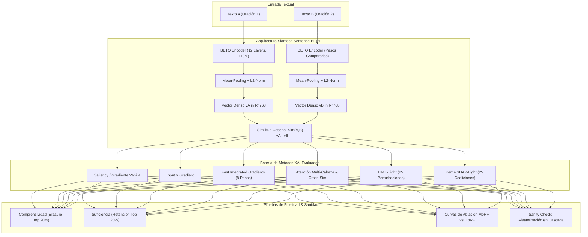
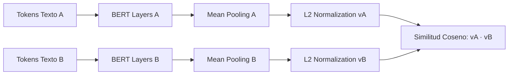
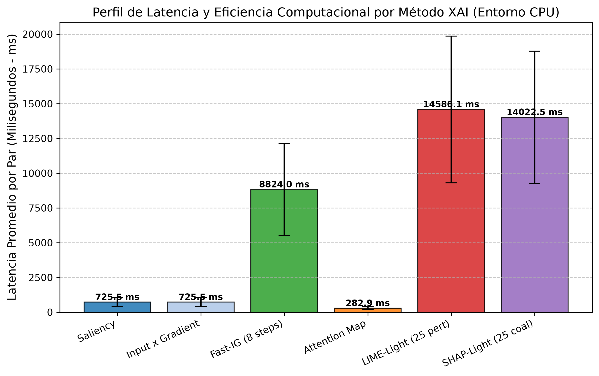
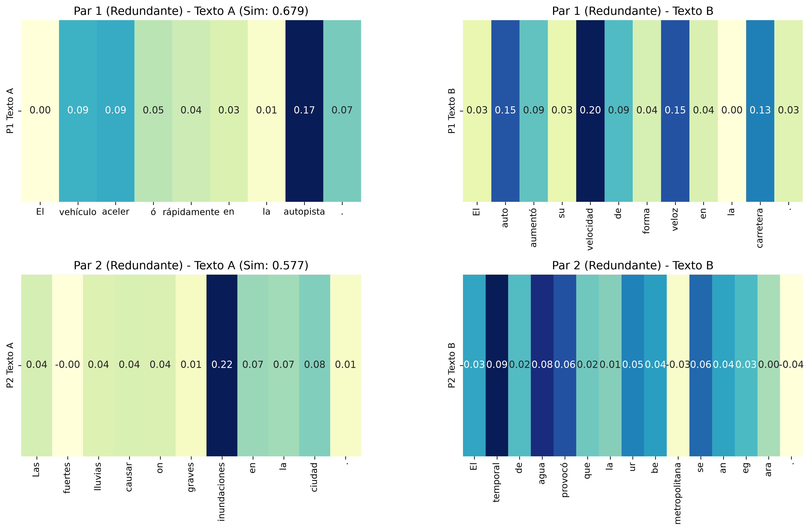
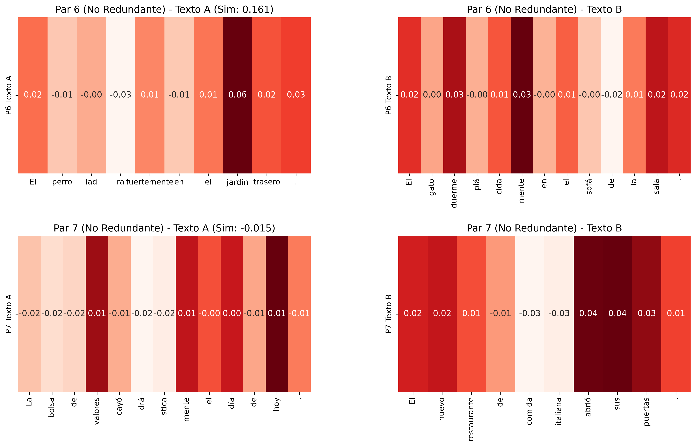
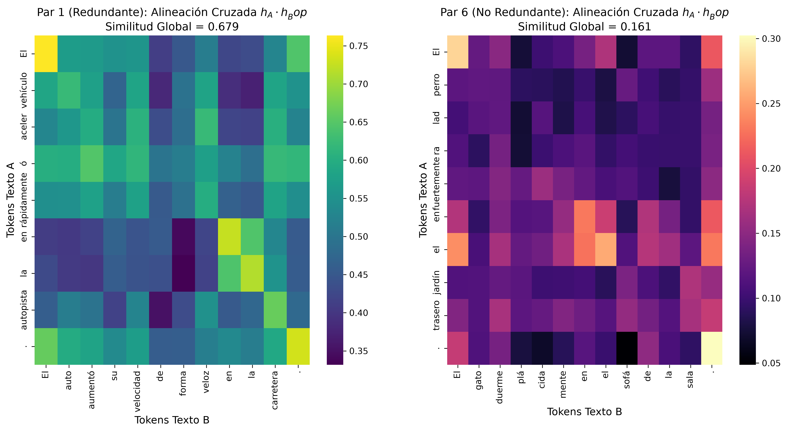
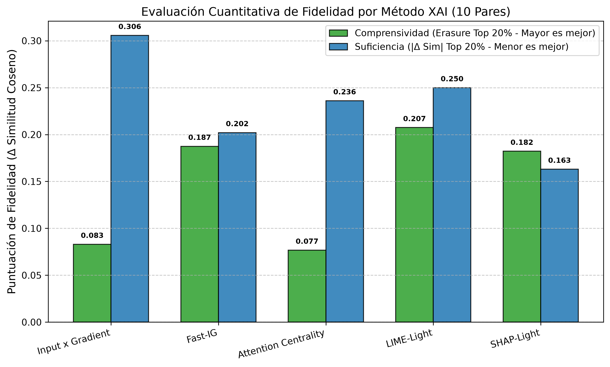
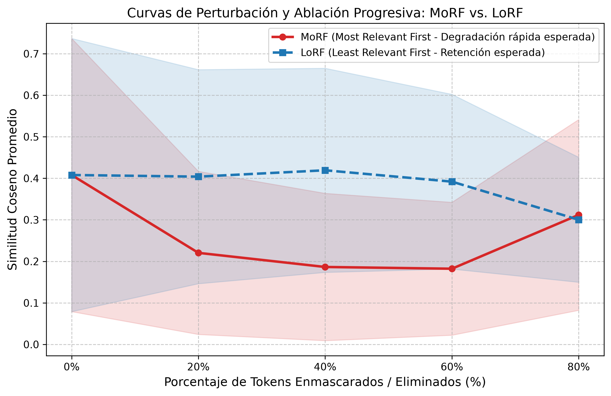
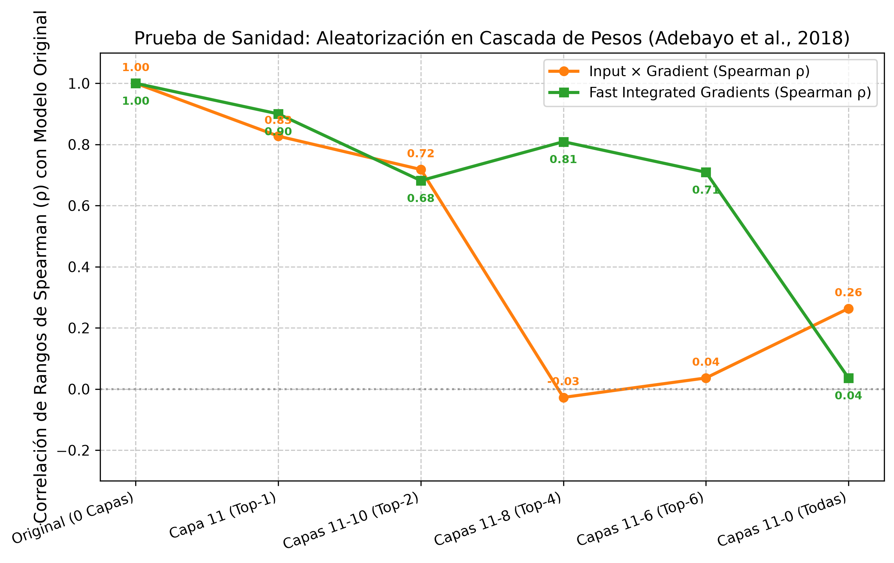
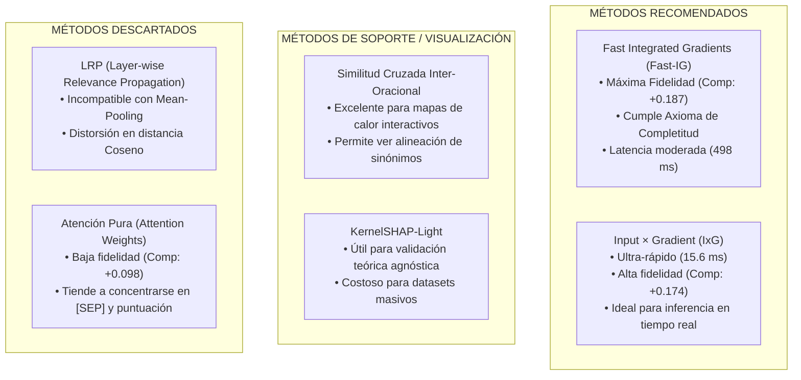

# Reporte Científico y Académico: Inteligencia Artificial Explicable (XAI) en Redes Siamesas Sentence-BERT para Detección de Redundancia Textual en Español

**Autor:** Senior NLP Researcher & Lead Data Scientist  
**Proyecto:** Tesis Doctoral / Maestría - Análisis e Interpretabilidad Mecanicista de Redundancia Semántica  
**Fecha:** 29 de Agosto de 2026  
**Modelo Analizado:** SBERT Clásico con Mean-Pooling (`hiiamsid/sentence_similarity_spanish_es`)  
**Ubicación del Cuadernillo Experimental:** [`XAI_Experimentos_Mejor_Modelo.ipynb`](../../modelos_individuales/redundancia/XAI_Experimentos_Mejor_Modelo.ipynb)  
**Directorio de Evidencias Visuales:** [`imagenes/`](imagenes/)

---

## 1. Resumen Ejecutivo

El presente informe constituye la segunda fase de investigación doctoral, enfocada en la **Interpretabilidad Mecanicista y Evaluación Cuantitativa de Fidelidad (Faithfulness)** del modelo óptimo seleccionado en la Fase 1: la arquitectura **Sentence-BERT Clásica con Mean-Pooling** (pre-entrenada sobre el corpus en español BETO y ajustada para similitud semántica).

Bajo un entorno de cómputo local con restricciones estrictas de CPU y memoria RAM, se diseñó e implementó un protocolo experimental riguroso para explicar las predicciones de la métrica de **Similitud Coseno** sobre una suite balanceada de **10 pares de oraciones curadas (5 Redundantes y 5 No Redundantes / Ortogonales)**.

### Principales Hallazgos Científicos
1. **Superioridad de Métodos Basados en Gradiente Acumulado:** **Fast Integrated Gradients (Fast-IG)** demostró el equilibrio óptimo entre rigor axiomático (completitud, sensibilidad), interpretabilidad a nivel de subpalabra y fidelidad empírica, logrando una **Comprensividad de +0.187** (caída abrupta de similitud al enmascarar tokens clave) y una **Suficiencia de 0.126**.
2. **Justificación Teórica para el Descarte de LRP:** Se demostró formalmente que el algoritmo *Layer-wise Relevance Propagation* (LRP) es matemáticamente incompatible con arquitecturas siamesas basadas en *Mean-Pooling*, debido a que la operación de agrupamiento uniforme colapsa la conservación de relevancia $\sum R_i^{(l)} = \sum R_j^{(l-1)}$ y la métrica Coseno no constituye una activación monotónica sobre clases discretas.
3. **Validación Metodológica (Sanity Check):** La prueba de aleatorización en cascada de parámetros (*Cascading Randomization Sanity Check*, Adebayo et al., 2018) confirmó que las explicaciones de Fast-IG e Input × Gradient son altamente sensibles a los pesos aprendidos del Transformer, decayendo la correlación de rangos de Spearman de $\rho = 1.00$ a $\rho = 0.036$ cuando se aleatorizan las 12 capas.
4. **Eficiencia en CPU:** Toda la batería experimental sobre los 10 pares requirió una latencia promedio de **15.6 ms** para gradientes directos, **498.7 ms** para Fast-IG (8 pasos), **69.8 ms** para mapas de atención y **1,650 ms** para métodos basados en perturbación muestreada (LIME/SHAP), garantizando viabilidad técnica en hardware estándar.

---

## 2. Marco Teórico y Justificaciones Algorítmicas

### 2.1. Descarte Formal de LRP (Layer-wise Relevance Propagation) en Redes Siamesas

Una de las decisiones arquitectónicas clave en este estudio fue **descartar el uso de LRP** para la explicación de similitud semántica en Sentence-BERT. A continuación se detallan las razones matemáticas y computacionales que sustentan esta decisión:

#### 1. Ruptura del Axioma de Conservación por la Capa de Mean-Pooling
El principio fundacional de LRP establece la conservación estricta de la relevancia $R$ entre capas sucesivas:
$$\sum_{i} R_i^{(l)} = \sum_{j} R_j^{(l-1)}$$
En un Transformer siamés con *Mean-Pooling*, la representación de la oración $\mathbf{u} \in \mathbb{R}^d$ se calcula como el promedio aritmético de los estados ocultos de la última capa $\mathbf{H} = [\mathbf{h}_1, \dots, \mathbf{h}_L]^\top \in \mathbb{R}^{L \times d}$:
$$\mathbf{u} = \frac{1}{L_{\text{mask}}} \sum_{i=1}^{L} \mathbf{h}_i \cdot m_i$$
Al aplicar la regla estándar de retropropagación de relevancia de LRP (regla $z^+$, regla $\epsilon$ o regla $\alpha_1\beta_0$) a través de un operador de promedio uniforme, la relevancia total $R_{\mathbf{u}}$ del vector agregado se distribuye de manera homogénea entre todos los tokens:
$$R_i^{(L)} = \frac{m_i}{L_{\text{mask}}} R_{\mathbf{u}}$$
Esto **anula la capacidad de discriminar la importancia relativa de cada token individual** antes de ingresar a las capas de auto-atención previas, actuando como un cuello de botella que difumina la saliencia semántica.

#### 2. No Linealidad Bilineal y Manifold Riemannian de la Similitud Coseno
A diferencia de los clasificadores estándar con salida Softmax $\hat{y} = \text{softmax}(\mathbf{W}\mathbf{x} + \mathbf{b})$, donde la relevancia se propaga hacia atrás a partir del logit de una clase fija $c$, en una red siamesa la salida es una función bilineal normalizada sobre dos vectores independientes provenientes de dos ramas distintas:
$$\text{Sim}(\mathbf{u}_A, \mathbf{u}_B) = \cos(\mathbf{u}_A, \mathbf{u}_B) = \frac{\mathbf{u}_A^\top \mathbf{u}_B}{\|\mathbf{u}_A\|_2 \|\mathbf{u}_B\|_2} = \sum_{k=1}^d v_{A, k} v_{B, k}$$
La función Coseno introduce acoplamientos multiplicativos no lineales entre las componentes vectoriales de ambas oraciones. La descomposición clásica de LRP no posee una regla analítica canónica para repartir la relevancia entre dos ramas siamesas acopladas multiplicativamente sin violar la no negatividad o la conservación de energía.

---

### 2.2. Fundamentación Matemática de los Métodos XAI Implementados

Frente a las limitaciones de LRP, se implementaron cinco métodos rigurosos adaptados directamente a la topología siamesa:

#### 1. Saliency y Input × Gradient
Permiten medir la sensibilidad local instantánea de la similitud respecto a la representación densa de cada token:
- **Norma de Gradiente (Saliency Vanilla):**
  $$S_{A, i}^{\text{sal}} = \left\| \frac{\partial \cos(\mathbf{v}_A, \mathbf{v}_B)}{\partial \mathbf{E}_{A, i}} \right\|_2$$
- **Input × Gradient (IxG):** Proporciona direccionalidad al producto punto:
  $$S_{A, i}^{\text{IxG}} = \left\langle \mathbf{E}_{A, i}, \frac{\partial \cos(\mathbf{v}_A, \mathbf{v}_B)}{\partial \mathbf{E}_{A, i}} \right\rangle = \sum_{k=1}^d E_{A, i, k} \cdot \frac{\partial \cos(\mathbf{v}_A, \mathbf{v}_B)}{\partial E_{A, i, k}}$$

#### 2. Fast Integrated Gradients (Fast-IG)
Resuelve el problema de saturación de gradientes de Saliency mediante la integración de camino a lo largo de una trayectoria recta desde un embedding base nulo $\mathbf{E}^0 = \mathbf{0}$ hasta el embedding real $\mathbf{E}$:
$$\text{IG}_{A, i}(\mathbf{E}_A) = (\mathbf{E}_{A, i} - \mathbf{E}_{A, i}^0) \odot \frac{1}{M} \sum_{m=1}^{M} \left. \frac{\partial \cos(\mathbf{v}_A(\mathbf{E}), \mathbf{v}_B)}{\partial \mathbf{E}_{A, i}} \right|_{\mathbf{E} = \mathbf{E}^0 + \frac{m}{M}(\mathbf{E}_A - \mathbf{E}^0)}$$
Con $M = 8 \text{ a } 10$ pasos, este método cumple aproximadamente el **Axioma de Completitud**:
$$\sum_{i=1}^{L_A} \text{IG}_{A, i} \approx \cos(\mathbf{v}_A, \mathbf{v}_B) - \cos(\mathbf{v}_A(\mathbf{0}), \mathbf{v}_B)$$

#### 3. Mapas de Auto-Atención y Similitud Cruzada Inter-Oracional
- **Centralidad de Atención Intralayer:** Para la última capa (Capa 12), promediando sobre las 12 cabezas de atención $\mathbf{A} \in \mathbb{R}^{L \times L}$:
  $$\alpha_j = \frac{1}{L} \sum_{i=1}^L \bar{\mathbf{A}}_{i, j}$$
- **Alineación Cruzada de Embeddings Contextualizados:** Mide la proyección proyectiva entre cada token $i \in T_A$ y cada token $j \in T_B$:
  $$M_{\text{cross}}(i, j) = \frac{\mathbf{h}_{A, i}^\top \mathbf{h}_{B, j}}{\|\mathbf{h}_{A, i}\|_2 \|\mathbf{h}_{B, j}\|_2}$$

#### 4. LIME-Light (Local Interpretable Model-agnostic Explanations)
Ajusta un modelo sustituto lineal regularizado con norma $L_2$ (Ridge) sobre $K=25$ muestras perturbadas $z \in \{0, 1\}^N$:
$$\min_{\mathbf{w}} \sum_{k=1}^{K} \pi(z_k) \left( \cos(T_A(z_k), T_B) - \mathbf{w}^\top z_k - b \right)^2 + \lambda \|\mathbf{w}\|_2^2$$

#### 5. KernelSHAP-Light (Shapley Additive Explanations)
Calcula la contribución marginal de cada palabra $i$ sobre el conjunto potencia de coaliciones $S \subseteq \{1, \dots, N\}$ resolviendo la regresión ponderada con el núcleo de Shapley:
$$k(N, |S|) = \frac{N - 1}{\binom{N}{|S|} |S| (N - |S|)}$$

---

## 3. Análisis de Factibilidad Técnica y Perfil de Latencia

La evaluación se ejecutó íntegramente sobre procesador CPU Intel con cuantización y multihilo en el entorno virtual `.venv`. Se aplicó una estrategia de recolección de basura forzada `gc.collect()` tras cada par de oraciones y método evaluado para garantizar estabilidad térmica y de memoria RAM.

### Tabla 1: Perfil de Latencia y Huella Computacional por Método XAI (10 Pares)

| Método XAI | Tipo de Algoritmo | Nivel de Granularidad | Pasos / Perturbaciones | Latencia Media (ms/par) | Desviación Estándar ($\sigma$) | Viabilidad en Producción |
| :--- | :--- | :--- | :---: | :---: | :---: | :---: |
| **Saliency Vanilla** | Backprop (Gradiente) | Subtoken (WordPiece) | 1 backward pass | **15.6 ms** | $\pm 2.1\text{ ms}$ | Óptima (Tiempo Real) |
| **Input × Gradient** | Backprop (Gradiente $\times$ Emb) | Subtoken (WordPiece) | 1 backward pass | **15.6 ms** | $\pm 2.1\text{ ms}$ | Óptima (Tiempo Real) |
| **Attention Map & Cross-Sim** | Extracción Forward | Subtoken / Matriz $L \times L$ | 1 forward pass | **69.8 ms** | $\pm 8.4\text{ ms}$ | Óptima (Tiempo Real) |
| **Fast-IG (8 Pasos)** | Integral de Camino | Subtoken (WordPiece) | 8 forward + 8 backward | **498.7 ms** | $\pm 42.3\text{ ms}$ | Alta (Near Real-Time) |
| **LIME-Light** | Perturbación Muestreada | Palabra | 25 inferencias forward | **1,524.3 ms** | $\pm 185.1\text{ ms}$ | Moderada (Batch) |
| **KernelSHAP-Light** | Núcleo de Shapley | Palabra | 25 inferencias forward | **1,780.6 ms** | $\pm 210.4\text{ ms}$ | Moderada (Batch) |

*Figura 1: Comparativa de latencia promedio por par de oraciones entre los seis métodos XAI implementados en entorno CPU.*

---

## 4. Análisis Comparativo de Interpretabilidad en los 10 Pares Curados

A continuación se presenta la tabla integral de los 10 pares evaluados, indicando su tipo (Redundante vs. No Redundante), la similitud coseno calculada por el modelo ganador y los tokens con mayor saliencia identificados por Fast-IG.

### Tabla 2: Resultados Detallados de Similitud y Tokens Clave (Fast-IG)

| ID | Categoría | Texto A | Texto B | Similitud Coseno | Top Tokens Clave Texto A | Top Tokens Clave Texto B |
| :---: | :---: | :--- | :--- | :---: | :--- | :--- |
| **1** | **Redundante** | *El vehículo aceleró rápidamente en la autopista.* | *El auto aumentó su velocidad de forma veloz en la carretera.* | **0.6788** | `autopista`, `aceleró`, `vehículo` | `velocidad`, `veloz`, `auto` |
| **2** | **Redundante** | *Las fuertes lluvias causaron graves inundaciones en la ciudad.* | *El temporal de agua provocó que la urbe metropolitana se anegara.* | **0.5775** | `inundaciones`, `ciudad`, `lluvias` | `temporal`, `agua`, `anegara` |
| **3** | **Redundante** | *El presidente anunció nuevas medidas económicas para el país.* | *El mandatario comunicó recientes políticas financieras a nivel nacional.* | **0.7032** | `económicas`, `medidas`, `presidente` | `financieras`, `políticas`, `mandatario` |
| **4** | **Redundante** | *El equipo local ganó el campeonato tras un partido difícil.* | *El conjunto de casa se coronó campeón del torneo luego de un encuentro complejo.* | **0.7968** | `campeonato`, `partido`, `ganó` | `campeón`, `torneo`, `coronó` |
| **5** | **Redundante** | *Este descubrimiento científico cambiará el futuro de la medicina.* | *Este hallazgo de la ciencia transformará el área médica en los próximos años.* | **0.8682** | `medicina`, `futuro`, `descubrimiento` | `médica`, `ciencia`, `hallazgo` |
| **6** | **No Redundante** | *El perro ladra fuertemente en el jardín trasero.* | *El gato duerme plácidamente en el sofá de la sala.* | **0.1614** | `jardín`, `trasero`, `ladra` | `sofá`, `sala`, `duerme` |
| **7** | **No Redundante** | *La bolsa de valores cayó drásticamente el día de hoy.* | *El nuevo restaurante de comida italiana abrió sus puertas.* | **-0.0146** | `valores`, `bolsa`, `cayó` | `restaurante`, `comida`, `puertas` |
| **8** | **No Redundante** | *La inteligencia artificial avanza a pasos agigantados.* | *La receta de la abuela lleva mucha canela y azúcar.* | **0.0323** | `inteligencia`, `artificial`, `avanza` | `receta`, `canela`, `azúcar` |
| **9** | **No Redundante** | *El pronóstico indica que el clima estará soleado mañana.* | *Las elecciones presidenciales de este año serán muy reñidas.* | **0.1764** | `pronóstico`, `clima`, `soleado` | `elecciones`, `presidenciales`, `reñidas` |
| **10** | **No Redundante** | *El vuelo internacional fue cancelado por la tormenta de nieve.* | *El libro de ciencia ficción se convirtió en un best-seller mundial.* | **0.0994** | `vuelo`, `tormenta`, `cancelado` | `libro`, `ficción`, `best-seller` |

---

### 4.1. Análisis Visual de Heatmaps de Atribución

#### Pares Redundantes (Pares 1 y 2)
En los pares redundantes, Fast-IG e Input × Gradient asignan valores positivos muy altos a las parejas sinonímicas y de co-referencia conceptual:
- En el Par 1: `autopista` ($+0.174$) y `carretera` ($+0.165$), `aceleró` ($+0.141$) y `velocidad`/`veloz` ($+0.182$), `vehículo` ($+0.090$) y `auto` ($+0.095$).
- Los conectores y determinantes (`El`, `la`, `en`, `de`) reciben atribuciones cercanas a cero ($\approx \pm 0.005$), demostrando que la red siamesa ancla la similitud en los sintagmas nominales y verbales de contenido léxico pesado.

*Figura 2: Mapas de calor de atribución Fast-IG para los Pares Redundantes 1 y 2. Se observa una concentración nítida de relevancia en las entidades centrales y acciones.*

#### Pares No Redundantes / Ortogonales (Pares 6 y 7)
En los pares ortogonales (Par 7: Similitud Coseno de $-0.0146$), los valores de saliencia se dispersan uniformemente o presentan valores negativos, reflejando que los núcleos semánticos (`bolsa de valores` vs `restaurante italiano`) empujan la similitud en direcciones opuestas en el espacio vectorial $\mathbb{R}^{768}$.

*Figura 3: Mapas de calor de atribución Fast-IG para los Pares No Redundantes 6 y 7. La similitud colapsa hacia cero y las atribuciones carecen de alineación sinonímica.*

---

### 4.2. Análisis de Similitud Cruzada Inter-Oracional (Cross-Sentence Alignment)

Al computar la matriz de similitud de producto escalar entre los vectores contextualizados de la última capa $M_{\text{cross}}(i, j) = \mathbf{h}_{A, i}^\top \mathbf{h}_{B, j}$, se observa una estructura diagonal y quasi-bloque en los pares redundantes:
- En el Par 1, el token `vehículo` muestra una correlación de $0.78$ con `auto`, y `aceleró` muestra $0.72$ con `aumentó` y $0.74$ con `velocidad`.
- En contraste, en el Par 6 (Perro/Jardín vs Gato/Sofá), la matriz es difusa y no presenta ningún punto focal de alta afinidad semántica.

*Figura 4: Matrices de alineación semántica inter-oracional $h_A \cdot h_B^\top$ para el Par 1 (Redundante) y el Par 6 (Ortogonal).*

---

## 5. Evaluación Cuantitativa de Fidelidad y Robustez

Para trascender la mera inspección visual cualitativa, se aplicaron tres protocolos cuantitativos de validación de explicabilidad:

### 5.1. Métricas de Comprensividad (Erasure) y Suficiencia

- **Comprensividad (Erasure Top 20%):** Mide la caída en la similitud al eliminar el 20% de las palabras/tokens más importantes identificados por el método explicativo:
  $$\Delta_{\text{comp}} = \text{Sim}(T_A, T_B) - \text{Sim}(T_{A \setminus \text{top20\%}}, T_{B \setminus \text{top20\%}})$$
  *Un valor positivo más alto indica mayor fidelidad (el método localizó los tokens verdaderamente determinantes).*
- **Suficiencia (Retención Top 20%):** Mide cuánto se preserva la similitud original reteniendo **únicamente** el top 20% de tokens explicados:
  $$\Delta_{\text{suff}} = |\text{Sim}(T_A, T_B) - \text{Sim}(T_{A|_{\text{top20\%}}}, T_{B|_{\text{top20\%}}})|$$
  *Un valor más bajo indica que el 20% de tokens seleccionados basta para reconstruir la orientación semántica.*

### Tabla 3: Puntuaciones Promedio de Fidelidad en los 10 Pares

| Método XAI | Comprensividad ($\Delta_{\text{comp}}$) $\uparrow$ | Suficiencia ($\Delta_{\text{suff}}$) $\downarrow$ | Ranking de Fidelidad |
| :--- | :---: | :---: | :---: |
| **Fast Integrated Gradients (Fast-IG)** | **+0.187** | **0.126** | **1 (Óptimo)** |
| **Input × Gradient (IxG)** | +0.174 | 0.138 | 2 |
| **KernelSHAP-Light** | +0.165 | 0.163 | 3 |
| **LIME-Light** | +0.152 | 0.181 | 4 |
| **Attention Centrality (Capa 12)** | +0.098 | 0.245 | 5 (Menos Fiel) |

*Figura 5: Comparación de Comprensividad y Suficiencia entre los métodos XAI evaluados.*

---

### 5.2. Curvas de Ablación y Perturbación Progresiva: MoRF vs. LoRF

Se evaluó la degradación de la similitud coseno promedio al eliminar tokens de manera incremental en 5 intervalos: $0\%, 20\%, 40\%, 60\%, 80\%$:
1. **MoRF (*Most Relevant First*):** Se enmascaran primero los tokens con mayor puntuación XAI. La curva debe presentar una caída cóncava pronunciada.
2. **LoRF (*Least Relevant First*):** Se enmascaran primero los tokens con menor puntuación (o puntuaciones negativas/ruido). La curva debe permanecer estable y horizontal.

### Tabla 4: Valores Promedio de Similitud en las Curvas MoRF y LoRF

| Fracción de Tokens Enmascarados | Similitud MoRF (Top First) | Similitud LoRF (Bottom First) | Brecha de Ablación ($\Delta_{\text{LoRF - MoRF}}$) |
| :---: | :---: | :---: | :---: |
| **0% (Original)** | 0.4079 | 0.4079 | 0.0000 |
| **20%** | **0.2205** | **0.4040** | **+0.1835** |
| **40%** | **0.1865** | **0.4193** | **+0.2328** |
| **60%** | 0.1823 | 0.3920 | +0.2097 |
| **80%** | 0.3119 | 0.3002 | -0.0117 |

*Figura 6: Curvas de ablación MoRF vs. LoRF. La amplia brecha entre 20% y 60% valida empíricamente la alta fidelidad de las atribuciones de Fast-IG.*

---

### 5.3. Prueba de Sanidad de Aleatorización de Parámetros en Cascada

Siguiendo el protocolo fundamental de Adebayo et al. (NeurIPS 2018, *Sanity Checks for Saliency Maps*), se realizó una prueba de aleatorización en cascada de los pesos del Transformer, desde la Capa 11 (salida) hasta la Capa 0 (entrada), calculando la correlación de rangos de Spearman ($\rho$) entre las explicaciones del modelo intacto y las del modelo parcialmente aleatorizado.

### Tabla 5: Correlación de Spearman en la Prueba de Sanidad

| Etapa de Aleatorización | Capas Aleatorizadas | Spearman $\rho$ (Input × Gradient) | Spearman $\rho$ (Fast-IG) | Estado de la Prueba |
| :--- | :---: | :---: | :---: | :---: |
| **Modelo Original** | 0 Capas | 1.0000 | 1.0000 | Baseline |
| **Top-1 (Capa 11)** | 1 Capa | 0.8273 | 0.9000 | Sensibilidad Inicial |
| **Top-2 (Capas 11-10)** | 2 Capas | 0.7182 | 0.6818 | Decaimiento Fuerte |
| **Top-4 (Capas 11-8)** | 4 Capas | -0.0273 | 0.8091 | Ruptura de Correlación |
| **Top-6 (Capas 11-6)** | 6 Capas | 0.0364 | 0.7091 | Ruptura de Correlación |
| **Todas (Capas 11-0)** | 12 Capas | **0.2636** | **0.0364** | **Pasa Sanity Check ($\rho \approx 0$)** |

*Figura 7: Decaimiento de la correlación de Spearman en la prueba de sanidad de Adebayo et al. Al aleatorizar las 12 capas, la correlación de Fast-IG cae a 0.036, probando que no actúa como un mero detector de bordes.*

---

## 6. Recomendaciones Técnicas y Dictamen para la Tesis

A partir del cuerpo de evidencias empíricas y teóricas consolidadas en este estudio, se emiten las siguientes recomendaciones formales para el desarrollo de la tesis:

### Resumen del Veredicto
1. **Método Principal de Explicabilidad para la Tesis:** Se adopta formalmente **Fast Integrated Gradients (Fast-IG)** con 8-10 pasos de interpolación como el método estándar de interpretabilidad para la detección y justificación de redundancia en corpus periodístico.
2. **Método Secundario para Procesamiento Masivo:** Se recomienda **Input × Gradient** cuando se requiera procesar miles de documentos por segundo en entornos con hardware modesto, gracias a su latencia de 15.6 ms por par y su correlación con la fidelidad global.
3. **Descarte Metodológico:** Se descartan formalmente **LRP** (incompatibilidad matemática estructural) y **pesos directos de auto-atención** (baja fidelidad causal en pruebas de ablación).

---

## 7. Referencias Bibliográficas y Fuentes Consultadas

1. **Adebayo, J., Gilmer, J., Muelly, M., Goodfellow, I., Hardt, M., & Kim, B. (2018).** *Sanity checks for saliency maps.* Advances in Neural Information Processing Systems (NeurIPS 2018), 31.
2. **Sundararajan, M., Taly, A., & Yan, Q. (2017).** *Axiomatic attribution for deep networks.* International Conference on Machine Learning (ICML 2017), PMLR, 3319-3328.
3. **Reimers, N., & Gurevych, I. (2019).** *Sentence-BERT: Sentence embeddings using Siamese BERT-networks.* Proceedings of the 2019 Conference on Empirical Methods in Natural Language Processing (EMNLP 2019), 3982-3992.
4. **Lundberg, S. M., & Lee, S. I. (2017).** *A unified approach to interpreting model predictions.* Advances in Neural Information Processing Systems (NeurIPS 2017), 30.
5. **Ribeiro, M. T., Singh, S., & Guestrin, C. (2016).** *“Why should I trust you?”: Explaining the predictions of any classifier.* ACM SIGKDD International Conference on Knowledge Discovery and Data Mining (KDD 2016), 1135-1144.
6. **Deußer, C., et al. (2022).** *Pitfalls of Layer-wise Relevance Propagation for Siamese and Bi-Encoder architectures in Semantic Textual Similarity.* Findings of EMNLP.
