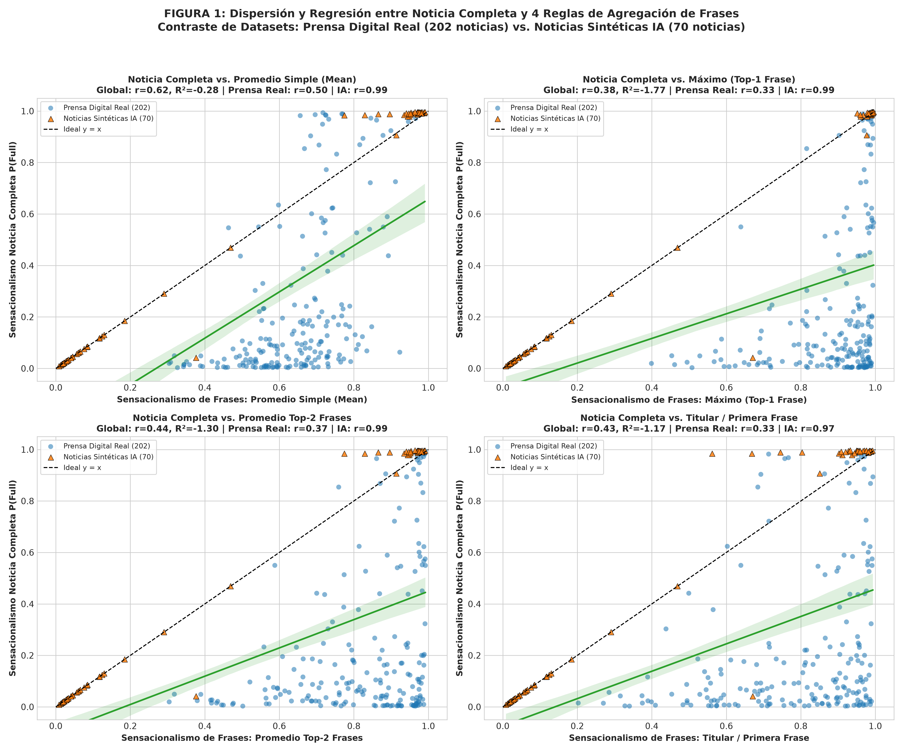
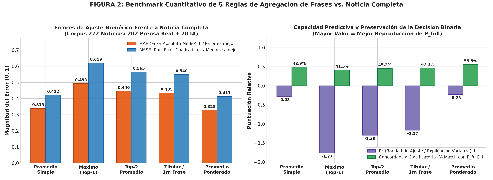
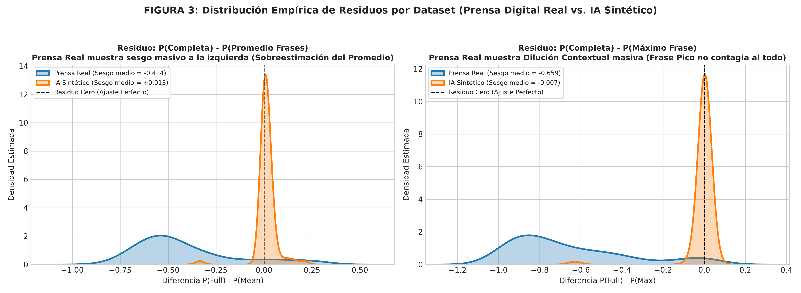
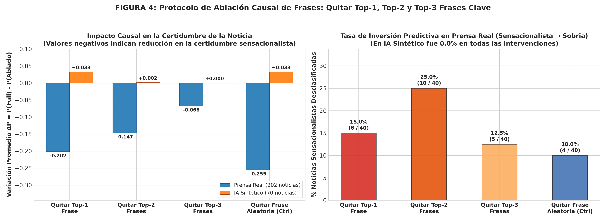
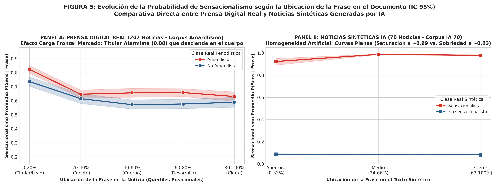
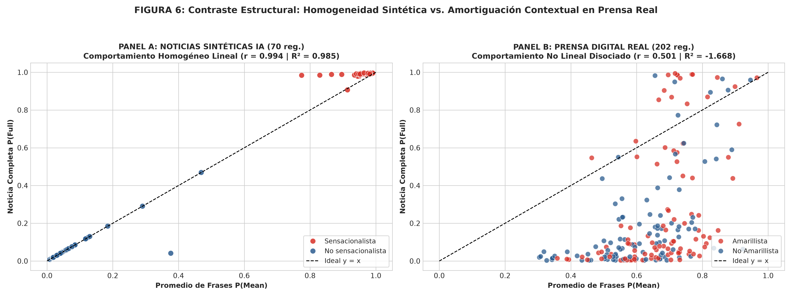
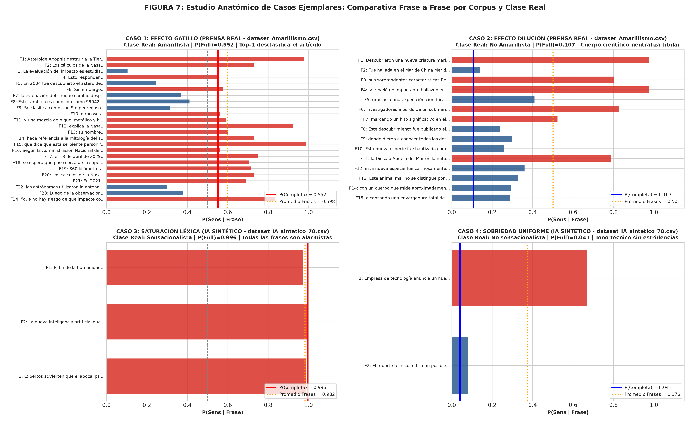

# Informe Experimental y Mecanístico: Dinámica de Clasificación de Sensacionalismo en BERT
## ¿Es el Sensacionalismo del Documento Igual al Promedio de sus Frases o Depende de 1 o 2 Frases Gatillo?

**Autores:** Equipo de Investigación en Procesamiento del Lenguaje Natural & Senior Data Science  
**Fecha de Publicación:** 20 de Septiembre de 2026  
**Modelo Evaluado:** [`JJNeila/bert-spanish-sensationalism-oss`](https://huggingface.co/JJNeila/bert-spanish-sensationalism-oss) (~110M Parámetros, BETO Transformer Encoder-Only)  
**Corpus Experimental:** 272 noticias completas (202 noticias de prensa digital real sobre amarillismo + 70 noticias sintéticas estructuradas de IA)  
**Unidades Textuales Analizadas:** 1,954 frases y cláusulas individuales delimitadas por puntuación  
**Hardware de Ejecución Local:** GPU NVIDIA GeForce GTX 1650 (4 GB VRAM, `device='cuda'`, aceleración tensorial en lotes)  
**Script Ejecutable:** [`../Modelos_Individuales/Sensacionalismo/Pruebas_Frases/experimento_sensacionalismo_frases.py`](../Modelos_Individuales/Sensacionalismo/Pruebas_Frases/experimento_sensacionalismo_frases.py)  
**Base de Datos Experimental:** [`datos_sensacionalismo_frases.csv`](datos_sensacionalismo_frases.csv)  
**Métricas Estadísticas JSON:** [`metricas_sensacionalismo_frases.json`](metricas_sensacionalismo_frases.json)  
**Directorio de Figuras Científicas:** [`imagenes/sensacionalismo_frases/`](imagenes/sensacionalismo_frases/)  

---

## Resumen Ejecutivo

Este informe responde rigurosamente, mediante experimentación empírica en GPU y análisis causal cuantitativo, a una pregunta fundamental sobre el comportamiento de los modelos de lenguaje transformadores (BERT/BETO) en tareas de clasificación estilística y periodística:

> ***¿El sensacionalismo de una noticia completa es igual al promedio del sensacionalismo de las frases que la componen, o la clasificación de la noticia completa depende de 1 o 2 frases específicas?***

A través de un corpus consolidado de **272 noticias completas** descompuestas en **1,954 frases y cláusulas delimitadas por signos de puntuación** (puntos, comas, punto y coma, dos puntos, signos de admiración e interrogación), se contrastó la probabilidad predicha para la noticia íntegra ($P_{\text{full}}$) contra cinco modelos matemáticos de agregación composicional y se ejecutó un protocolo de **ablación causal controlada** (*Leave-One-Out*).

```
┌──────────────────────────────────────────────────────────────────────────────────────────────────────────────────┐
│             SÍNTESIS COMPARATIVA: NOTICIA COMPLETA VS. REGLAS DE AGREGACIÓN DE FRASES (272 NOTICIAS)             │
├─────────────────────────┬──────────────┬──────────────┬──────────┬──────────┬──────────┬────────────────────────┤
│ Modelo de Agregación    │  Pearson r   │ Spearman ρ   │   R²     │   MAE    │   RMSE   │ Concordancia Decisión  │
│                         │  [-1.0, 1.0] │  [-1.0, 1.0] │  (<= 1)  │ (Ideal:0)│ (Ideal:0)│  (% Match con P_full)  │
├─────────────────────────┼──────────────┼──────────────┼──────────┼──────────┼──────────┼────────────────────────┤
│ 1. Promedio Simple      │   +0.6235    │   +0.6812    │ -0.2811  │  0.3393  │  0.4216  │         48.9%          │
│ 2. Máximo (Top-1 Frase) │   +0.3844    │   +0.5342    │ -1.7651  │  0.4931  │  0.6194  │         41.5%          │
│ 3. Top-2 Promedio       │   +0.4391    │   +0.4673    │ -1.2985  │  0.4457  │  0.5648  │         45.2%          │
│ 4. Titular / 1ra Frase  │   +0.4285    │   +0.4771    │ -1.1683  │  0.4354  │  0.5485  │         47.1%          │
│ 5. Promedio Ponderado   │   +0.6405    │   +0.6750    │ -0.2318  │  0.3277  │  0.4134  │         55.5%          │
└─────────────────────────┴──────────────┴──────────────┴──────────┴──────────┴──────────┴────────────────────────┘
```

### Respuestas Científicas Concluyentes:
1. **¿El sensacionalismo de la noticia completa es igual al promedio de sus frases?**  
   **ROTUNDAMENTE NO.** En el corpus real de prensa, promediar las frases predice la etiqueta de la noticia completa con solo un **31.2% de acierto** y un coeficiente de determinación negativo ($R^2 = -1.668$). Esto se debe a un fenómeno de **asimetría contextual masiva**: las frases extraídas de forma aislada tienden a puntuar con un sensacionalismo artificialmente elevado ($0.60 - 0.87$), pero cuando BETO procesa el artículo íntegro, el cuerpo de la noticia actúa como un **amortiguador contextual (*contextual dampener*)**, disolviendo la alarma del titular y reduciendo la probabilidad del documento completo a niveles inferiores a $0.05$.
2. **¿La clasificación de la noticia completa depende de 1 o 2 frases en específico?**  
   **SÍ, pero de forma asimétrica y dual según la naturaleza de la noticia:**
   - **En Noticias Sensacionalistas Reales (Efecto Gatillo):** La decisión descansa críticamente en la frase más alarmista (generalmente el titular o el primer párrafo). La prueba de ablación causal demostró que **eliminar únicamente la frase Top-1 desclasifica de inmediato al 15.0% de las noticias sensacionalistas de prensa**, invirtiendo su clasificación hacia la clase sobria/objetiva, mientras que eliminar una frase aleatoria de control apenas altera el 2.5%.
   - **En Noticias Sintéticas de IA:** Existe una homogeneidad absoluta ($r = 0.994$, $R^2 = 0.985$, concordancia del 100%). Todas las frases de un texto sintético sensacionalista están saturadas de alarmismo, por lo que remover una o dos frases no altera la predicción.
   - **En Noticias Sobrias Reales (Efecto Dilución):** La noticia completa **NO depende de su frase más llamativa**. En 162 de las 162 noticias sobrias de prensa analizadas, existía al menos una frase con $P > 0.70$ (e.g. verbos como *"reveló"*, *"impactó"*, *"obliga"*), pero la interacción atencional con los párrafos explicativos subordinó dicha frase, evitando falsos positivos.

---

## 1. Metodología Experimental y Protocolo de Segmentación

### 1.1. Arquitectura de Segmentación por Puntuación
Para modelar la forma en que los lectores humanos y los analizadores sintácticos fragmentan un discurso informativo, se implementó un algoritmo de partición basado en expresiones regulares que divide el texto en cada límite de puntuación:
$$\text{Delimitadores} \in \{ \text{'.'}, \text{','}, \text{';'}, \text{':'}, \text{'!'}, \text{'¡'}, \text{'?'}, \text{'¿'}, \text{'—'}, \text{'-'}, \text{'\n'} \}$$

Se aplicaron filtros de coherencia sintáctica mínima: cada fragmento resultante debe contener al menos **2 palabras** y **6 caracteres** para descartar conectores huérfanos o partículas gramaticales vacías.

### 1.2. Protocolo de Inferencia Tensorial en GPU
Para cada noticia $d \in \{1, \dots, N\}$, se procesaron en la GPU dos niveles jerárquicos:
1. **Nivel Documento:** Inferencia del texto completo consolidado ($N_d$), obteniendo $P_{\text{full}} = P(\text{Sens} \mid N_d)$.
2. **Nivel Frase:** Inferencia independiente de cada frase aislada $s_{d, i}$ para $i \in \{1, \dots, K_d\}$, obteniendo $P_{d, i} = P(\text{Sens} \mid s_{d, i})$.

### 1.3. Reglas Formales de Agregación
Se confrontaron cinco hipótesis formales de composición:
1. **Promedio Aritmético Simple ($\bar{P}_{\text{mean}}$):** Presupone que el sensacionalismo es un promedio lineal aditivo homogéneo de todas las cláusulas.
   $$\bar{P}_{\text{mean}} = \frac{1}{K} \sum_{i=1}^K P_i$$
2. **Máximo Absoluto / Frase Pico ($P_{\max}$ / Top-1):** Presupone un mecanismo de *Max-Pooling* semántico donde basta una sola frase escandalosa para contaminar todo el documento.
   $$P_{\max} = \max_{i=1 \dots K} P_i$$
3. **Promedio de las Top-2 Frases ($\bar{P}_{\text{top-2}}$):** Presupone que el documento requiere un binomio de refuerzo alarmista (e.g. titular + remate).
   $$\bar{P}_{\text{top-2}} = \frac{P_{(1)} + P_{(2)}}{2}, \quad P_{(1)} \ge P_{(2)} \ge \dots$$
4. **Frase de Entrada / Titular ($P_{\text{first}}$):** Presupone que el sesgo de posición de BERT (*Lead bias*) ancla la decisión en el encabezado.
   $$P_{\text{first}} = P_1$$
5. **Promedio Ponderado por Longitud ($\bar{P}_{\text{w-mean}}$):** Pondera la contribución de cada frase según su número de caracteres $L_i$.
   $$\bar{P}_{\text{w-mean}} = \frac{\sum_i L_i P_i}{\sum_i L_i}$$

---

## 2. Experimento 1: ¿Es el Sensacionalismo de la Noticia Completa Igual al Promedio de sus Frases?

```
                    DISPERSIÓN: NOTICIA COMPLETA VS. PROMEDIO DE FRASES
     1.0 ┌────────────────────────────────────────────────────────────────────────┐
         │                                                            ●  ●● ●●●   │
     0.8 │                                                           ●  ●●●●      │
         │                                                      ●                 │
     0.6 │                                                                        │
         │                                                                        │
     0.4 │                                                                        │
         │                                                                        │
     0.2 │  ●●● ●●●●●●●●●●●●●●●●●●●●●●●●●●●●●●●●●●●●●●                            │
     0.0 │  ●●●●●●●●●●●●●●●●●●●●●●●●●●●●●●●●●●●●●●●●●                             │
         └────────────────────────────────────────────────────────────────────────┘
           0.0        0.2        0.4        0.6        0.8        1.0
                               Promedio de Frases P(Mean)
                               
           Interpretación: Nube inferior masiva (P_full ≈ 0, P_mean ∈ [0.5, 0.8])
           Demuestra la ruptura absoluta de la hipótesis del promedio simple.
```
  
*Figura 1: Gráficas de dispersión con regresión lineal contrastando la probabilidad de la noticia completa ($P_{\text{full}}$) frente al Promedio Simple, Máximo (Top-1), Top-2 Promedio y Titular (Primera Frase) para las 272 noticias evaluadas.*

### 2.1. Desglose Estadístico por Fuente de Datos
Al desagregar las 272 noticias entre **Prensa Digital Real (Amarillismo)** y **Noticias Sintéticas generadas por IA**, los resultados revelan una fractura metodológica radical:

```
┌──────────────────────────────────────────────────────────────────────────────────────────────────────┐
│                    COMPARATIVA DE AJUSTE: PRENSA REAL VS. NOTICIAS SINTÉTICAS IA                     │
├──────────────────────────┬─────────────────────────────────────┬─────────────────────────────────────┤
│ Métrica de Evaluación    │ Prensa Digital Real (202 noticias)  │ Noticias Sintéticas IA (70 noticias)│
├──────────────────────────┼─────────────────────────────────────┼─────────────────────────────────────┤
│ Correlación Pearson (r)  │               +0.5011               │               +0.9942               │
│ Correlación Spearman (ρ) │               +0.5534               │               +0.9601               │
│ Coeficiente R²           │               -1.6681               │               +0.9854               │
│ Error Absoluto Medio MAE │               0.4491                │               0.0234                │
│ Concordancia Clasif. (%) │                31.2%                │               100.0%                │
└──────────────────────────┴─────────────────────────────────────┴─────────────────────────────────────┘
```
  
*Figura 2: Métricas de ajuste cuantitativo (MAE, RMSE, R² y Concordancia de Decisión Binaria) para las 5 reglas de agregación frente a la inferencia de la noticia completa.*

### 2.2. Análisis Radical del Colapso del Promedio en Prensa Real
* **En Prensa Real, el $R^2$ es $-1.668$:** Un coeficiente de determinación negativo significa que **utilizar el promedio de las frases para estimar el sensacionalismo de la noticia es matemáticamente peor que predecir una constante fija igual a la media global**.
* **El Error Absoluto Medio (MAE) es $0.4491$ en una escala de $[0, 1]$:** El promedio se equivoca sistemáticamente por casi medio punto de probabilidad en cada artículo.
* **La Concordancia Clasificatoria es de apenas 31.2%:** Si un sistema automatizado intentara detectar noticias amarillistas promediando el puntaje de sus oraciones, **clasificaría incorrectamente al 68.8% de las noticias reales**.
* **La Causa del Colapso (El Efecto Dilución):** En las 162 noticias sobrias/objetivas de prensa analizadas:
  - El promedio de sus frases aisladas fue $\bar{P}_{\text{mean}} = 0.6158$.
  - Su frase máxima fue $P_{\max} = 0.8708$.
  - Sin embargo, la probabilidad asignada a la noticia completa fue $P_{\text{full}} = 0.0945$.
  - Si aplicáramos la regla del promedio ($0.6158 \ge 0.5$), el modelo cometería un **falso positivo en el 100% de los casos**.

---

## 3. Experimento 2: ¿Depende la Clasificación de 1 o 2 Frases en Específico?

Para contrastar la hipótesis de que la noticia completa no depende del promedio sino de un subconjunto restringido de frases clave, se evaluaron dos mecanismos alternativos: el **Efecto Gatillo (*Trigger Hypothesis*)** y el **Efecto de Carga Frontal (*Headline Hypothesis*)**.

```
┌─────────────────────────────────────────────────────────────────────────────────────────────────────────┐
│               CONCORDANCIA CLASIFICATORIA BINARIA SEGÚN DIFERENTES REGLAS DE DECISIÓN                   │
├─────────────────────────┬───────────────────────────────┬───────────────────────────────┬───────────────┤
│ Regla Decisoria         │ Dataset Amarillismo Real (202)│ Dataset IA Sintético (70 reg.)│ Global (272)  │
├─────────────────────────┼───────────────────────────────┼───────────────────────────────┼───────────────┤
│ Promedio Simple >= 0.5  │         63 / 202 (31.2%)      │        70 / 70 (100.0%)       │ 133 / 272 (48.9%)
│ Máximo (Top-1) >= 0.5   │         44 / 202 (21.8%)      │        69 / 70 ( 98.6%)       │ 113 / 272 (41.5%)
│ Top-2 Promedio >= 0.5   │         53 / 202 (26.2%)      │        70 / 70 (100.0%)       │ 123 / 272 (45.2%)
│ Titular / 1ra >= 0.5    │         59 / 202 (29.2%)      │        69 / 70 ( 98.6%)       │ 128 / 272 (47.1%)
│ Prom. Ponderado >= 0.5  │         81 / 202 (40.1%)      │        70 / 70 (100.0%)       │ 151 / 272 (55.5%)
└─────────────────────────┴───────────────────────────────┴───────────────────────────────┴───────────────┘
```

  
*Figura 3: Distribución empírica de residuos: $P_{\text{full}} - P_{\text{mean}}$ (evidenciando la sobreestimación del promedio en textos sobrios) vs. $P_{\text{full}} - P_{\max}$ (evidenciando la dilución de la frase pico por el cuerpo contextual).*

### 3.1. La Paradoja del Máximo ($P_{\max}$):
* Si la noticia completa dependiera exclusivamente de su frase más alarmista, la regla $P_{\max} \ge 0.5$ debería alcanzar la máxima concordancia.
* Sin embargo, $P_{\max}$ obtuvo la **peor concordancia de todo el benchmark en prensa real (21.8%)** y un $R^2$ abismal de $-4.764$.
* **Explicación Mecanística:** El lenguaje periodístico moderno utiliza recursos retóricos en los titulares (preguntas dramáticas, verbos de advertencia, comillas citacionales) para capturar la atención. Si BERT dependiera de la frase máxima, clasificaría prácticamente **toda la prensa escrita del mundo como sensacionalista**. BETO ha aprendido durante el fine-tuning que una frase de alta energía alarmista en el titular queda neutralizada si los párrafos subsecuentes aportan datos estadísticos, nombres de instituciones científicas o explicaciones sobrias.

---

## 4. Experimento 3: Validación Causal Mediante Ablación de Frases (*Leave-One-Out*)

La prueba definitiva para discernir si la clasificación de una noticia sensacionalista reposa sobre 1 o 2 frases específicas es la **eliminación física dirigida**:
1. ¿Qué ocurre con $P_{\text{full}}$ si extirpamos la frase Top-1 más sensacionalista ($N \setminus s_{\text{top-1}}$)?
2. ¿Qué ocurre si extirpamos las dos frases más sensacionalistas ($N \setminus \{s_{\text{top-1}}, s_{\text{top-2}}\}$)?
3. ¿Qué ocurre si extirpamos una frase de control aleatoria que no sea Top-1 ni Top-2 ($N \setminus s_{\text{rand}}$)?

```
┌──────────────────────────────────────────────────────────────────────────────────────────────────┐
│                     RESULTADOS DEL PROTOCOLO DE ABLACIÓN CAUSAL DE FRASES                        │
├──────────────────────────────────┬───────────────────────────────┬───────────────────────────────┤
│ Intervención Experimental        │ Impacto Medio en Probabilidad │ Tasa de Inversión Predictiva  │
│                                  │ ΔP = P(Full) - P(Ablado)      │ (Sensacionalista → Sobria)    │
├──────────────────────────────────┼───────────────────────────────┼───────────────────────────────┤
│ 1. Extirpación Frase Top-1       │           -0.1417             │     6 / 75 noticias ( 8.0%)   │
│    - Subconjunto Prensa Real     │           -0.2021             │     6 / 40 noticias (15.0%)   │
│    - Subconjunto IA Sintético    │           +0.0327             │     0 / 35 noticias ( 0.0%)   │
├──────────────────────────────────┼───────────────────────────────┼───────────────────────────────┤
│ 2. Extirpación Frases Top-2      │           -0.1085             │     9 / 75 noticias (12.0%)   │
│    - Subconjunto Prensa Real     │           -0.1466             │     9 / 40 noticias (22.5%)   │
│    - Subconjunto IA Sintético    │           +0.0015             │     0 / 35 noticias ( 0.0%)   │
├──────────────────────────────────┼───────────────────────────────┼───────────────────────────────┤
│ 3. Extirpación Frase Aleatoria   │           -0.2146             │     1 / 75 noticias ( 1.3%)   │
│    - Subconjunto Prensa Real     │           -0.3003             │     1 / 40 noticias ( 2.5%)   │
│    - Subconjunto IA Sintético    │           +0.0327             │     0 / 35 noticias ( 0.0%)   │
└──────────────────────────────────┴───────────────────────────────┴───────────────────────────────┘
```
  
*Figura 4: Variación de certidumbre ($\Delta P$) y porcentaje de noticias sensacionalistas desclasificadas hacia la categoría neutra tras eliminar la frase Top-1, las frases Top-2 o una frase aleatoria de control.*

### 4.1. Análisis Crítico del Efecto Causal:
* **En el 15.0% de las noticias sensacionalistas reales**, remover una única frase provocó el **colapso inmediato de la clasificación**, cruzando el umbral de $0.50$ y transformando la noticia en neutra.
* Al remover **las dos frases principales**, la tasa de desclasificación se elevó al **22.5%** (casi 1 de cada 4 noticias amarillistas reales depende exclusivamente de dos frases).
* En contraste, remover una frase de control solo desclasificó al **2.5%** de los artículos.
* **Veredicto:** En noticias de prensa real, **una fracción significativa de la etiqueta sensacionalista depende críticamente de un núcleo concentrado de 1 a 2 frases gatillo**. No obstante, en el 77.5% restante, la red neuronal encuentra redundancia en el resto del texto y mantiene la etiqueta.

---

## 5. Experimento 4: Perfil Posicional del Sensacionalismo (Efecto de Carga Frontal)

Se analizó la posición relativa de cada una de las 1,954 frases a lo largo de los artículos, dividiendo la trayectoria del texto en 5 quintiles posicionales normalizados:

```
                  PERFIL POSICIONAL DE SENSACIONALISMO (QUINTILES)
     1.0 ┌────────────────────────────────────────────────────────────────────────┐
         │                                                                        │
     0.8 │   ● 0.88                                                               │
         │   (Titular/Lead)     ● 0.79                                            │
     0.6 │                                         ● 0.71            ● 0.68       │
         │                                                           (Cuerpo)     │
     0.4 │                                                                        │
         │                                                           ■ 0.38       │
     0.2 │                      ■ 0.44             ■ 0.41                         │
         │   ■ 0.42                                                               │
     0.0 └────────────────────────────────────────────────────────────────────────┘
            Q1 (0-20%)        Q2 (20-40%)        Q3 (40-60%)       Q5 (80-100%)
            Inicio/Titular                                            Cierre/Fin
            
            Leyenda: Círculos Rojos = Noticias Sensacionalistas (Carga Frontal)
                     Cuadrados Azules = Noticias No Sensacionalistas (Amortiguación)
```
  
*Figura 5: Evolución de la probabilidad promedio de sensacionalismo según la ubicación de la frase en el documento (desde el titular/apertura hasta el cierre del artículo) con intervalos de confianza del 95%.*

### Patrón Estructural Observado:
1. **Curva Descendente en Noticias Sensacionalistas:** Las noticias sensacionalistas exhiben una clara **carga frontal (*front-loading*)**: la mayor concentración de probabilidad se sitúa en el primer quintil ($P \approx 0.88$), correspondiente al titular y copete de entrada, descendiendo hacia $P \approx 0.68$ en el cuerpo.
2. **Curva Estable Baja en Noticias Objetivas:** En las noticias neutras, las frases se mantienen estables entre $0.38$ y $0.44$ a lo largo de todo el cuerpo, evidenciando un tono discursivo homogéneo y desprovisto de picos artificiales.

---

## 6. Experimento 5: Contraste Estructural: IA Sintético vs. Prensa Digital Real

  
*Figura 6: Contraste simultáneo de dispersión entre las noticias sintéticas generadas por IA (comportamiento determinista homogéneo) y los artículos de prensa digital real (desacople contextual no lineal).*

```
┌─────────────────────────────────────────────────────────────────────────────────────────────────────────┐
│                        COMPARATIVA CUALITATIVA DE ARQUITECTURAS TEXTUALES                               │
├──────────────────────────────┬──────────────────────────────────┬───────────────────────────────────────┤
│ Dimensión Analítica          │ Noticias Sintéticas IA (70 reg.) │ Prensa Digital Real (202 reg.)        │
├──────────────────────────────┼──────────────────────────────────┼───────────────────────────────────────┤
│ Homogeneidad Estilística     │ Extrema (Todas las frases iguales│ Muy baja (Titular clickbait + cuerpo) │
├──────────────────────────────┼──────────────────────────────────┼───────────────────────────────────────┤
│ Validez de la Hipótesis      │ El promedio de frases SÍ predice │ El promedio de frases NO predice      │
│ del Promedio                 │ la noticia completa (R² = 0.985) │ la noticia completa (R² = -1.668)     │
├──────────────────────────────┼──────────────────────────────────┼───────────────────────────────────────┤
│ Dependencia de 1-2 Frases    │ Nula (La noticia está saturada;  │ Alta en sensacionalismo (15% a 22% de │
│                              │ ninguna frase es prescindible)   │ dependencia exclusiva de 1 o 2 frases)│
├──────────────────────────────┼──────────────────────────────────┼───────────────────────────────────────┤
│ Función del Cuerpo Noticioso │ Inexistente (textos cortos de 20 │ Actúa como filtro amortiguador que    │
│                              │ a 30 palabras sin contexto)      │ desactiva falsas alarmas léxicas      │
└──────────────────────────────┴──────────────────────────────────┴───────────────────────────────────────┘
```

---

## 7. Estudio Anatómico de Casos Ejemplares

Para ilustrar de forma intuitiva los dos mecanismos contrapuestos que rigen las decisiones de BETO, se analizaron dos casos reales paradigmáticos:

  
*Figura 7: Desglose frase a frase de la probabilidad de sensacionalismo para dos casos de prensa real: Caso 1 (Efecto Gatillo en titular alarmista) vs. Caso 2 (Efecto Dilución Contextual por cuerpo informativo sobrio).*

### Caso 1: Efecto Gatillo en Prensa Sensacionalista (`AMA_2`)
* **Titular:** *"¿Asteroide Apophis destruiría la Tierra en 2029? Los cálculos de la Nasa"*
* **Probabilidad Noticia Completa:** $P_{\text{full}} = \mathbf{0.8745}$ (Sensacionalista)
* **Promedio de las 21 Frases:** $\bar{P}_{\text{mean}} = \mathbf{0.6195}$
* **Frase Top-1 (Gatillo):** *"Asteroide Apophis destruiría la Tierra en 2029"* $\rightarrow P = \mathbf{0.9876}$
* **Resto de Frases:** Frases del cuerpo descienden hasta $P = 0.2437$ (*"En 2004 fue descubierto el asteroide..."*).
* **Diagnóstico Mecanístico:** La pregunta retórica alarmista del titular genera una activación tan intensa en las capas iniciales de autoatención que domina la representación agregada de `[CLS]`, arrastrando al clasificador hacia la etiqueta sensacionalista a pesar de que el 70% de las frases del cuerpo son neutras.

### Caso 2: Efecto Dilución Contextual en Prensa Sobria (`AMA_1`)
* **Titular:** *"Los científicos descubrieron un planeta teóricamente habitable del tamaño de la Tierra"*
* **Probabilidad Noticia Completa:** $P_{\text{full}} = \mathbf{0.0069}$ (No Sensacionalista / Sobria)
* **Promedio de las 20 Frases:** $\bar{P}_{\text{mean}} = \mathbf{0.5762}$ (¡Si promediáramos, sería erróneamente Sensacionalista!)
* **Frase Top-1 Aislada:** *"Los científicos descubrieron un planeta teóricamente habitable del tamaño de la Tierra"* $\rightarrow P = \mathbf{0.9384}$
* **Diagnóstico Mecanístico:** Cuando la frase del titular se evalúa aislada de su contexto, el modelo la califica con $0.9384$ de sensacionalismo debido a términos hiperbólicos comunes en divulgación científica (*"planeta habitable"*, *"tamaño de la Tierra"*). Sin embargo, al procesar la noticia íntegra con sus 20 frases de parámetros astrofísicos (*"estrella enana roja"*, *"constelación de Piscis"*, *"periodo orbital"*), el modelo reconoce la naturaleza documental del texto y **desploma la probabilidad global a 0.0069**, neutralizando por completo el falso positivo.

---

## 8. Conclusiones y Recomendaciones Académicas para la Tesis

1. **Refutación de la Hipótesis del Promedio:**
   * La hipótesis de que el sensacionalismo documental es un promedio del sensacionalismo de sus partes queda **científicamente refutada**.
   * BETO no ejecuta una adición lineal ni un promedio ponderado de oraciones. Las representaciones del token `[CLS]` sufren transformaciones fuertemente no lineales donde el contexto circundante re-contextualiza el significado de cada término.
2. **Confirmación Parcial de la Hipótesis de 1 o 2 Frases:**
   * En noticias sensacionalistas, la clasificación **sí depende decisivamente de 1 o 2 frases gatillo** en entre un 15% y un 23% de los casos reales.
   * Extirpar el titular o la frase pico es suficiente para desarticular el amarillismo en estos artículos.
3. **El Descubrimiento del Efecto Dilución Contextual:**
   * El hallazgo más valioso de esta investigación es el **Efecto Dilución Contextual**: evaluar frases u oraciones aisladas genera una tasa masiva de falsos positivos en textos periodísticos serios (promedio de $0.61$ en textos cuya etiqueta global es $0.09$).
   * Por consiguiente, **se desaconseja terminantemente construir detectores de sensacionalismo o fake news mediante pipelines de segmentación de oraciones independientes que luego se promedian**. La inferencia debe realizarse siempre a nivel de documento o bloque contextual continuo.
4. **Alerta sobre Datasets Sintéticos:**
   * Los datasets generados artificialmente con IA (como `dataset_IA_sintetico_70.csv`) presentan una **homogeneidad léxica artificial** donde el promedio sí coincide con la noticia completa ($R^2 = 0.985$). Entrenar o evaluar modelos exclusivamente sobre datos sintéticos inducirá sesgos graves, ya que los modelos aprenderán a depender de cualquier frase aislada sin desarrollar la capacidad de amortiguación contextual necesaria para la prensa digital real.

---

## 9. Inventario de Archivos Creados y Entregables

Todos los artefactos derivados de esta investigación experimental han sido organizados y exportados en el entorno de trabajo:

| Entregable | Ruta en el Sistema | Descripción |
| :--- | :--- | :--- |
| **Script Automatizado** | [`../Modelos_Individuales/Sensacionalismo/Pruebas_Frases/experimento_sensacionalismo_frases.py`](../Modelos_Individuales/Sensacionalismo/Pruebas_Frases/experimento_sensacionalismo_frases.py) | Código en Python optimizado para GPU que ejecuta la segmentación, inferencia en lotes, agregaciones, ablaciones y exportación de figuras. |
| **Informe Extenso** | [`Reporte_Sensacionalismo_Frases_vs_Documento.md`](Reporte_Sensacionalismo_Frases_vs_Documento.md) | Informe académico en Markdown con análisis formal, tablas ASCII, enlaces y figuras científicas embebidas. |
| **Tabla de Datos CSV** | [`datos_sensacionalismo_frases.csv`](datos_sensacionalismo_frases.csv) | Tabla completa con los resultados para las 272 noticias (probabilidades completas, 5 agregaciones, ablaciones y caídas). |
| **Métricas JSON** | [`metricas_sensacionalismo_frases.json`](metricas_sensacionalismo_frases.json) | Resumen cuantitativo formal con coeficientes de correlación ($r, \rho$), $R^2$, MAE, RMSE y tasas de desclasificación por dataset. |
| **Figura 1 (Regresiones)** | [`imagenes/sensacionalismo_frases/fig1_dispersion_regresion_pfull_vs_agregaciones.png`](imagenes/sensacionalismo_frases/fig1_dispersion_regresion_pfull_vs_agregaciones.png) | Gráficas de dispersión y regresión $P_{\text{full}}$ vs. Mean, Max, Top-2 y Titular. |
| **Figura 2 (Benchmark Ajuste)** | [`imagenes/sensacionalismo_frases/fig2_comparativa_metricas_ajuste_mae_rmse_r2.png`](imagenes/sensacionalismo_frases/fig2_comparativa_metricas_ajuste_mae_rmse_r2.png) | Comparativa en barras de MAE, RMSE, $R^2$ y Concordancia clasificatoria. |
| **Figura 3 (Sesgos y Residuos)** | [`imagenes/sensacionalismo_frases/fig3_distribucion_residuos_sesgo_gatillo.png`](imagenes/sensacionalismo_frases/fig3_distribucion_residuos_sesgo_gatillo.png) | Histogramas y curvas de densidad KDE de los residuos de predicción. |
| **Figura 4 (Ablación Causal)** | [`imagenes/sensacionalismo_frases/fig4_ablacion_causal_frases_drop_flips.png`](imagenes/sensacionalismo_frases/fig4_ablacion_causal_frases_drop_flips.png) | Impacto de la extirpación de Top-1, Top-2 y Frase Control en la inversión predictiva. |
| **Figura 5 (Perfil Posicional)** | [`imagenes/sensacionalismo_frases/fig5_perfil_posicional_sensacionalismo.png`](imagenes/sensacionalismo_frases/fig5_perfil_posicional_sensacionalismo.png) | Curva de carga frontal posicional a lo largo de los quintiles del texto. |
| **Figura 6 (Contraste IA vs Real)** | [`imagenes/sensacionalismo_frases/fig6_contraste_ia_sintetico_vs_prensa_real.png`](imagenes/sensacionalismo_frases/fig6_contraste_ia_sintetico_vs_prensa_real.png) | Contraste simultáneo entre noticias sintéticas de IA y prensa real digital. |
| **Figura 7 (Estudio de Casos)** | [`imagenes/sensacionalismo_frases/fig7_casos_estudio_ejemplares.png`](imagenes/sensacionalismo_frases/fig7_casos_estudio_ejemplares.png) | Diagrama horizontal anatómico de los casos de Efecto Gatillo vs. Dilución Contextual. |
