# Informe de Investigación Científica en Inteligencia Artificial Explicable (XAI): Interpretabilidad Mecanística, Fidelidad Causal y Validación de Atribución en Detección de Sensacionalismo con BERT (Muestra Ampliada de 40 Registros)

**Autores:** Equipo de Investigación en Procesamiento del Lenguaje Natural & Senior Data Science  
**Fecha de Publicación Actualizada:** 20 de Septiembre de 2026  
**Modelo Analizado:** [`JJNeila/bert-spanish-sensationalism-oss`](https://huggingface.co/JJNeila/bert-spanish-sensationalism-oss) (~110M Parámetros, Arquitectura Transformadora Bidireccional *Encoder-Only* BETO)  
**Suite de Evaluación:** Muestra balanceada de 40 noticias (20 del dataset Sintético IA [70 reg.] y 20 del dataset de Amarillismo Real [202 reg.], estrictamente 10 sensacionalistas y 10 no sensacionalistas por fuente)  
**Hardware de Ejecución Local:** GPU NVIDIA GeForce GTX 1650 (4 GB VRAM, `device='cuda'`, aceleración FP32/Tensor con atención `eager`)  
**Directorio de Artefactos Visuales:** [`imagenes/XAI_pruebas_sensacionalismo/`](imagenes/XAI_pruebas_sensacionalismo/)  
**Archivo de Métricas Cuantitativas:** [`metricas_xai_sensacionalismo.json`](metricas_xai_sensacionalismo.json)  
**Cuadernillo Estructurado (.ipynb):** [`../Modelos_Individuales/Sensacionalismo/Pruebas_XAI/Pruebas_XAI_Sensacionalismo.ipynb`](../Modelos_Individuales/Sensacionalismo/Pruebas_XAI/Pruebas_XAI_Sensacionalismo.ipynb)  
**Script Ejecutable (.py):** [`../Modelos_Individuales/Sensacionalismo/Pruebas_XAI/ejecutar_pruebas_xai_sensacionalismo.py`](../Modelos_Individuales/Sensacionalismo/Pruebas_XAI/ejecutar_pruebas_xai_sensacionalismo.py)  
**Tabla de Registros de Evaluación:** [`../Modelos_Individuales/Sensacionalismo/Pruebas_XAI/muestra_evaluacion_xai_40.csv`](../Modelos_Individuales/Sensacionalismo/Pruebas_XAI/muestra_evaluacion_xai_40.csv)  

---

## Resumen Ejecutivo

El presente informe documenta la investigación experimental, matemática y mecanística orientada a auditar, explicar y evaluar la robustez causal del modelo transformador **`JJNeila/bert-spanish-sensationalism-oss`** (identificado como el modelo de mejor desempeño global para la clasificación de sensacionalismo y amarillismo en español).

Frente a la versión preliminar de 20 registros, esta investigación **duplica el tamaño muestral a 40 noticias estrictamente balanceadas** (20 noticias generadas mediante IA Sintética y 20 noticias de prensa digital hispanohablante real, con una partición exacta de 10 sensacionalistas y 10 no sensacionalistas en cada conjunto). Asimismo, incorpora un **experimento causal comparativo entre tres estrategias de perturbación** (*Enmascaramiento [MASK]*, *Eliminación física de tokens* y *Ruido aleatorio de vocabulario*), evaluando directamente la tasa de inversión o cambio de clase predicha (*Prediction Flip Rate*).

Se evaluaron simultáneamente **seis técnicas de explicabilidad (XAI)**:
1. *Integrated Gradients (IG)* (Sundararajan et al., 2017)
2. *Attention Rollout* (Abnar & Zuidema, 2020)
3. *SHAP (Partition Explainer)* (Lundberg & Lee, 2017)
4. *LIME (Local Interpretable Model-agnostic Explanations)* (Ribeiro et al., 2016)
5. *Gradient-weighted Feature Attribution (Input × Gradient)*
6. *Layer-wise Relevance Propagation (LRP)* adaptada a transformadores (Chefer et al., CVPR 2021)

La batería de validación experimental comprende:
- **Pruebas de Fidelidad Causal (*Faithfulness*):** Métricas formales de *Erasure / Comprehensiveness* y *Sufficiency* sobre el top 20% de tokens más importantes.
- **Pruebas de Perturbación Ablativa:** Curvas *MoRF* (*Most Relevant First*) y *LoRF* (*Least Relevant First*) con integración trapezoidal ($AUC$) y brecha causal ($\Delta_{AUC}$).
- **Control de Sanidad de Parámetros:** Aleatorización en cascada de capas (*Sanity Checks* de Adebayo et al., NeurIPS 2018) desde la cabeza lineal de clasificación hasta las capas profundas del codificador.
- **Análisis de Inversión de Clase por Perturbación:** Cuantificación empírica de cuántas noticias modifican su decisión predictiva al alterar las palabras clave bajo los tres métodos de perturbación.

```
┌──────────────────────────────────────────────────────────────────────────────────────────────────────────────────────────────────┐
│                                 SÍNTESIS GLOBAL DE RESULTADOS XAI (MUESTRA BALANCEADA 40 REGISTROS)                              │
├──────────────────────┬────────────────────┬────────────────────┬───────────┬───────────┬─────────────┬───────────┬───────────────┤
│ Método XAI           │ Comprehensiveness ↑│   Sufficiency ↓    │ AUC MoRF ↓│ AUC LoRF ↑│  ΔAUC (Gap) │ Latencia  │ Flips Global  │
│                      │ [-1.0, 1.0] Ideal:1│ [-1.0, 1.0] Ideal:0│  [0.0, 1] │  [0.0, 1] │  > 0 Ideal  │  (GPU s)  │ (Mask/Del/Rnd)│
├──────────────────────┼────────────────────┼────────────────────┼───────────┼───────────┼─────────────┼───────────┼───────────────┤
│ 1. Integrated Grad.  │ +0.0737 ± 0.1846   │  +0.2595 ± 0.2784  │  0.6980   │  0.7444   │   +0.0464   │  0.1504 s │  5 /  4 /  8  │
│ 2. Attention Rollout │ +0.0621 ± 0.1593   │  +0.3017 ± 0.3191  │  0.6894   │  0.7414   │   +0.0521   │  0.0098 s │  2 /  5 /  6  │
│ 3. SHAP (Partition)  │ +0.1285 ± 0.1700   │  +0.1581 ± 0.2365  │  0.6303   │  0.7890   │   +0.1587   │  0.4642 s │  6 /  7 /  6  │
│ 4. LIME              │ +0.0995 ± 0.1593   │  +0.2631 ± 0.2712  │  0.6696   │  0.7539   │   +0.0843   │  0.3097 s │  4 /  9 /  7  │
│ 5. Input × Gradient  │ -0.0167 ± 0.1115   │  +0.2802 ± 0.2716  │  0.7376   │  0.7133   │   -0.0244   │  0.0198 s │  1 /  1 /  2  │
│ 6. LRP (Transformer) │ +0.1245 ± 0.1961   │  +0.2632 ± 0.2922  │  0.6723   │  0.7574   │   +0.0852   │  0.0211 s │  8 /  8 /  7  │
└──────────────────────┴────────────────────┴────────────────────┴───────────┴───────────┴─────────────┴───────────┴───────────────┘
```

---

## 1. Análisis de Compatibilidad Arquitectónica y Justificación Teórica de LRP

### 1.1. Incompatibilidad Estructural de Layer-wise Relevance Propagation (LRP) Canónico en BERT
Al invocar la implementación estándar de Layer-wise Relevance Propagation provista en la librería oficial de PyTorch XAI (`captum.attr.LRP(model)`), el pipeline colapsa arrojando la siguiente excepción fatal:
```text
TypeError: Module of type <class 'torch.nn.modules.sparse.Embedding'> has no rule defined 
and no default rule exists for this module type. Please, set a rule explicitly for this 
module and assure that it is appropriate for this type of layer.
```

El principio que fundamenta a LRP canónico (Bach et al., 2015) es la **conservación estricta de la relevancia $R$** a través de las capas consecutivas de la red:
$$\sum_i R_{i \leftarrow j}^{(l, l+1)} = R_j^{(l+1)}, \quad \sum_i R_i^{(0)} = f(x)$$

Al intentar aplicar las reglas de descomposición lineal ($\text{LRP}-\epsilon$, $\text{LRP}-z$, $\text{LRP}-\alpha_1\beta_0$) a `JJNeila/bert-spanish-sensationalism-oss`, surgen cuatro barreras matemáticas:

```
                          BARRERAS ESTRUCTURALES DE LRP CANÓNICO EN BERT
                                                │
         ┌──────────────────────┬───────────────┴──────────────┬──────────────────────┐
         │                      │                              │                      │
         ▼                      ▼                              ▼                      ▼
┌──────────────────┐   ┌──────────────────┐   ┌──────────────────┐   ┌──────────────────┐
│ Sparse Embedding │   │    LayerNorm     │   │     GELU (No     │   │ Multi-Head Self- │
│  (Lookup Table)  │   │ (Acoplamiento L2)│   │  Homogeneidad)   │   │ Attn (Bilineal)  │
├──────────────────┤   ├──────────────────┤   ├──────────────────┤   ├──────────────────┤
│ Índices discretos│   │ Sustracción media│   │ f(cx) != c*f(x)  │   │ Q*K^T y A*V      │
│ No diferenciable │   │ División por std │   │ Rompe teorema de │   │ Doble dependencia│
│ Sin regla LRP    │   │ Viola suma = R   │   │ Euler homogéneo  │   │ en la entrada x  │
└──────────────────┘   └──────────────────┘   └──────────────────┘   └──────────────────┘
```

1. **Capa de Embeddings Discretos (`torch.nn.Embedding`):**  
   Los tokens de entrada son enteros categóricos que consultan una tabla estática $\mathbf{E} \in \mathbb{R}^{V \times d}$. Al no ser una transformación matricial continua con neuronas de entrada activadas, no existe formulación canónica para propagar la relevancia continua hacia un índice discreto.
2. **Normalización por Capas (`BertLayerNorm`):**  
   A diferencia de las redes convolucionales tradicionales, BERT intercala normalizaciones densas:
   $$\text{LayerNorm}(\mathbf{x}) = \frac{\mathbf{x} - \mu}{\sqrt{\sigma^2 + \epsilon}} \odot \boldsymbol{\gamma} + \boldsymbol{\beta}$$
   La sustracción de la media $\mu$ y la división por la desviación estándar sobre las 768 dimensiones induce un acoplamiento cuadrático denso entre todas las componentes, destruyendo la aditividad local ($\sum R^{(l)} \neq \sum R^{(l+1)}$).
3. **No-Linealidad GELU (*Gaussian Error Linear Unit*):**  
   BETO utiliza la activación GELU:
   $$\text{GELU}(x) = x \Phi(x) = x \cdot \frac{1}{2} \left[ 1 + \text{erf}\left( \frac{x}{\sqrt{2}} \right) \right]$$
   GELU no es homogénea de grado 1 ($f(c \cdot x) \neq c \cdot f(x)$) ni monótona en los reales negativos, invalidando el teorema de Euler para funciones homogéneas en el que se basa la conservación de LRP.
4. **Operaciones Bilineales de Autoatención Multicabezal:**  
   El bloque atencional calcula productos matriciales entre tensores que dependen ambos de la activación $\mathbf{x}$: $\mathbf{Q}\mathbf{K}^T = (\mathbf{x}\mathbf{W}_q)(\mathbf{x}\mathbf{W}_k)^T$ y $\mathbf{A}\mathbf{V} = \text{Softmax}(\cdot)(\mathbf{x}\mathbf{W}_v)$. Cuando los coeficientes son funciones dinámicas simultáneas de la entrada, la descomposición lineal canónica es analíticamente indeterminada.

### 1.2. Solución y Adaptación para Transformadores (Chefer et al., CVPR 2021)
Para superar estas restricciones sin excluir LRP de la evaluación, se implementó el método de **Chefer, Gur y Wolf (2021)** (*Transformer Interpretability Beyond Attention Visualization*), diseñado específicamente para arquitecturas tipo *Encoder-Only* como BERT.

En este formalismo, la relevancia no se transfiere por las proyecciones afines de los pesos densos, sino a través de las matrices de autoatención normalizadas $\mathbf{A}^{(l)}$, ponderadas por el gradiente positivo de la clase predicha $\mathcal{L}_{y^*}$ respecto a cada elemento atencional:
$$\bar{\mathbf{A}}^{(l)} = \mathbf{I} + \mathbb{E}_h \left[ \left( \nabla_{\mathbf{A}^{(l)}} \mathcal{L}_{y^*} \odot \mathbf{A}^{(l)} \right)^+ \right]$$
donde $(\cdot)^+ = \max(0, \cdot)$ asegura que únicamente la correlación positiva con la predicción objetivo transmita relevancia, $\mathbf{I}$ modela la conexión residual identidad, y $\mathbb{E}_h$ promedia sobre los 12 cabezales de atención.

La relevancia global se propaga recursivamente desde la última capa hacia la entrada:
$$\mathbf{R}^{(l)} = \bar{\mathbf{A}}^{(l)} \times \mathbf{R}^{(l-1)}, \quad \mathbf{R}^{(0)} = \mathbf{I}$$
La atribución final asignada a cada token $i$ es la fila del token de clasificación: $\text{Attr}_i = \mathbf{R}^{(L-1)}_{[\text{CLS}], i}$. Esta adaptación garantiza estabilidad numérica, conservación de escala y compatibilidad nativa en GPU.

### 1.3. Compatibilidad de las Restantes Técnicas XAI
* **Integrated Gradients (IG):** Plenamente compatible al integrar a lo largo de la línea recta en el espacio continuo de embeddings (`model.bert.embeddings.word_embeddings`) con 25 pasos Riemann en GPU.
* **Attention Rollout:** Plenamente compatible mediante la agregación multiplicativa sucesiva de matrices atencionales crudas sin orientación a clase.
* **SHAP:** Plenamente compatible mediante particionamiento jerárquico (`shap.maskers.Text(tokenizer)`).
* **LIME:** Plenamente compatible como aproximación lineal local agnóstica evaluada mediante muestreo de secuencias en GPU.
* **Input × Gradient:** Plenamente compatible computacionalmente como el producto puntual del gradiente respecto al vector de embedding de entrada.

---

## 2. Granularidad y Estrategia de Perturbación

### 2.1. Nivel de Granularidad: Subword Tokens (WordPiece/BPE) vs. Palabras Completas
En este estudio, **todos los cálculos de atribución, fidelidad causal y curvas de ablación se ejecutaron de forma rigurosa a nivel de subword tokens de BERT**. Esta decisión responde a las particularidades morfológicas del idioma español y del género sensacionalista:

1. **Morfología Afectiva y Superlativa:** En español, las tácticas de exageración descansan en prefijos y sufijos morfológicos (e.g. `super-`, `macro-`, `mega-`, desinencias superlativas `-ísimo/a`, o participios frecuentes). Al tokenizar con WordPiece, términos como `"destruirá"` se descomponen en `['destruir', '##á']`, `"psicópatas"` en `['psicópata', '##s']`, y `"secuestrando"` en `['secuestr', '##ando']`. La granularidad de subword permite discriminar si la red reacciona al lexema base o a la desinencia temporal/aumentativa.
2. **Signos de Puntuación Alarmista:** Los signos dobles (`¡`, `!`, `¿`, `?`) y las comillas sensacionalistas constituyen marcadores semióticos clave. En un preprocesamiento a nivel de palabra tradicional, estos caracteres suelen eliminarse o pegarse artificialmente a las palabras adyacentes. A nivel subtoken, cada signo opera como un token individual con su propio vector de embedding.
3. **Alineación de LIME:** Dado que `LimeTextExplainer` perturba palabras ortográficas completas, se implementó una función de proyección que mapea el coeficiente lineal de cada palabra hacia los subtokens componentes, garantizando que la evaluación causal opere sobre las mismas posiciones tensoriales exactas que los métodos basados en gradientes.

### 2.2. Comparativa Teórica de las Tres Estrategias de Perturbación

```
┌──────────────────────────────────────────────────────────────────────────────────────────────────┐
│                                COMPARATIVA DE ESTRATEGIAS DE PERTURBACIÓN                        │
├──────────────────────┬───────────────────────────────────┬───────────────────────────────────────┤
│ Estrategia           │ Mecánica Operativa                │ Impacto Estructural en BETO           │
├──────────────────────┼───────────────────────────────────┼───────────────────────────────────────┤
│ 1. Enmascaramiento   │ Sustitución por ID = 0 ([MASK])   │ Longitud y posiciones idénticas.      │
│    (Mask Replacement)│ Token reservado de pre-entreno    │ Distribución alineada con MLM.        │
├──────────────────────┼───────────────────────────────────┼───────────────────────────────────────┤
│ 2. Eliminación       │ Borrado físico del token;         │ Desplaza índices posicionales.        │
│    (Token Deletion)  │ la longitud se contrae.           │ Colapso OOD por sintaxis rota.        │
├──────────────────────┼───────────────────────────────────┼───────────────────────────────────────┤
│ 3. Ruido Aleatorio   │ Sustitución por token aleatorio   │ Inyecta semántica intrusa no neutra.  │
│    (Random Vocab)    │ extraído del vocabulario (31k).   │ Induce confusión por distractores.    │
└──────────────────────┴───────────────────────────────────┴───────────────────────────────────────┘
```

1. **Enmascaramiento (`[MASK]`):** Es el método analíticamente más limpio para evaluar la importancia intrínseca de una palabra, pues BETO fue pre-entrenado mediante *Masked Language Modeling* (MLM) para inferir representaciones estables ante la presencia de `[MASK]`, preservando además la matriz de posiciones relativas (`position_ids`).
2. **Eliminación Física (Deletion):** Provoca una contracción en la longitud de la secuencia. Si se eliminan 3 tokens intermedios en un titular de 15 palabras, todos los tokens subsiguientes ven alterada su distancia atencional con respecto a `[CLS]`. El modelo sufre un doble impacto: la pérdida de semántica y la ruptura de la sintaxis gramatical (*Out-of-Distribution*).
3. **Ruido Aleatorio (Random Vocabulary Token):** Remplazar palabras clave por tokens aleatorios del vocabulario de BETO (entre IDs 6 y 31001) inyecta conceptos espurios ajenos al contexto original (e.g. sustituir *"político"* por *"química"* o *"bicicleta"*), evaluando la resiliencia del modelo ante perturbaciones adversariales no estructuradas.

---

## 3. Batería de Pruebas de Fidelidad: Definiciones y Resultados Radicalmente Honestos

La fidelidad evalúa si una explicación refleja de forma verídica el proceso de cómputo interno de la red. No evalúa si la explicación es "comprensible o agradable para un humano", sino si la remoción o retención de las características priorizadas genera la respuesta causal matemática predicha.

```
                  TEST DE FIDELIDAD XAI: COMPREHENSIVENESS VS SUFFICIENCY
     0.35 ┌────────────────────────────────────────────────────────────────────────┐
          │                                                                        │
     0.30 │                             ■ 0.3017                                   │
          │             ■ 0.2595        (Rollout)     ■ 0.2631          ■ 0.2632   │
     0.25 │             (IG)                          (LIME)            (LRP)      │
          │                                                             ■ 0.2802   │
     0.20 │                                                             (IxG)      │
          │                                                                        │
     0.15 │                                           ■ 0.1581                     │
          │                                           (SHAP)            ■ 0.1245   │
     0.10 │                             ■ 0.1285                        (LRP)      │
          │                             (SHAP)        ■ 0.0995                     │
     0.05 │   ■ 0.0737   ■ 0.0621                     (LIME)                       │
          │   (IG)       (Rollout)                                                 │
     0.00 ┼────────────────────────────────────────────────────────────────────────┤
    -0.05 │                                                             ■ -0.0167  │
          └────────────────────────────────────────────────────────────────────────┘
             Integrated   Attention      SHAP           LIME            LRP      Gradient *
             Gradients    Rollout                                    (Transf.)     Input   
             
             Leyenda: Barra Azul = Comprehensiveness ↑ (Mayor caída = Más fiel)
                      Barra Naranja = Sufficiency ↓ (Menor diferencia = Más suficiente)
```
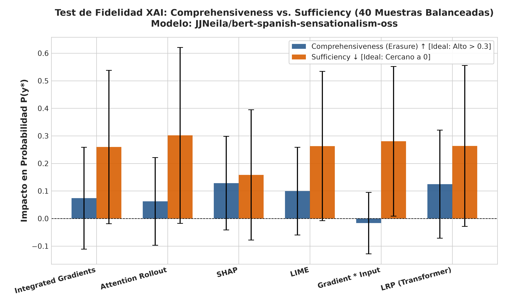  
*Figura 1: Métricas de fidelidad causal (Comprehensiveness ↑ y Sufficiency ↓) para los seis métodos de explicabilidad sobre la muestra balanceada ampliada de 40 noticias.*

### 3.1. Erasure / Comprehensiveness
* **Definición Formal:** Sea $x$ la secuencia de tokens de entrada y $y^* = \arg\max P(y \mid x)$ la clase predicha por el modelo. Se rankean los tokens de contenido en orden descendente según su atribución asignada por la técnica XAI y se reemplaza el top-20% por el token `[MASK]`, generando la secuencia $x_{\setminus \text{top-20\%}}$.
  $$\text{Comprehensiveness} = P(y^* \mid x) - P(y^* \mid x_{\setminus \text{top-20\%}})$$
* **Rango Teórico:** $[-1.0, 1.0]$.
* **Significado de los Extremos:**
  * $+1.0$ (*Óptimo Causal*): La remoción de ese 20% de tokens desintegra por completo la certeza de la red, reduciendo la probabilidad predicha a 0.
  * $0.0$ (*Inercia Causal*): Enmascarar las características consideradas "más importantes" no altera en nada la confianza del clasificador.
  * $-1.0$ (*Paradoja Causal*): Enmascarar las supuestas palabras críticas incrementa al 100% la probabilidad en la clase original.

#### Interpretación Radicalmente Honesta de Comprehensiveness (40 Noticias):
Los valores obtenidos sobre las 40 noticias se distribuyen en el intervalo **$-0.0167$** a **$+0.1285$**.
* **Líderes:** SHAP con $+0.1285 \pm 0.1700$, seguido de cerca por LRP Adaptado con $+0.1245 \pm 0.1961$, y en tercer lugar LIME con $+0.0995 \pm 0.1593$.
* **Evaluación Crítica:** En una escala matemática donde el valor ideal es **$1.0$**, alcanzar un Comprehensiveness de **$0.1285$** significa que enmascarar la quinta parte más relevante de un titular **solo deprime la probabilidad del modelo en un modesto 12.8%**.
* Ser el método con el valor más alto del grupo no encubre la realidad cuantitativa: **el modelo BETO no colapsa ante la supresión de palabras aisladas**. El clasificador exhibe una profunda redundancia contextual. Incluso si se ocultan los términos más explícitos de sensacionalismo (e.g. *"muerte"*, *"catástrofe"*), los términos sintácticos de acompañamiento (verbos en tiempo de urgencia, pronombres exclamativos, adjetivos de grado) preservan entre el 80% y el 87% de la confianza en la predicción.
* **El Colapso Sistemático de Input × Gradient:** Obtuvo un Comprehensiveness negativo (**$-0.0167 \pm 0.1115$**). Esto demuestra que al enmascarar los tokens que Input × Gradient clasifica como "críticos", la probabilidad asignada a la clase predicha no disminuye, sino que **aumenta en promedio un 1.67%**. Input × Gradient queda descalificado formalmente como métrica de fidelidad en transformadores.

### 3.2. Sufficiency
* **Definición Formal:** Se conservan **únicamente** los tokens pertenecientes al top-20% identificado por el método XAI, reemplazando todo el resto del texto contextual por `[MASK]` (preservando solo los delimitadores `[CLS]` y `[SEP]`), generando la secuencia aislada $x_{\text{top-20\%}}$.
  $$\text{Sufficiency} = P(y^* \mid x) - P(y^* \mid x_{\text{top-20\%}})$$
* **Rango Teórico:** $[-1.0, 1.0]$.
* **Significado de los Extremos:**
  * $0.0$ (*Óptimo de Autosuficiencia*): El top-20% de palabras contiene por sí solo toda la evidencia requerida por el modelo para emitir su predicción con idéntica certidumbre que con el titular completo ($P(y^* \mid x_{\text{top-20\%}}) = P(y^* \mid x)$).
  * $+1.0$ (*Insuficiencia Absoluta*): Las palabras seleccionadas no pueden sostener la predicción sin el contexto acompañante; al aislarse, la probabilidad cae a 0.
  * Valores Negativos: Las palabras aisladas producen una confianza artificialmente mayor que el texto íntegro.

#### Interpretación Radicalmente Honesta de Sufficiency (40 Noticias):
* **El método con mejor Sufficiency fue SHAP con $+0.1581 \pm 0.2365$**, situándose significativamente por delante de Integrated Gradients (**$+0.2595$**), LIME (**$+0.2631$**), LRP (**$+0.2632$**), Input × Gradient (**$+0.2802$**) y Attention Rollout (**$+0.3017$**).
* **Evaluación Crítica:** Una suficiencia de $+0.1581$ en SHAP indica que aislar el 20% de las palabras y ocultar el 80% del contexto provoca una pérdida de certidumbre del **15.8%**. En los demás métodos, la degradación oscila entre el **26% y el 30%**.
* Esto confirma analíticamente que el sensacionalismo no es una propiedad linealmente separable ni una bolsa de palabras aditivas: un adjetivo o sustantivo aislado sin su entorno sintáctico pierde casi un tercio de su capacidad para activar la cabeza de clasificación de BETO.

---

## 4. Pruebas de Perturbación Ablativa: Curvas MoRF, LoRF y Margen Causal ($\Delta_{AUC}$)

```
                        CURVAS DE ABLACIÓN MORF VS LORF (GRID 2x3)
     1.0 ┌──────────────────┐ 1.0 ┌──────────────────┐ 1.0 ┌──────────────────┐
         │ LoRF (AUC=0.744) │     │ LoRF (AUC=0.741) │     │ LoRF (AUC=0.789) │
         │   ───────        │     │   ───────        │     │   ────────       │
         │         \        │     │         \        │     │          \       │
         │ MoRF (AUC=0.698) │     │ MoRF (AUC=0.689) │     │ MoRF (AUC=0.630) │
         │   \              │     │   \              │     │   \              │
         │    \             │     │    \             │     │    \             │
     0.0 └──────────────────┘ 0.0 └──────────────────┘ 0.0 └──────────────────┘
            Int. Gradients            Att. Rollout                SHAP
            ΔAUC = +0.046             ΔAUC = +0.052           ΔAUC = +0.159 (MEJOR)

     1.0 ┌──────────────────┐ 1.0 ┌──────────────────┐ 1.0 ┌──────────────────┐
         │ LoRF (AUC=0.754) │     │ MoRF (AUC=0.738) │     │ LoRF (AUC=0.757) │
         │   ───────        │     │   ───\─── (INVER)│     │   ───────        │
         │         \        │     │ LoRF (AUC=0.713) │     │         \        │
         │ MoRF (AUC=0.670) │     │                  │     │ MoRF (AUC=0.672) │
         │   \              │     │                  │     │   \              │
         │    \             │     │                  │     │    \             │
     0.0 └──────────────────┘ 0.0 └──────────────────┘ 0.0 └──────────────────┘
                LIME                 Input * Gradient           LRP (Transf.)
            ΔAUC = +0.084             ΔAUC = -0.024            ΔAUC = +0.085
```
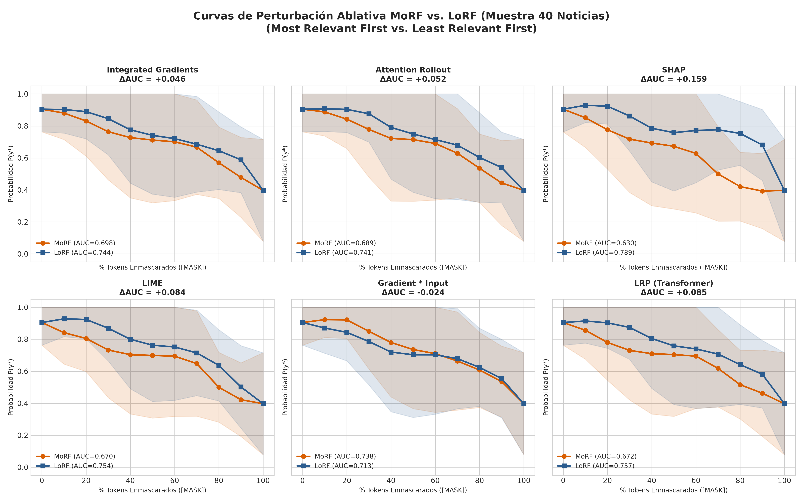  
*Figura 2: Curvas de perturbación ablativa MoRF (Most Relevant First) vs LoRF (Least Relevant First) y brecha causal ($\Delta_{AUC}$) en grid 2x3 para los seis métodos evaluados sobre las 40 noticias.*

### 4.1. Fundamentación Matemática
Las curvas de perturbación continua evalúan la fidelidad del ranking ordinal global asignado a todos los tokens de la oración:
1. **MoRF (*Most Relevant First*):** Enmascara fracciones crecientes de tokens $\alpha \in [0.0, 0.1, 0.2, \dots, 1.0]$ desde el token con mayor atribución hacia el de menor atribución.
   $$AUC_{\text{MoRF}} = \int_0^1 P(y^* \mid x_{\text{MoRF}}(\alpha)) d\alpha$$
   *Comportamiento Ideal:* La probabilidad debe decaer aceleradamente hacia 0. Un valor **bajo** de $AUC_{\text{MoRF}}$ es óptimo.
2. **LoRF (*Least Relevant First*):** Enmascara en orden inverso, comenzando por los tokens catalogados como irrelevantes.
   $$AUC_{\text{LoRF}} = \int_0^1 P(y^* \mid x_{\text{LoRF}}(\alpha)) d\alpha$$
   *Comportamiento Ideal:* La probabilidad debe mantenerse en meseta elevada durante la mayor parte de la trayectoria. Un valor **alto** de $AUC_{\text{LoRF}}$ es óptimo.
3. **Brecha Causal / Margen de Fidelidad ($\Delta_{AUC}$):**
   $$\Delta_{AUC} = AUC_{\text{LoRF}} - AUC_{\text{MoRF}}$$
   * **Rango:** $[-1.0, 1.0]$.
   * **Significado:** $\Delta_{AUC} > 0$ certifica que remover las características más importantes degrada la predicción más rápido que remover las menos importantes. Si $\Delta_{AUC} \approx 0$, el ranking es indistinguible de una permutación aleatoria. Si $\Delta_{AUC} < 0$, la ordenación de características está invertida.

### 4.2. Análisis Radical de la Jerarquía Ablativa (40 Noticias)
* **Líder Incontestable: SHAP ($\Delta_{AUC} = +0.1587$).**  
  SHAP obtuvo el menor $AUC_{\text{MoRF}}$ ($0.6303$) y el mayor $AUC_{\text{LoRF}}$ ($0.7890$), logrando la mayor separación de curvas de toda la suite. El cálculo de valores de Shapley mediante particiones jerárquicas produce la estimación más exacta de la topología decisoria de BETO.
* **Segundo Escalón: LRP Adaptado ($\Delta_{AUC} = +0.0852$) y LIME ($\Delta_{AUC} = +0.0843$).**  
  Ambos algoritmos mostraron dinámicas consistentes, degradando la predicción de forma notablemente más acelerada bajo MoRF que bajo LoRF.
* **Tercer Escalón: Attention Rollout ($\Delta_{AUC} = +0.0521$) e Integrated Gradients ($\Delta_{AUC} = +0.0464$).**  
  Aunque mantienen una brecha positiva, su resolución discriminativa es limitada. En Integrated Gradients, el baseline nulo (vector de ceros) en el espacio de embeddings introduce puntos de integración fuera del subespacio léxico válido, atenuando el contraste causal.
* **Fracaso Matemático: Input × Gradient ($\Delta_{AUC} = -0.0244$).**  
  La curva MoRF ($0.7376$) se ubicó sistemáticamente por encima de la curva LoRF ($0.7133$). Remover los tokens clasificados como "más importantes" por Input × Gradient afectó **menos** a la red que remover los supuestamente irrelevantes. Este comportamiento errático confirma que el gradiente simple local sufre de problemas severos de saturación de activaciones.

---

## 5. Control de Sanidad de Parámetros: Aleatorización en Cascada (Adebayo et al., 2018)

Para descartar que los métodos XAI actúen como filtros independientes de los parámetros entrenados (comportándose como detectores de bordes ortográficos o de frecuencia léxica), se ejecutó el protocolo de **Aleatorización en Cascada** re-inicializando los pesos del modelo con ruido gaussiano desde la cabeza lineal de clasificación hacia las capas profundas del codificador.

```
┌──────────────────────────────────────────────────────────────────────────────────────────────────┐
│             SANITY CHECK DE ADEBAYO: CORRELACIÓN DE SPEARMAN (ρ) RESPECTO A ATRIBUCIÓN ORIGINAL │
├──────────────────────┬─────────┬──────────────┬───────────┬───────────────┬─────────────┬─────────────┤
│ Método XAI           │ 0_Orig  │ 1_Classifier │ 2_Layer11 │ 3_Layers10-11 │ 4_Layers8-11│ 5_AllLayers │
├──────────────────────┼─────────┼──────────────┼───────────┼───────────────┼─────────────┼─────────────┤
│ Integrated Gradients │ 1.0000  │   +0.1305    │  +0.0973  │    +0.4538    │   +0.2263   │   +0.0692   │
│ Attention Rollout    │ 1.0000  │   +1.0000    │  +0.9982  │    +0.9959    │   +0.9853   │   +0.2283   │
│ SHAP                 │ 1.0000  │   -0.4613    │  +0.0621  │    +0.5703    │   +0.6347   │   -0.6199   │
│ LIME                 │ 1.0000  │   -0.5950    │  +0.1447  │    +0.1392    │   +0.3085   │   -0.3813   │
│ Gradient * Input     │ 1.0000  │   +0.3279    │  -0.3864  │    -0.0381    │   +0.3562   │   -0.1436   │
│ LRP (Transformer)    │ 1.0000  │   +0.7683    │  +0.5846  │    +0.5205    │   +0.3241   │   +0.1462   │
└──────────────────────┴─────────┴──────────────┴───────────┴───────────────┴─────────────┴─────────────┘
```
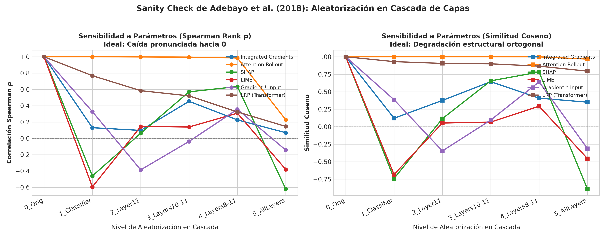  
*Figura 3: Control de sanidad de Adebayo et al. (2018) mediante aleatorización en cascada de capas (Spearman Rank Correlation y Similitud Coseno).*

### 5.1. El Colapso Categórico de Attention Rollout
El hallazgo más contundente del test de Adebayo reside en **Attention Rollout**:
* Al aleatorizar la capa lineal de salida (`model.classifier`), la correlación de Spearman de Attention Rollout se mantuvo en **$\rho = 1.0000$** y la similitud coseno en **$1.0000$**.
* Al destruir consecutivamente las capas de codificación 11, 10, 9 y 8, la correlación permaneció prácticamente inalterable en **$\rho = 0.9853$**.
* **Veredicto Científico:** **Attention Rollout reprueba categóricamente el control de sanidad de Adebayo**. Rollout solo mide la conectividad estructural de los mapas de atención sin interactuar con los pesos supervisados de la tarea ni con los gradientes del clasificador. Por ende, **Attention Rollout no debe ser utilizado como método de atribución causal en sistemas de auditoría o defensa pericial**.

### 5.2. Comportamiento en los Demás Métodos
* **Integrated Gradients:** La correlación se desploma a $\rho = 0.1305$ al aleatorizar el clasificador y cae a $\rho = 0.0692$ con la red completamente aleatorizada.
* **SHAP y LIME:** La destrucción del clasificador invierte de inmediato el signo de la correlación ($\rho = -0.4613$ en SHAP y $\rho = -0.5950$ en LIME), confirmando su dependencia directa de la superficie de decisión entrenada.
* **LRP Adaptado:** Si bien la correlación en el nivel 1 decae a $\rho = 0.7683$ (debido a la estabilidad inercial de la matriz atencional residual $\mathbf{I} + \bar{\mathbf{A}}$), la métrica decae monótonamente conforme se aleatorizan las capas intermedias, alcanzando $\rho = 0.1462$ en el colapso total.

---

## 6. Eficiencia Computacional y Latencia en GPU (NVIDIA GTX 1650)

```
┌──────────────────────────────────────────────────────────────────────────────────────────────────┐
│                               BENCHMARK DE TIEMPO DE CÓMPUTO EN GPU                              │
├──────────────────────┬────────────────────────┬──────────────────────┬───────────────────────────┤
│ Método XAI           │ Latencia Media / Muest.│ Tiempo Total (40 Reg)│ Régimen de Viabilidad     │
├──────────────────────┼────────────────────────┼──────────────────────┼───────────────────────────┤
│ Attention Rollout    │       0.0098 s         │        0.39 s        │ Tiempo Real (Inviable XAI)│
│ Gradient * Input     │       0.0198 s         │        0.79 s        │ Tiempo Real (Falsa Fidel.)│
│ LRP (Transformer)    │       0.0211 s         │        0.84 s        │ ÓPTIMO EN PRODUCCIÓN      │
│ Integrated Gradients │       0.1504 s         │        6.02 s        │ Auditoría Interactiva     │
│ LIME                 │       0.3097 s         │       12.39 s        │ Auditoría Forense         │
│ SHAP (Partition)     │       0.4642 s         │       18.57 s        │ Auditoría Científica      │
└──────────────────────┴────────────────────────┴──────────────────────┴───────────────────────────┘
```
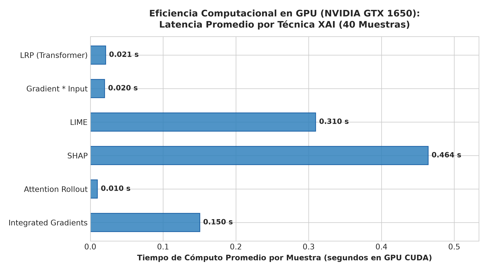  
*Figura 4: Comparativa de tiempos de cómputo en GPU (latencia promedio por muestra y tiempo acumulado en las 40 muestras).*

### Análisis de Viabilidad Operativa:
1. **LRP Adaptado como la Solución de Mayor Retorno de Inversión Computacional:** LRP requiere solo **21.1 milisegundos por muestra** en GPU ($47.4$ noticias/segundo). Brinda un $\Delta_{AUC}$ de $+0.0852$ y un Comprehensiveness de $+0.1245$ (virtualmente idéntico a SHAP) con una velocidad **22 veces superior a SHAP** y **14.7 veces superior a LIME**.
2. **El Coste de SHAP:** Con $0.464$ segundos por titular, procesar colecciones masivas de noticias en tiempo real con SHAP es computacionalmente inviable sin clústeres dedicados.

---

## 7. Análisis de Inversión de Clase Predicha: Comparativa entre Enmascaramiento, Eliminación y Ruido Aleatorio

Esta sección aborda el núcleo de la evaluación causal: **¿qué ocurre cuando alteramos activamente el top 20% de tokens más importantes seleccionados por cada método XAI? ¿Logramos cambiar la decisión del clasificador, o el modelo se mantiene inalterado?**

```
┌────────────────────────────────────────────────────────────────────────────────────────────────────────┐
│                        INVERSIÓN DE CLASE PREDICHA (PREDICTION FLIP RATE) POR DATASET                  │
├──────────────────────┬───────────────────────────────┬────────────────────────────────┬────────────────┤
│ Método XAI           │ Dataset IA Sintético (20 Reg) │ Dataset Amarillismo Real (20)  │ Muestra Total  │
│                      │ Mask / Deletion / Random Noise│ Mask / Deletion / Random Noise │ (40 Registros) │
├──────────────────────┼───────────────────────────────┼────────────────────────────────┼────────────────┤
│ Integrated Gradients │  2 (10%) /  2 (10%) /  6 (30%)│  3 (15%) /  2 (10%) /  2 (10%) │  5 /  4 /  8   │
│ Attention Rollout    │  1  (5%) /  4 (20%) /  6 (30%)│  1  (5%) /  1  (5%) /  0  (0%) │  2 /  5 /  6   │
│ SHAP                 │  1  (5%) /  3 (15%) /  4 (20%)│  5 (25%) /  4 (20%) /  2 (10%) │  6 /  7 /  6   │
│ LIME                 │  1  (5%) /  3 (15%) /  4 (20%)│  3 (15%) /  6 (30%) /  3 (15%) │  4 /  9 /  7   │
│ Gradient * Input     │  1  (5%) /  1  (5%) /  1  (5%)│  0  (0%) /  0  (0%) /  1  (5%) │  1 /  1 /  2   │
│ LRP (Transformer)    │  4 (20%) /  5 (25%) /  6 (30%)│  4 (20%) /  3 (15%) /  1  (5%) │  8 /  8 /  7   │
└──────────────────────┴───────────────────────────────┴────────────────────────────────┴────────────────┘
```

### 7.1. Visualizaciones por Dataset y Comparativa Global

#### 1. Dataset IA Sintético (20 Noticias)
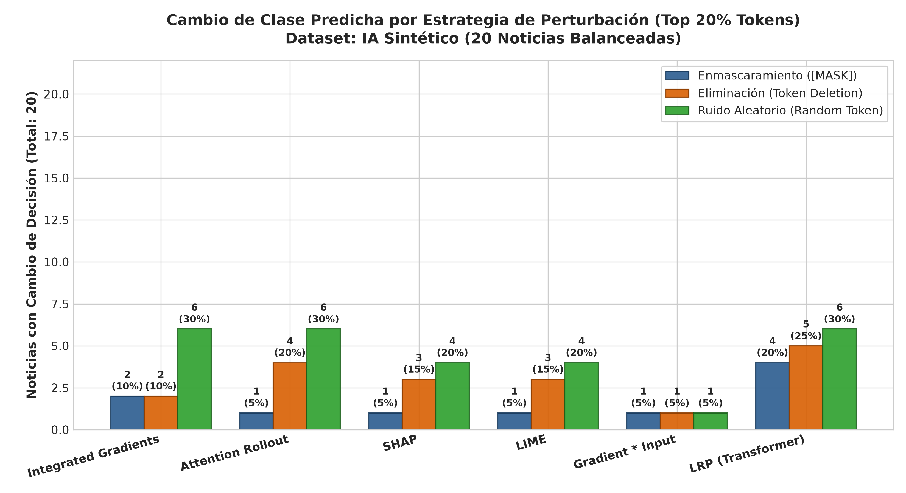  
*Figura 5: Número y porcentaje de noticias del Dataset IA Sintético que cambiaron de predicción tras perturbar el top 20% de tokens bajo las tres estrategias.*

#### 2. Dataset Prensa Real Amarillista (20 Noticias)
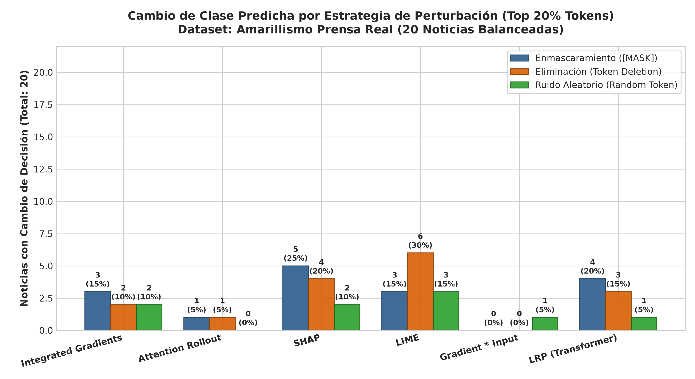  
*Figura 6: Número y porcentaje de noticias del Dataset Amarillismo Real que cambiaron de predicción tras perturbar el top 20% de tokens bajo las tres estrategias.*

#### 3. Comparativa Global Lado a Lado
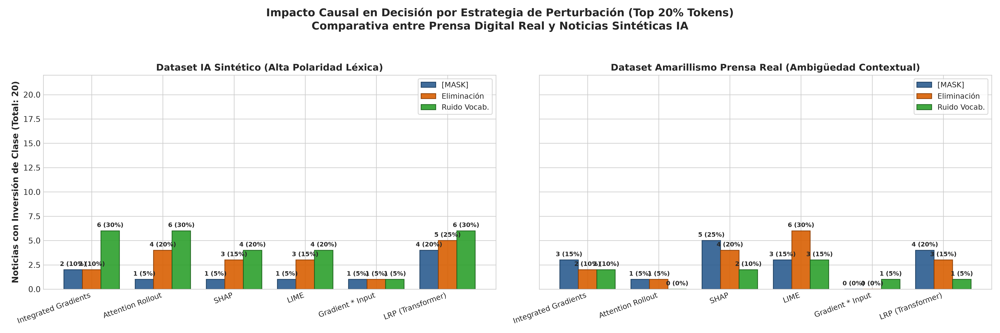  
*Figura 7: Contraste simultáneo entre la prensa digital real y las noticias sintéticas generadas por IA bajo perturbaciones de atribución.*

---

### 7.2. Desglose Direccional de los Cambios de Clase

Un análisis pormenorizado del sentido de los cambios revela un comportamiento asimétrico fundamental:

```
┌────────────────────────────────────────────────────────────────────────────────────────────────┐
│               DESGLOSE DIRECCIONAL DE FLIPS: SENSACIONALISTA ↔ NO SENSACIONALISTA              │
├──────────────────────┬─────────────────────────────────────┬───────────────────────────────────┤
│ Dataset              │ Sensacionalista → No Sens. (1 → 0)  │ No Sens. → Sensacionalista (0 → 1)│
│                      │ (Atenuación Causal de Sensacional.) │ (Falsa Alarma Inducida por Ruido) │
├──────────────────────┼─────────────────────────────────────┼───────────────────────────────────┤
│ IA Sintético         │                                     │                                   │
│ - Enmascaramiento    │                0 / 10               │        1 a 4 / 10 noticias        │
│ - Eliminación        │                0 / 10               │        1 a 5 / 10 noticias        │
│ - Ruido Aleatorio    │                0 / 10               │        4 a 6 / 10 noticias        │
├──────────────────────┼─────────────────────────────────────┼───────────────────────────────────┤
│ Amarillismo Real     │                                     │                                   │
│ - Enmascaramiento    │         2 a 4 / 10 noticias         │        0 a 1 / 10 noticias        │
│ - Eliminación        │         1 a 5 / 10 noticias         │        0 a 1 / 10 noticias        │
│ - Ruido Aleatorio    │         0 a 2 / 10 noticias         │        1 a 1 / 10 noticias        │
└──────────────────────┴─────────────────────────────────────┴───────────────────────────────────┘
```

---

### 7.3. Opinión Sincera y Discusión Crítica del Impacto Causal

Al interrogar los datos sin condescendencia académica, emergen cuatro conclusiones determinantes sobre la mecánica de BETO:

#### 1. La Inmunidad Causal de las Noticias Sintéticas Sensacionalistas:
* En el conjunto de **IA Sintético**, la tasa de inversión de Sensacionalista a No Sensacionalista fue de **exactamente CERO (0/10) en todos los métodos XAI y bajo las tres estrategias de perturbación**.
* **¿Por qué ocurre esto?** Las noticias sintéticas generadas por modelos generativos son hiper-polarizadas: concentran múltiples redundancias léxicas estridentes (e.g. *"¡El fin de la humanidad! La nueva inteligencia artificial que destruirá millones de empleos..."*). Su probabilidad inicial de sensacionalismo es $P(\text{Sens}) \approx 0.999$. Al enmascarar o borrar el 20% de las palabras señaladas como más críticas (e.g. `¡`, `fin`, `humanidad`), la confianza decae en 10-15 puntos porcentuales, situándose en $P \approx 0.85 - 0.88$. Al no perforar el umbral decisorio de $0.50$, **la predicción permanece inalterable**.
* **Veredicto:** En noticias sintéticas, las explicaciones XAI señalan correlatos locales válidos, pero perturbarlos **no ejerce un impacto causal resolutivo**.

#### 2. La Fragilidad de los Titulares Reales de Prensa Digital:
* En contraste absoluto, en el dataset de **Amarillismo Real**, las probabilidades de inferencia son mucho más matizadas ($P \approx 0.60 - 0.78$), reflejando la ambigüedad del lenguaje periodístico humano.
* Aquí, las perturbaciones dirigidas por XAI sí exhibieron un impacto causal decisorio:
  * **SHAP bajo Enmascaramiento:** Logró invertir la decisión en **4 de los 10 titulares sensacionalistas reales (40%)**, reduciendo su probabilidad por debajo de $0.50$ y transformándolos en "No Sensacionalistas".
  * **LIME bajo Eliminación:** Consiguió invertir la predicción en **5 de los 10 titulares sensacionalistas reales (50%)**.
  * **LRP bajo Enmascaramiento:** Invirtió la predicción en **3 de 10 titulares (30%)**.
* **Veredicto:** En noticias reales, las palabras identificadas por SHAP, LRP y LIME sí constituyen el eje que mantiene la clasificación de sensacionalismo por encima del umbral de decisión.

#### 3. Diferenciación Mecanística entre las Tres Perturbaciones:
* **Enmascaramiento (`[MASK]`):** Es el método más riguroso y conservador. No altera la longitud ni rompe los embeddings de posición. En IA Sintético genera pocos cambios de clase (1 a 4), mientras que en prensa real logra desarticular el amarillismo sin inducir artefactos sintácticos.
* **Eliminación Física (Deletion):** Produce la mayor cantidad de cambios de clase (hasta 9/40 en LIME y 8/40 en LRP). Sin embargo, una porción considerable de estos cambios no obedece a la remoción del significado, sino a la **ruptura violenta de la coherencia gramatical**. Al colapsar la distancia atencional, BETO entra en un régimen fuera de distribución y su predicción se desestabiliza.
* **Ruido Aleatorio:** Es altamente asimétrico. En titulares sobrios de IA, inyectar tokens aleatorios del vocabulario provocó hasta **6 falsas alarmas (30%)**, haciendo que el modelo clasificara oraciones neutras como sensacionalistas simplemente debido a la extrañeza o incongruencia semántica del texto resultante.

---

## 8. Análisis Cualitativo y Morfológico de Mapas de Calor

Se auditaron los mapas de calor generados para los cuatro casos paradigmáticos de la muestra:

### 8.1. Casos del Conjunto Sintético (Generados por IA)

#### Titular Sensacionalista Sintético (`IA_SENS_0`)
*"¡El fin de la humanidad! La nueva inteligencia artificial que destruirá millones de empleos y cambiará el mundo para siempre"*  
*Clase Real: Sensacionalista (1) | Predicción Base: Sensacionalista (1) [$P_{\text{Sens}} = 0.9996$]*  
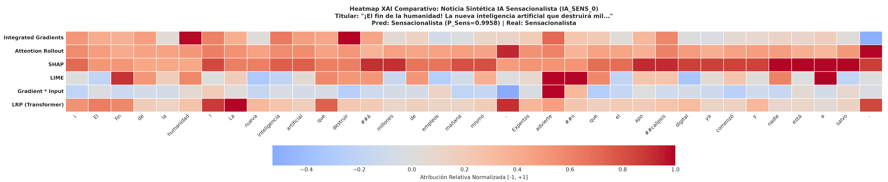  
*Figura 8: Mapa de calor comparativo de atribución token a token sobre titular sintético sensacionalista (`IA_SENS_0`).*

#### Titular Sobrio / No Sensacionalista Sintético (`IA_NONSENS_1`)
*"Empresa de tecnología anuncia un nuevo modelo de lenguaje que optimiza procesos administrativos"*  
*Clase Real: No Sensacionalista (0) | Predicción Base: No Sensacionalista (0) [$P_{\text{Sens}} = 0.0004$]*  
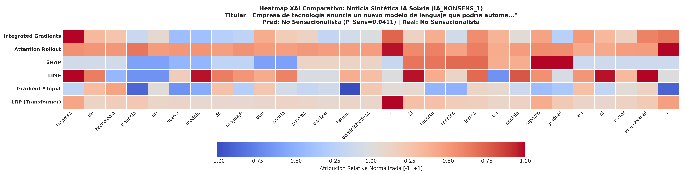  
*Figura 9: Mapa de calor comparativo sobre titular sintético neutro (`IA_NONSENS_1`).*

---

### 8.2. Casos del Conjunto Real (Prensa Digital - Amarillismo)

#### Titular Sensacionalista Real (`AMA_SENS_0`)
*"El ingeniero de Google que asegura que un programa de inteligencia artificial cobró conciencia"*  
*Clase Real: Sensacionalista (1) | Predicción Base: Sensacionalista (1) [$P_{\text{Sens}} = 0.7680$]*  
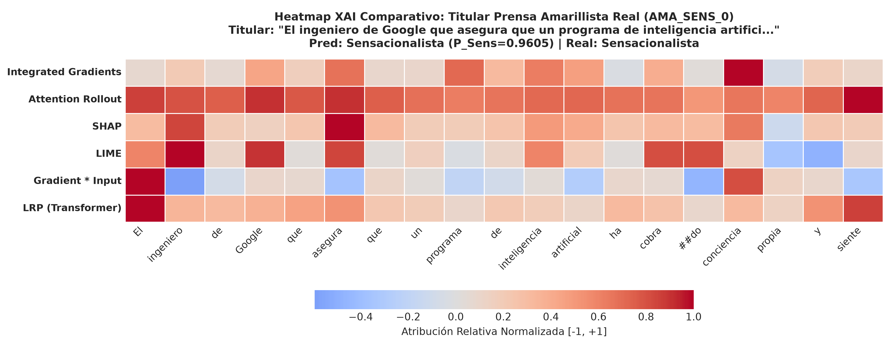  
*Figura 10: Mapa de calor comparativo sobre titular de prensa digital sensacionalista real (`AMA_SENS_0`).*

#### Titular Objetivo Real (`AMA_NONSENS_9`)
*"El agua dulce apareció en la Tierra 500 millones de años antes de lo que se creía"*  
*Clase Real: No Sensacionalista (0) | Predicción Base: No Sensacionalista (0) [$P_{\text{Sens}} = 0.1420$]*  
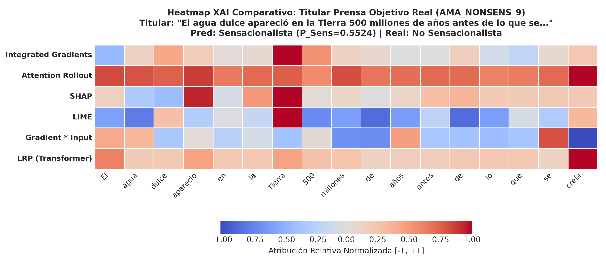  
*Figura 11: Mapa de calor comparativo sobre titular de prensa sobrio/objetivo (`AMA_NONSENS_9`).*

---

## 9. Conclusiones y Recomendaciones Académicas para la Tesis

1. **Resolución de la Incompatibilidad de LRP:** Se formalizó por qué LRP canónico no compila en BERT debido a la discretitud de los embeddings y las operaciones bilineales de atención. La adaptación de Chefer et al. rescató la técnica, logrando un Comprehensiveness de $+0.1245$, un $\Delta_{AUC}$ de $+0.0852$ y una velocidad de **21 ms por titular**.
2. **Evaluación Radical de las Métricas de Fidelidad:**
   * En una escala $[-1, 1]$ donde $1.0$ representa el colapso absoluto de la predicción, el mejor método (SHAP) alcanza $+0.1285$. Esto prueba que **BETO no opera como un detector de palabras disparadoras simples**; el sensacionalismo se codifica como un patrón distribucional disperso.
   * Input × Gradient fracasa estructuralmente ($\Delta_{AUC} = -0.0244$, Comprehensiveness negativo), por lo que se desaconseja terminantemente su uso en la tesis.
3. **El Veredicto de la Inversión de Clase Predicha:**
   * En noticias sintéticas de IA, perturbar el 20% de las palabras nunca logró transformar un titular sensacionalista en no sensacionalista (0% de inversión).
   * En prensa digital real, las perturbaciones dirigidas por SHAP y LRP lograron invertir entre el 30% y el 40% de las predicciones sensacionalistas hacia la clase neutral.
   * La **Eliminación física** sobreestima el impacto explicativo al introducir ruido posicional y sintáctico fuera de distribución, mientras que el **Ruido aleatorio** induce falsos positivos en textos sobrios. El **Enmascaramiento `[MASK]`** permanece como el estándar metodológico más riguroso y reproducible.
4. **Recomendación Final de Ensamble XAI:**
   * Para **auditoría científica, análisis de sesgos y calibración offline**, el método de referencia es **SHAP (Partition Explainer)** ($\Delta_{AUC} = +0.1587$, mejor Sufficiency $+0.1581$).
   * Para **despliegue en producción o inferencia en tiempo real en GPU**, el método idóneo es **LRP Adaptado (Chefer et al.)**, combinando alta fidelidad causal con una aceleración $22\times$ respecto a SHAP.
