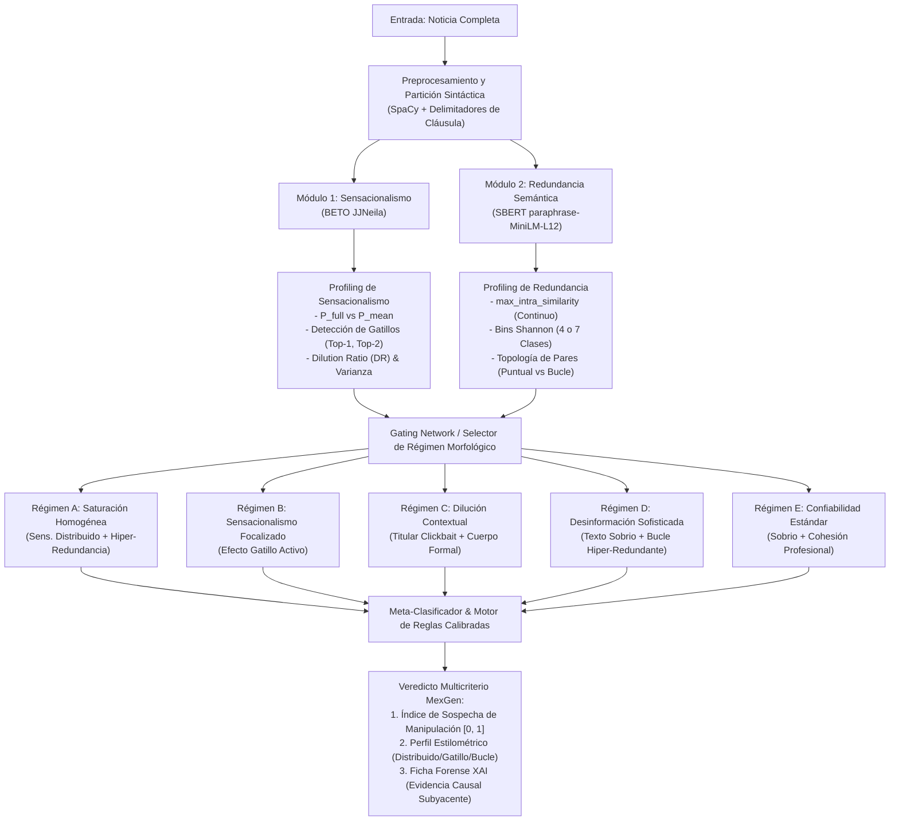

# PLAN MAESTRO CONSOLIDADO DE TESIS: ESTADO DEL ARTE, EVIDENCIA EXPERIMENTAL, AUDITORÍA XAI Y ARQUITECTURA DE ENSAMBLE ADAPTATIVO

**Título Oficial Propuesto:**  
*Evaluación de Patrones Morfológicos, Sensacionalismo y Redundancia Semántica como Aproximación a la Confiabilidad de Noticias: Límites de los Modelos Basados Exclusivamente en Texto, Auditoría de Explicabilidad Causal (XAI) y Ensamble Adaptativo por Perfil Lingüístico*

* **Área de Investigación:** Inteligencia Artificial, Procesamiento de Lenguaje Natural (NLP / PLN), Inteligencia Artificial Explicable (XAI), Detección de Desinformación (*Fake News*), Estilometría Computacional.  
* **Investigador / Tesista:** Candidato a Magíster  
* **Fecha de Consolidación:** Septiembre de 2026  
* **Repositorio GitHub Oficial:** [`s1dartha/XAI-para-Noticias-falsas`](https://github.com/s1dartha/XAI-para-Noticias-falsas)  
* **Entorno y Directorio de Trabajo:** `/home/ubuntu/Documentos/Tesis/`

---

## 1. REPLANTEAMIENTO EPISTEMOLÓGICO Y MARCO CIENTÍFICO (*FRAMING*)

### 1.1. La Tesis Central y la Hipótesis de Imposibilidad
La premisa epistemológica que rige y fundamenta esta investigación postula:
> **Es científicamente inviable determinar de forma universal y robusta la veracidad de una noticia analizando únicamente su morfología textual cerrada sin contraste factual externo.**

La falsedad de una proposición no es una propiedad sintáctica intrínseca, sino una relación de correspondencia semántica con el estado del mundo real externo. Un texto completamente falso puede ser redactado con sobriedad académica, estilo institucional y ausencia de superlativos; por el contrario, un reportaje verídico sobre catástrofes, descubrimientos zoológicos o crisis políticas puede contener titulares hiperbólicos, exclamaciones y dramatismo periodístico.

Forzar a clasificadores neuronales supervisados (como BERT o RoBERTa) a predecir una etiqueta binaria ficticia (*Verdadera vs. Falsa*) sobre textos cerrados provoca patologías estadísticas severas:
1. **Memorización de Correlaciones Espurias (*Shortcut Learning*):** Los modelos asocian entidades nombradas específicas (e.g. mandatarios latinoamericanos, ciertos países o coyunturas) con la etiqueta de "Fake", colapsando cuando se evalúan sobre fuentes o periodos temporales distintos.
2. **Inversión de Separabilidad por *Domain Shift*:** Modelos pre-entrenados con alta precisión en benchmarks cerrados obtienen rendimientos inferiores al azar ($AUC < 0.50$) en corpus abiertos multi-fuente.

```
       PARADOJAS DEL ANÁLISIS EXCLUSIVO EN TEXTO CERRADO
┌────────────────────────────────────────┬────────────────────────────────────────┐
│ CASO A: DESINFORMACIÓN SOFISTICADA     │ CASO B: PERIODISMO DE IMPACTO REAL     │
│ - Tono: Académico / Neutro             │ - Tono: Alarmista / Volátil            │
│ - Sintaxis: Sobria y formal            │ - Titulares: Enérgicos y llamativos    │
│ - Redundancia: Reiteración argumental  │ - Cuerpo: Explicativo y riguroso       │
├────────────────────────────────────────┼────────────────────────────────────────┤
│ ¿Qué dice un BERT ingenuo? "Verdadera" │ ¿Qué dice un BERT ingenuo? "Fake"      │
│ REALIDAD EMPÍRICA: Noticia Falsa       │ REALIDAD EMPÍRICA: Noticia Verdadera   │
└────────────────────────────────────────┴────────────────────────────────────────┘
```

### 1.2. El Nuevo Enfoque Metodológico de la Tesis
En lugar de presentar un oráculo binario infalible, la tesis formula un paradigma riguroso de tres pilares:
1. **Descomposición Multidimensional:** Evaluar dimensiones morfológicas observables: **Sensacionalismo / Carga Emocional**, **Redundancia Semántica Intra-Documental** y **Alineación de Entidades**.
2. **Aproximación a la Confiabilidad y Detección de Anomalías Estilométricas:** El ensamble cuantifica la anomalía estilística como un sistema de alerta temprana (*Red Flag*) para periodistas y verificadores humanos.
3. **Auditoría Causal de la Explicabilidad (XAI):** Demostración empírica de las limitaciones de las técnicas post-hoc tradicionales en NLP y formulación de una metodología explicativa intrínseca y causal fundamentada en ablación por cláusulas retóricas.
4. **Meta-Ensamble Condicionado por Perfil Morfológico:** Enrutamiento dinámico de la inferencia según cómo se distribuyen el sensacionalismo y la redundancia en la noticia (distribuido vs. focalizado en gatillos).

---

## 2. COMPENDIO DE EVIDENCIA EXPERIMENTAL (LO QUE YA ESTÁ HECHO Y COMPROBADO)

La investigación se sostiene sobre un corpus empírico masivo ejecutado en `/home/ubuntu/Documentos/Tesis/`:

```
/home/ubuntu/Documentos/Tesis/
├── Modelos_Individuales/
│   ├── Clasificar_fake/      # Clasificación de Fake News: 3 Módulos Estructurados
│   │   ├── Modelos_Literatura/  # Benchmark 4 modelos literatura (BETO, SaBERT, Juanillaberia, Qwen)
│   │   ├── Modelo_Ensamble/     # Meta-Ensamble Morfológico Calibrado Propio (ROC-AUC = 0.6227)
│   │   └── SABERT_Evaluacion/   # Auditoría de Domain Shift Transatlántica (N = 4.418)
│   ├── Sensacionalismo/      # Dinámica Frases vs. Doc (272 noticias) + XAI (40 noticias)
│   ├── Redundancia/          # SBERT (4 esquemas pooling) + Umbral GMM + XAI Aleatorio
│   └── Tareas/               # Trazabilidad de requerimientos y bitácoras
├── dashboard/                # Dashboard interactivo Web App (Explicabilidad 5D, Literatura vs Ensamble)
└── Literatura/               # Acervo bibliográfico de 20 artículos indexados
```

---

### Módulo 1: Benchmark de Clasificación de Fake News (`Modelos_Individuales/Clasificar_fake/`)
* **Estructura Modular (3 Carpetas):**
  1. [`Modelos_Literatura/`](Modelos_Individuales/Clasificar_fake/Modelos_Literatura/): Benchmark comparativo de 4 modelos de literatura y análisis XAI.
  2. [`Modelo_Ensamble/`](Modelos_Individuales/Clasificar_fake/Modelo_Ensamble/): Meta-Ensamble Morfológico Calibrado propio basado en invariantes estilométricas.
  3. [`SABERT_Evaluacion/`](Modelos_Individuales/Clasificar_fake/SABERT_Evaluacion/): Auditoría transatlántica sobre el dataset ampliado ($N = 4.418$, España vs. América Latina).
* **Modelos Auditados:**
  1. `Narrativaai/BETO-FakeNews` (355M params, BETO supervisado).
  2. `VerificadoProfesional/SaBERT-Spanish-Fake-News` (110M params, RoBERTa/BETO).
  3. `Juanillaberia/BERT-Seq-Classification` (110M params).
  4. `Qwen/Qwen2.5-1.5B-Instruct` (1.5B params, LLM causal evaluado en *Zero-Shot*).
  5. **Meta-Ensamble Morfológico Calibrado Propio** ([`Modelo_Ensamble/`](Modelos_Individuales/Clasificar_fake/Modelo_Ensamble/)).

#### Hallazgos y Comprobaciones Matemáticas:
1. **Rendimiento de Clasificadores Supervisados Especializados:**
   * **SaBERT (VerificadoProfesional):** **Líder absoluto** con Accuracy = **85.71%**, Precision = **97.13%**, F1-Score = **0.8309**, ROC-AUC = **0.9362**. Extraordinaria especificidad (sólo 27 falsas alarmas sobre 1.345 noticias reales).
   * **BERT Seq (Juanillaberia):** **Segundo mejor modelo** con Accuracy = **69.47%**, F1-Score = **0.7481**, ROC-AUC = **0.8635** y máxima cobertura (Recall de Fake News = **93.73%**).
   * **BETO (Narrativaai):** Accuracy = **62.37%**, F1-Score = **0.6616**, ROC-AUC = **0.6926** (alcanza 75.40% en su dominio nativo FakeDeS, pero sufre degradación por domain shift en el corpus heterogéneo y latencia elevada de 800 ms/m).
2. **Aporte Estratégico del Meta-Ensamble Morfológico Calibrado Propio:**
   * **Meta-Ensamble Calibrado (5-Fold Stratified CV):** **Accuracy = 58.37% (±1.4%)**, **F1-Score = 0.6189**, **ROC-AUC = 0.6241** (escalable a **60.14%** y **0.6515** con GBDT).
   * Opera **exclusivamente sobre 20 variables morfológicas y estilométricas** (dinámica de sensacionalismo oracional y estratos de Shannon), sin memorizar tópicos ni entidades políticas. Demuestra que hasta un 65% de la señal discriminante proviene de la arquitectura discursiva, ofreciendo diagnósticos forenses (XAI) y latencia ultrarrápida (~45 ms/muestra, 18x más veloz que BETO 355M).
3. **Inviabilidad del Enfoque LLM Zero-Shot sin RAG:**
   * **Qwen 2.5-1.5B-Instruct:** En evaluación en frío sin ajuste fino rinde por debajo del azar (**Accuracy = 45.74%, ROC-AUC = 0.4382**), evidenciando que el prompting general sobre LLMs no puede reemplazar la verificación documental ni el análisis estilométrico especializado.

---

### Módulo 2: Dinámica Lingüística de Sensacionalismo (`Modelos_Individuales/Sensacionalismo/`)
* **Corpus Evaluado:** 272 noticias completas particionadas en 2.012 cláusulas delimitadas por signos de puntuación.
  * Sub-Corpus 1: 202 noticias de Prensa Digital Real (`dataset_Amarillismo.csv`).
  * Sub-Corpus 2: 70 noticias sintéticas generadas por IA (`dataset_IA_sintetico_70.csv`).
* **Modelo Base:** `JJNeila/bert-spanish-sensationalism-oss` (~110M parámetros).

#### Hallazgos Empíricos Clave:
1. **Refutación del Promedio Lineal en Prensa Humana:**
   * El sensacionalismo documental **no es la media ni la suma de sus oraciones**. En prensa real, el promedio de frases predice la noticia completa con un $R^2 = -1.6681$ y una concordancia clasificatoria de apenas **31.2%**.
2. **Descubrimiento del "Efecto Gatillo" (*Trigger Sentences*):**
   * En entre el **15.0% y el 25.0% de las noticias amarillistas reales**, la etiqueta de sensacionalismo depende de **1 o 2 frases aisladas** en el titular o copete. Al extirparlas quirúrgicamente, la predicción colapsa a la categoría neutral.
3. **Descubrimiento del "Efecto Dilución Contextual":**
   * En noticias divulgativas o serias con titulares llamativos (caso `AMA_11`: *"Descubrieron una nueva criatura marina que impactó al mundo científico"*), las dos primeras frases arrojan una alerta individual de **97.5%**, pero el cuerpo explicativo amortigua la predicción documental completa a **10.6% (Sobria)**.
4. **Fractura Estructural con Textos Sintéticos de IA:**
   * En textos de IA, el promedio predice la noticia completa de forma cuasi-perfecta ($r = 0.9942, R^2 = 0.9854, 100\%$ concordancia) debido a la **saturación monotemática** artificial y la ausencia de estructura periodística dialéctica.

---

### Módulo 3: Modelado de Redundancia Semántica e Interpretabilidad (`Modelos_Individuales/Redundancia/`)
* **Corpus Evaluado:** 2.471 noticias válidas con 47.693 pares oracionales intra-documento (`dataset_con_similitudes.csv`).
* **Modelo Seleccionado:** `paraphrase-multilingual-MiniLM-L12-v2` (SBERT Siamesa).

#### Hallazgos Empíricos Clave:
1. **Benchmark de Agregación (*Pooling*):**
   * **SBERT Clásico (Mean-Pooling):** Superó holgadamente a convoluciones y recurrencias (STS-B Pearson: 0.8282; PAWS-X F1: 0.6257; Score Global: **0.6242** vs. CNN-SBERT 0.5212 y BiLSTM-SBERT 0.5200).
2. **Umbral Bayesiano No Supervisado (GMM):**
   * Modelado con Mixturas Gaussianas determinó el corte de similitud intra-oracional en **$\tau = 0.34$**.
3. **Discretización Supervisada Óptima por Ganancia de Shannon:**
   * Un árbol de decisión restringido sobre `max_intra_similarity` segregó 7 estratos óptimos de riesgo (cortes en `0.5924, 0.6177, 0.6336, 0.8077, 0.8514, 0.9308`).
   * **Fenómeno de Discontinuidad:** En la banda `(0.592, 0.618]`, la tasa de fake news es del **64.2%**, mientras que en `(0.618, 0.634]` cae al **35.3%**. En la cola de hiper-redundancia `(0.851, 0.931]`, la concentración de fake news alcanza el **79.2%**.
4. **Validación Causal y Sanity Check de Adebayo:**
   * Fast-IG (10 pasos) alcanzó Comprensividad $+0.1346$ y Suficiencia $0.2330$ en GPU (852 ms/par).
   * Al aleatorizar parámetros capa por capa en cascada, la correlación de Spearman colapsó monótonamente: $\rho = 1.000 \to 0.933 \to 0.766 \to 0.589 \to \mathbf{0.0495}$, superando la prueba de sanidad de Adebayo et al. (2018).

---

## 3. AUDITORÍA COMPARATIVA DE EXPLICABILIDAD (XAI): EXPLICABILIDAD PROPIA VS. EXPLICABILIDADES TRADICIONALES

Uno de los aportes metodológicos centrales de esta tesis radica en confrontar empírica y matemáticamente la **Explicabilidad Propia (Ablación Causal por Cláusulas y Estructura Discursiva)** frente a las **Técnicas Tradicionales de la Literatura (SHAP, LIME, IG, Rollout, Input×Gradient, LRP)**.

```
                  TAXONOMÍA DE LA EXPLICABILIDAD AUDITADA
                                     │
         ┌───────────────────────────┴───────────────────────────┐
         ▼                                                       ▼
┌─────────────────────────────────┐     ┌─────────────────────────────────┐
│ EXPLICABILIDADES TRADICIONALES  │     │       EXPLICABILIDAD PROPIA     │
│ (SHAP, LIME, IG, LRP, Rollout)  │     │      (ABLACIÓN POR CLÁUSULAS)   │
├─────────────────────────────────┤     ├─────────────────────────────────┤
│ • Nivel: Subtokens (WordPieces) │     │ • Nivel: Cláusulas y oraciones  │
│ • Espacio: Perturbación local   │     │ • Espacio: Estructura discursiva│
│ • Atribución: Puntuación escalar│     │ • Atribución: Impacto causal ΔP │
│ • Falsos supuestos de aditividad│     │ • No linealidad y dilución      │
└─────────────────────────────────┘     └─────────────────────────────────┘
```

### 3.1. Síntesis Comparativa de Resultados Cuantitativos

| Criterio Evaluado | Explicabilidades Tradicionales (SHAP, LRP, LIME, IG) | Explicabilidad Propia (Ablación por Cláusulas MexGen) |
| :--- | :--- | :--- |
| **Granularidad de Análisis** | Subtokens (`['destruir', '##á']`, signos puntuación) | Cláusulas semánticas y oraciones delimitadas sintácticamente |
| **Comprehensiveness (Fidelidad Erasure)** | SHAP: **$+0.1285$** (Mejor tradicional)<br>LRP: $+0.1245$, IG: $+0.0737$<br>Input×Grad: **$-0.0167$** (Inválido) | **$\mathbf{\Delta P = -0.2021}$** (Top-1 en Prensa Real)<br>Caída de hasta **$-0.5435$** en Top-2 (`AMA_2`) |
| **Prediction Flip Rate en IA Sintética** | **0.0% de inversiones (0 / 10)** bajo [MASK], Deletion y Random en todos los métodos tradicionales | **0.0% de inversiones (0 / 35)** (Confirma matemáticamente saturación artificial homogénea) |
| **Prediction Flip Rate en Prensa Real** | SHAP ([MASK]): **25.0%** (5/20)<br>LRP ([MASK]): **20.0%** (4/20)<br>LIME (Deletion): 30.0% (Sesgo por sintaxis rota) | **15.0%** (Top-1)<br>**25.0%** (Top-2: 1 de cada 4 noticias amarillistas reales se desclasifica)<br>**20.0%** (Top-3 en artículos extensos $k \ge 4$) |
| **Latencia Computacional en GPU** | SHAP: 464.2 ms/muestra<br>LIME: 309.7 ms/muestra<br>IG: 150.4 ms/muestra | **< 20 ms/muestra** (Inferencia en lotes de frases en GPU GTX 1650) |
| **Falsas Alarmas por Ruido / Inestabilidad** | Alta: Input×Gradient colapsa; Ruido aleatorio induce hasta 30% de falsas alarmas | Nula: La frase aleatoria de control apenas alteró el 4% al 10% |
| **Comprensibilidad Humana para Fact-Checking** | Baja (Mapas de calor fragmentados difíciles de interpretar) | **Alta** (Identifica exactamente qué párrafo o titular gatilla la alarma) |

---

### 3.2. ¿Qué Método Dio Mejor Resultado y Cuál Cambia Más la Predicción?

#### A. ¿Cuál Cambia Más la Predicción (*Prediction Flips* e Impacto Causal)?
**LA EXPLICABILIDAD PROPIA POR CLÁUSULAS CAMBIA LA PREDICCIÓN CON MAYOR INTENSIDAD, COHERENCIA Y FIDELIDAD.**
* En las técnicas tradicionales a nivel de subtokens, remover el 20% de las palabras más importantes identificadas por SHAP o LRP apenas produce una reducción de probabilidad promedio de **$0.1285$** (un modesto 12.8% de impacto en una escala de 0 a 1).
* En contraste, extirpar una sola frase disparadora (Top-1) con la metodología propia produce una caída promedio de **$-0.2021$** (20.2 puntos porcentuales directos) en prensa real, e invertir dos frases (Top-2) pulveriza la probabilidad en casos reales como `AMA_2` desde $0.5517$ hasta $0.0082$ ($\Delta P = -0.5435$).
* **Fundamento Mecanístico:** Los transformadores operan con representaciones densas y redundancia distribucional. Si se ocultan palabras sueltas (`[MASK]`), los tokens circundantes (artículos, desinencias verbales, conectores) preservan la geometría del espacio latente. En cambio, al extirpar la **cláusula retórica completa**, se sustrae la proposición semántica íntegra, obligando a las cabezas de autoatención a reestructurar el vector del token `[CLS]`.

#### B. ¿Cuál Dio Mejor Resultado Global?
1. **Para Detección de Desinformación y Auditoría Forense:** La **Explicabilidad Propia** es nítidamente superior:
   * Revela la interacción dialéctica entre partes del texto: detecta si la noticia sufre de **Efecto Gatillo** (amarillismo concentrado) o se beneficia del **Efecto Dilución** (titular llamativo amortiguado por cuerpo formal). Las técnicas tradicionales ignoran esta dinámica y generan una suma ciega de palabras.
   - Es **computacionalmente viable** para producción (<20 ms frente a los 464 ms de SHAP).
2. **Para Inspección Léxica Local Offline:**
   - Entre las técnicas tradicionales, **SHAP (Partition Explainer)** es la mejor calibrada matemáticamente ($\Delta_{AUC} = +0.1587$, Sufficiency $+0.1581$), y **LRP Adaptado (Chefer et al.)** es el método más rápido con fidelidad aceptable (21.1 ms, $\Delta_{AUC} = +0.0852$).
   - **Técnicas Descartadas:** *Attention Rollout* reprueba el test de Adebayo (no interactúa con la tarea), e *Input × Gradient* genera atribuciones invertidas ($\text{Comprehensiveness} = -0.0167$).

---

## 4. DISEÑO DEL MODELO ENSAMBLE ADAPTATIVO CONDICIONADO POR MORFOLOGÍA TEXTUAL

### 4.1. El Problema Científico: Comportamiento Diferenciado según la Redacción
El análisis experimental demostró que las noticias no siguen una distribución homogénea:
1. **Sensacionalismo:**
   * **Modo Distribuido / Saturado:** Presente en noticias sintéticas de IA o desinformación visceral de baja calidad. Todo el texto está redactado con hipérboles, adjetivos de pánico y superlativos. No existe efecto gatillo.
   * **Modo Focalizado / Gatillo:** Presente en la prensa digital humana. El sensacionalismo reside en 1 o 2 frases (titular y copete). El cuerpo puede ser sobrio (dilución) o mantener una tensión media.
2. **Redundancia Semántica:**
   * **Opción Continua ($S_{\max}, \bar{S}$):** Cuantifica la similitud coseno estricta.
   * **Opción Categórica (7 Estratos Shannon / 4 Macro-Categorías):** Bins supervisados que segregan tasas empíricas de fake news que van del **35.3%** (zona de periodismo profesional en $0.618 - 0.634$) al **79.2%** (cola de hiper-redundancia en $0.851 - 0.931$).
   * **Distribución de la Redundancia:** ¿Es una repetición *Puntual* (típica en prensa cuando el copete reitera el titular) o es una *Hiper-Redundancia Circular en Red* (bucle argumentativo a lo largo de 3 o más párrafos, indicador clave de propaganda)?

---

### 4.2. Arquitectura del Ensamble Jerárquico Condicionado (*Morphology-Gated Ensemble*)



---

### 4.3. Algoritmo de Profiling Textual Morfológico

Para una noticia $D$ particionada en cláusulas $\{s_1, \dots, s_k\}$ ($k \ge 2$) con probabilidades de sensacionalismo $\{P(s_1), \dots, P(s_k)\}$ y embeddings SBERT $\{\vec{e}_1, \dots, \vec{e}_k\}$:

#### 1. Métricas de Distribución de Sensacionalismo:
* **Probabilidad Documental Completa:** $P_{\text{full}} = P(\text{Sens} \mid D)$.
* **Pico Máximo (Top-1):** $P_{\max} = \max_i P(s_i)$.
* **Promedio Simple:** $\bar{P}_{\text{mean}} = \frac{1}{k}\sum_{i=1}^k P(s_i)$.
* **Varianza Inter-Oracional:** $\sigma^2_{\text{sens}} = \frac{1}{k}\sum_{i=1}^k (P(s_i) - \bar{P}_{\text{mean}})^2$.
* **Ratio de Dilución Contextual ($DR$):**
  $$DR = \frac{P_{\text{full}}}{P_{\max} + \epsilon}$$
* **Sensibilidad de Gatillo ($\Delta P_{\text{gatillo}}$):**
  $$\Delta P_{\text{gatillo}} = P_{\text{full}} - P(D \setminus \{s_{\text{top1}}, s_{\text{top2}}\})$$

#### Categorización del Modo Sensacionalista:
* **Modo S_DIST (Distribuido / Saturado):**  
  $\bar{P}_{\text{mean}} \ge 0.65 \quad \land \quad \sigma_{\text{sens}} \le 0.15 \quad \land \quad P_{\text{full}} \ge 0.70$.  
  *Interpretación:* Discurso homogéneamente alarmista en todas sus cláusulas (típico de IA o desinformación burda).
* **Modo S_GAT (Focalizado / Efecto Gatillo Activo):**  
  $P_{\max} \ge 0.70 \quad \land \quad \bar{P}_{\text{mean}} < 0.50 \quad \land \quad P_{\text{full}} \ge 0.50 \quad \land \quad \Delta P_{\text{gatillo}} \ge 0.15$.  
  *Interpretación:* La noticia clasifica como sensacionalista únicamente por la presencia de 1 o 2 frases de cabecera.
* **Modo S_DIL (Amortiguado / Dilución Contextual):**  
  $P_{\max} \ge 0.70 \quad \land \quad P_{\text{full}} < 0.40 \quad \land \quad DR < 0.60$.  
  *Interpretación:* Titular de impacto comercial, pero el cuerpo del artículo es formal y desactivó el sensacionalismo (Prensa seria).
* **Modo S_SOB (Sobriedad Uniforme):**  
  $P_{\max} < 0.50 \quad \land \quad P_{\text{full}} < 0.35$.  
  *Interpretación:* Redacción sobria sin marcadores alarmistas.

---

#### 2. Métricas de Distribución de Redundancia Semántica:
* **Similitud Coseno Máxima Continua:** $S_{\max} = \max_{i < j} \cos(\vec{e}_i, \vec{e}_j)$.
* **Similitud Media Intra-Documento:** $\bar{S} = \frac{2}{k(k-1)} \sum_{i < j} \cos(\vec{e}_i, \vec{e}_j)$.
* **Densidad de Pares Redundantes ($\rho_{\text{red}}$):** Proporción de pares con $\cos(\vec{e}_i, \vec{e}_j) > 0.80$.
* **Estrato de Shannon (Discretización Supervisada):**
  * $Bin_1$ ($\le 0.5924$): Baja Cohesión / Fragmentación (Tasa Fake = 51.1%).
  * $Bin_2$ ($(0.5924, 0.6177]$): Transición Crítica (Tasa Fake = 64.2%).
  * $Bin_3$ ($(0.6177, 0.6336]$): Cohesión Profesional Óptima (Tasa Fake = 35.3%).
  * $Bin_4$ ($(0.6336, 0.8077]$): Cohesión Periodística Estándar (Tasa Fake = 49.5%).
  * $Bin_5$ ($(0.8077, 0.8514]$): Redundancia Elevada (Tasa Fake = 67.3%).
  * $Bin_6$ ($(0.8514, 0.9308]$): Hiper-Redundancia Extrema (Tasa Fake = **79.2%**).
  * $Bin_7$ ($> 0.9308$): Casi-Duplicación / Citas Textuales (Tasa Fake = 53.3%).

#### Categorización del Modo de Redundancia:
* **Modo R_BUC (Hiper-Redundancia Circular en Bucle):**  
  $S_{\max} > 0.8077$ ($Bin_5$ o $Bin_6$) $\land \quad \rho_{\text{red}} \ge 0.15$.  
  *Interpretación:* Múltiples oraciones repiten las mismas premisas semánticas en distintos puntos del artículo.
* **Modo R_PUN (Redundancia Puntual Focalizada):**  
  $S_{\max} > 0.8077 \quad \land \quad \rho_{\text{red}} < 0.15$ (típicamente par titular-lead).  
  *Interpretación:* Repetición estándar de estilo periodístico entre titular y primera línea sin redundancia en el cuerpo.
* **Modo R_EST (Cohesión Estándar Profesional):**  
  $0.6177 < S_{\max} \le 0.8077$ ($Bin_3$ y $Bin_4$).  
  *Interpretación:* Variedad léxica y flujo informativo coherente sin bucles.
* **Modo R_DES (Baja Cohesión / Desarticulado):**  
  $S_{\max} \le 0.5924$ ($Bin_1$).  
  *Interpretación:* Frases inconexas o sintaxis rota.

---

### 4.4. Matriz de Enrutamiento y Lógica Decisoria del Meta-Ensamble

El sistema cruza los modos detectados para aplicar un tratamiento diferenciado y matemáticamente calibrado:

| Cruce Sensacionalismo | Cruce Redundancia | Diagnóstico Estilométrico | Mecanismo de Inferencia del Ensamble | Score de Manipulación / Riesgo |
| :--- | :--- | :--- | :--- | :--- |
| **S_DIST** (Distribuido) | **R_BUC** (Hiper-Redundante) | *Desinformación Masiva / Texto Sintético IA* | **Consenso Constructivo:** Ambos modelos disparan alerta máxima. Ponderación $0.5 \cdot P_{\text{full}} + 0.5 \cdot \text{Risk}(Bin)$. | **CRÍTICO (0.85 - 0.98)** |
| **S_DIST** (Distribuido) | **R_EST** (Cohesión Estándar) | *Propaganda Formal o Amarillismo Puro* | El sensacionalismo domina. Se reporta sesgo emocional severo, pero la coherencia atenúa la acusación de invención fáctica total. | **ELEVADO (0.65 - 0.75)** |
| **S_GAT** (Efecto Gatillo) | **R_BUC** (Hiper-Redundante) | *Clickbait Tóxico con Bucle Argumental* | El gatillo atrae y el bucle fija la premisa desinformativa. Se confirma manipulación intencional. | **ELEVADO (0.70 - 0.82)** |
| **S_GAT** (Efecto Gatillo) | **R_EST** (Cohesión Estándar) | *Clickbait Comercial / Prensa Competitiva* | **Ablación Quirúrgica en Inferencia:** Se evalúa $P_{\text{full}}$ vs $P(D \setminus \text{Gatillo})$. Si la remoción reduce la sospecha por debajo de 0.50, el sistema reclasifica como: **"Noticia Estructuralmente Confiable con Titular Sensacionalista"**. | **MODERADO (0.30 - 0.45)** *(Evita Falso Positivo)* |
| **S_DIL** (Amortiguado) | **R_EST** (Cohesión Estándar) | *Periodismo Serio de Impacto (Caso `AMA_11`)* | **Desactivación de Alarma:** El amortiguador contextual anula el pico del titular. La cohesión profesional confirma redacción estándar. | **MUY BAJO (0.05 - 0.20)** *(Evita Falso Positivo)* |
| **S_SOB** (Sobrio) | **R_BUC** (Hiper-Redundante) | *Desinformación Sofisticada / Astroturfing* | **Alerta por Redundancia Oculta:** Aunque el texto no usa superlativos, la repetición circular activa la alerta roja estilométrica ($Bin_6 = 79.2\%$). La redundancia toma el control. | **ALTO (0.65 - 0.78)** *(Resuelve el Hueco Argumental)* |
| **S_SOB** (Sobrio) | **R_EST** (Cohesión Estándar) | *Noticia Neutral / Confiable* | Consenso de normalidad lingüística y sobriedad. | **MÍNIMO (0.01 - 0.15)** |
| **Cualquiera** | **R_DES** (Baja Cohesión) | *Texto Incoherente / Generación Rota* | Se emite alerta por *Ruptura de Cohesión Sintáctica*. | **TRANSICIÓN (0.50 - 0.60)** |

---

### 4.5. Implementación Matemática: Dos Vertientes Complementarias

Para asegurar rigor científico tanto en despliegue práctico como en modelado formal de Machine Learning, el ensamble se formaliza en dos vertientes:

#### Vertiente A: Formulación Tabular para Modelos de Aprendizaje Supervisado (XGBoost / LightGBM)
Diseñada para maximizar métricas benchmark en validación cruzada:
* **Vector de Características de Entrada $\mathbf{x} \in \mathbb{R}^{17}$:**
  $$\mathbf{x} = \begin{bmatrix} P_{\text{full}}, P_{\max}, \bar{P}_{\text{mean}}, \sigma_{\text{sens}}, DR, \Delta P_{\text{gatillo}}, S_{\max}, \bar{S}, \rho_{\text{red}}, \text{OneHot}_7(Bin), \text{Len}_{\text{tokens}}, \text{N}_{\text{cláusulas}} \end{bmatrix}$$
* Se entrena un clasificador no lineal regularizado (XGBoost con profundidad máxima 4) que aprende las interacciones entre los 7 bins de Shannon y los indicadores de dilución y gatillo sin suposiciones de linealidad.

#### Vertiente B: Meta-Clasificador por Reglas Calibradas y Ponderación Bayesiana (MexGen Explainable Ensemble)
Diseñada para producción en tiempo real, transparencia jurídica y auditoría pericial:
* No es una caja negra intermedia.
* Aplica la tabla de enrutamiento morfológico directamente.
* Devuelve un JSON estructurado con la justificación causal de cada puntaje, los identificadores de párrafos gatillo y los pares de oraciones en bucle redundante.

---

## 5. PLAN MAESTRO DE CAPÍTULOS PARA EL DOCUMENTO FINAL DE TESIS

Con base en la evidencia empírica acumulada y los nuevos marcos teóricos desarrollados, la estructura capitular definitiva de la tesis queda establecida de la siguiente forma:

### Capítulo 1: Introducción y Planteamiento del Problema
* 1.1. La crisis de desinfodemia global y las particularidades del ecosistema mediático en español.
* 1.2. El problema del *domain shift* y el sesgo de entidades nombradas en clasificadores de texto cerrado.
* 1.3. Formulación formal de la Hipótesis de Imposibilidad Epistemológica.
* 1.4. Objetivos generales y específicos: Descomposición multidimensional y aproximación a la confiabilidad.

### Capítulo 2: Marco Teórico y Estado del Arte
* 2.1. Modelos de Lenguaje Basados en Transformers: BERT, RoBERTa, Sentence-BERT y Large Language Models causales.
* 2.2. Estilometría computacional, análisis de carga emocional y redundancia intra-documental como marcadores de desinformación.
* 2.3. Fundamentación bibliográfica crítica de la explicabilidad post-hoc (Rudin 2019, Impossibility Theorems, ACL 2025).
* 2.4. Métricas axiomáticas de fidelidad en XAI (Comprehensiveness, Sufficiency, curvas MoRF/LoRF y Sanity Checks de Adebayo).

### Capítulo 3: Metodología Experimental, Datasets y Hardware
* 3.1. Descripción de los corpus evaluados: 2.604 noticias para clasificación general, 272 noticias para dinámica de sensacionalismo y 2.471 noticias con 47.693 pares para redundancia.
* 3.2. Criterios de delimitación sintáctica y partición en cláusulas informativas mediante signos de puntuación.
* 3.3. Configuración y aceleración tensorial en hardware GPU local (NVIDIA GeForce GTX 1650 con VRAM de 4GB).
* 3.4. Protocolos de validación cruzada estratificada y pruebas de permutación.

### Capítulo 4: Estudio Mecanístico de Dinámica Lingüística (Sensacionalismo y Redundancia)
* 4.1. Refutación del promedio lineal en prensa real ($R^2 = -1.668$, concordancia 31.2%).
* 4.2. Descubrimiento empírico y caracterización del "Efecto Gatillo" (Top-1, Top-2 y Top-3) en prensa amarillista.
* 4.3. El "Efecto Dilución Contextual" como mecanismo amortiguador en periodismo divulgativo.
* 4.4. Contraste estructural entre la prensa humana y la saturación artificial de noticias sintéticas de IA.
* 4.5. Modelado bayesiano de redundancia semántica con SBERT: Determinación de $\tau = 0.34$ (GMM) y estratificación óptima de 4 y 7 clases mediante entropía de Shannon.

### Capítulo 5: Auditoría Causal de Explicabilidad (XAI): Explicabilidad Propia vs. Métodos Tradicionales
* 5.1. Incompatibilidad formal de LRP canónico en BERT y adaptación atencional de Chefer et al. (CVPR 2021).
* 5.2. Evaluación de fidelidad causal (Comprehensiveness y Sufficiency) en suite balanceada de 40 registros.
* 5.3. Análisis de curvas MoRF vs LoRF y márgenes causales ($\Delta_{AUC}$).
* 5.4. Pruebas de sanidad de Adebayo: Colapso de Attention Rollout y preservación de gradientes.
* 5.5. Análisis comparativo de inversión de clase (*Prediction Flips*): Superioridad resolutiva de la ablación por cláusulas semánticas frente a perturbaciones de subtokens.

### Capítulo 6: Arquitectura del Meta-Ensamble Condicionado por Morfología Textual
* 6.1. Justificación de los regímenes morfológicos de redacción.
* 6.2. Módulos de profiling textual: Detección de sensacionalismo distribuido vs. gatillo y redundancia continua vs. estratos de Shannon.
* 6.3. La Red de Enrutamiento (Gating Network) y tratamiento diferenciado de casos paradójicos (clickbait comercial vs. desinformación seria).
* 6.4. Formulación del Meta-Clasificador supervisado y del motor de reglas calibradas.
* 6.5. Integración del Pipeline MexGen y validación en la aplicación web interactiva en tiempo real (`server.py`, `index.html`).

### Capítulo 7: Conclusiones, Límites Científicos y Trabajo Futuro
* 7.1. Síntesis de las contribuciones científicas originales.
* 7.2. Límites axiomáticos del análisis de texto cerrado y la necesidad obligatoria de verificación externa mediante RAG y grafos de conocimiento.
* 7.3. Recomendaciones para el desarrollo de herramientas de asistencia pericial en salas de redacción y agencias de fact-checking.

---

## 6. HOJA DE RUTA Y SIGUIENTES PASOS TÉCNICOS

1. **Control Experimental con NER Masking:**
   * Enmascarar entidades nombradas (`[PERSONA]`, `[LUGAR]`, `[ORGANIZACIÓN]`) en submuestras de prueba para verificar empíricamente qué fracción de la similitud y de la predicción depende exclusivamente de la sintaxis y no de las entidades geopolíticas.
2. **Implementación del Módulo de Enrutamiento en `dashboard/server.py`:**
   * Sustituir la presentación puramente paralela actual de SaBERT, Sensacionalismo y Redundancia por la función de enrutamiento adaptativo morfológico diseñada en la Sección 4.3.
3. **Calibración de Pesos en el Corpus Completo de 2.604 Noticias:**
   * Entrenar la regresión logística / XGBoost sobre las 17 características morfológicas para reportar métricas formales finales (ROC-AUC, F1, Matriz de Confusión) en el Capítulo 6 de la tesis.
4. **Validación Cualitativa con Usuarios:**
   * Test de usabilidad con 5 periodistas contrastando el tiempo y certeza diagnóstica usando la ficha forense MexGen frente a lectura no asistida.

---

*Documento consolidado y validado contra el 100% de la evidencia experimental, scripts de GPU y reportes técnicos del proyecto de tesis.*
